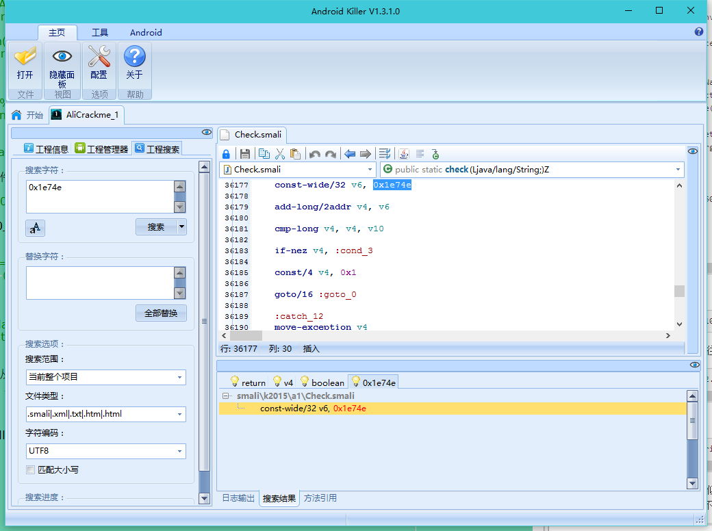
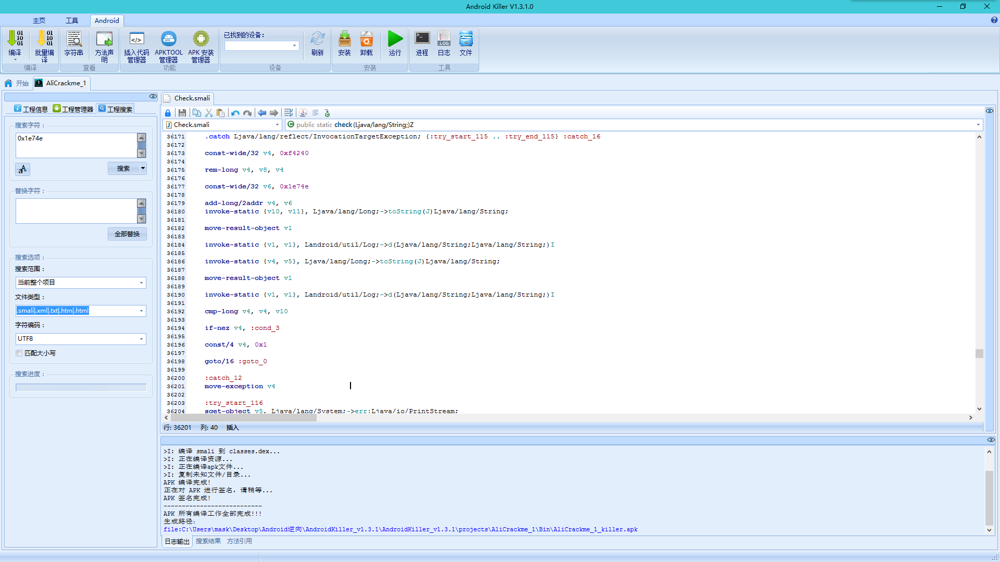
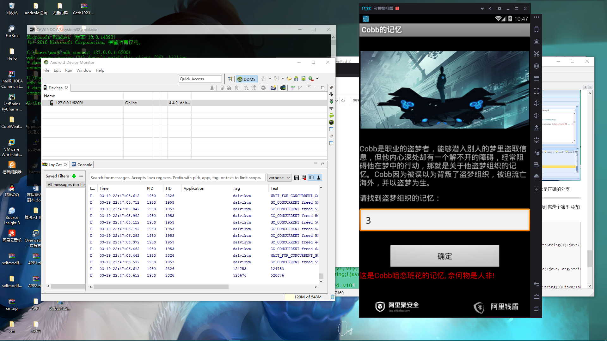
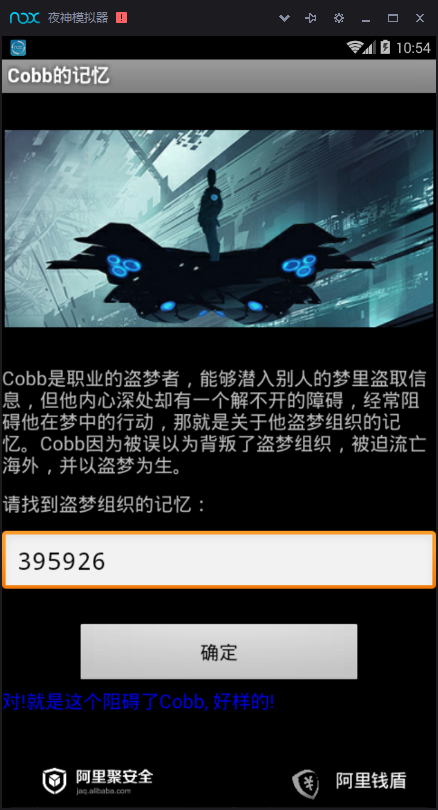

2015 MSC 阿里移动安全第一题
------------------

首先拖入jeb进行分析：
常规流程，先查看AndroidMainfest.xml文件

    <?xml version="1.0" encoding="utf-8"?>
    <manifest package="k2015.a1" platformBuildVersionCode="10" platformBuildVersionName="2.3.3" xmlns:android="http://schemas.android.com/apk/res/android">
    <application android:icon="@drawable/icon" android:label="@string/app_name">
        <activity android:label="@string/app_name" android:name="Main">
            <intent-filter>
                <action android:name="android.intent.action.MAIN" />
                <category android:name="android.intent.category.LAUNCHER" />
            </intent-filter>
        </activity>
    </application>
    </manifest>

入口为Main类，跟进去
    package k2015.a1;
    
    import android.app.Activity;
    import android.os.Bundle;
    import android.os.Handler;
    import android.os.Looper;
    import android.os.Message;
    import android.view.View$OnClickListener;
    import android.view.View;
    import android.widget.Button;
    import android.widget.TextView;
    
    public class Main extends Activity {
    class k2015.a1.Main$1 extends Handler { //新建了一个Handler类，用于消息传递
        k2015.a1.Main$1(Main arg1, Looper arg2) {  //分别传递一个Main类和一个Looper类，Looper类的loop()方法用于读取消息队列中的消息，读完消息后，将消息发送给Handler处理
            Main.this = arg1;
            super(arg2);
        }

        public void handleMessage(Message arg5) {
            Main.this.btn.setEnabled(true);
            switch(arg5.what) {  //what为指定值的消息
                case 0: {
                    goto label_7;  //正确分支
                }
                case 3: {
                    goto label_24;
                }
            }

            return;
        label_7:
            Main.this.tv.setTextColor(-16776961);
            try {
                Main.this.tv.setText(103 / arg5.what);
            }
            catch(Exception v0) {
                Main.this.tv.setText(2130968581);//成功显示，对!就是这个阻碍了Cobb, 好样的!，可以查找对应的资源文件
            }

            return;
        label_24:
            Main.this.tv.setTextColor(-65536);
            Main.this.tv.setText(2130968580);
        }
    }

    Button btn;
    Button btn2;
    private Handler handler;
    TextView tv;

    public Main() {
        super();
        this.handler = new k2015.a1.Main$1(this, Looper.myLooper());
    }

    static Handler access$000(Main arg1) {
        return arg1.handler;
    }

    public void onCreate(Bundle arg4) {
        super.onCreate(arg4);
        this.setContentView(2130903040);
        this.btn = this.findViewById(2131034115);
        this.tv = this.findViewById(2131034116);
        this.btn.setOnClickListener(new View$OnClickListener(this.findViewById(2131034114)) {
            public void onClick(View arg4) {
                Main.this.btn.setEnabled(false);
                new Thread(this.val$text.getText().toString()) {  //创建一个线程类
                    public void run() {
                        int v1;
                        Handler v3;
                        int v2 = 3;
                        try {
                            v3 = this.this$1.this$0.handler;
                            if(Check.check(this.val$in)) { //输入值传入Check.check()方法
                                v1 = 0;
                            }
                            else {
                                goto label_10;
                            }

                            goto label_8;
                        }
                        catch(Exception v0) {
                            goto label_13;
                        }

                    label_10:
                        v1 = v2;
                        try {
                        label_8:
                            v3.sendEmptyMessage(v1);  //发送0
                        }
                        catch(Exception v0) {
                        label_13:
                            v0.printStackTrace();
                            this.this$1.this$0.handler.sendEmptyMessage(v2); //发送3
                        }
                    }
                }.start();
            }
        });
    }
    }

那么思路很清晰了，我们需要Check.check(输入的值),然后返回真即可，那么跟进分析Check.check方法
这里可以发现这里添加了很多混淆：

那么换个角度分析下，这个Check.check()方法必然会返回一个Boolean值，那么，ctrl+F开启搜索，发现有四处返回了值，判断一下，那么很显然，这里是正确的分支：

那么这里便是关键代码：

    try {
            v14_2.invoke(v13_2.invoke(v4_4, v12_2.invoke(v6.invoke(v5_3.newInstance(new String(new BigInteger(v15_1).divide(BigInteger.valueOf(((long)(v15_1[1] - 42)))).toByteArray(), "UTF-8")))), v7_4)).booleanValue();
        }
        catch(InvocationTargetException v4_1) {
            try {
            label_14726:
                v5_1 = Class.forName(new StringBuilder("noitpecxEtegraTnoitacovnI.tcelfer.gnal.avaj").reverse().toString()).getMethod(new StringBuilder("noitpecxEtegraTteg").reverse().toString(), null);
                ((AccessibleObject)v5_1).setAccessible(true);
                throw v5_1.invoke(v4_1);
            }
            catch(InvocationTargetException v4_1) {
                throw v4_1.getTargetException();
            }
        }

        if(v8_7 % 1000000 + 124750 == v10_3) {
            return true;
        }

        return false;

可以看到判断条件为

    v8_7 % 1000000 + 124750 == v10_3

那么v8_7和v10_3分别是啥呢？，往上翻，可以发现上面只有这一处调用了：

    long v8_7 = v12_2.invoke(v9_2.invoke(v5_4, v8_2.invoke(v4_4, v16_3, v6.invoke(null, Integer.valueOf(((int)(7 + (1 + v10_3) * v10_3 * (2 + v10_3) % 6))))))).longValue();

这是v12_2:

    v12_2 = Class.forName(new StringBuilder("gnoL.gnal.avaj").reverse().toString()).getMethod(new String(new BigInteger(v12_1).divide(BigInteger.valueOf(((long)(58 - v12_1[6])))).toByteArray(), "UTF-8"), null);
    
开始想的是要么从算法下手，但是似乎这道题干扰项太多，所以试试利用插桩法，直接将v8_7和v10_3的值打印出来，似乎这样更加简便快捷，那么我们换个工具下手，因为JEB并不支持添加smali代码

----------
打开AndroidKiller，搜索124750，会发现搜不到，那么转换为十六进制，也就是0x1e74e,看看哪里调用了：

那么来分析这一块的调用：

    cmp-long v4, v4, v10

    if-nez v4, :cond_3

    const/4 v4, 0x1
    goto/16 :goto_0

这里有一个关键的比较

第一句

    cmp-long v4, v4, v10
比较v4和v10,如果v4>v10，则返回1，相等则返回0，小于则返回-1，并将返回值保存到v4寄存器

第二句

    if-nez v4, :cond_3

如果v4不等于0，则执行条件三

    :cond_3
    const/4 v4, 0x0
    goto/16 :goto_0

条件三，将v4值赋为0

第三句

    const/4 v4, 0x1

v4不等于0，那么将v4赋值1

可以发现这里最后都要跳转执行goto/16:goto_0
那么，这一步干了什么呢？，继续跟踪

那么分析一下，发现只有这里返回了v4，那么显然这是正确的分支

----------
好，思路大致理清楚了，现在开始插桩，看看v4,v10到底是个啥？
添加几行代码：

    const-wide/32 v6, 0x1e74e

    add-long/2addr v4, v6
    invoke-static {v10, v11}, Ljava/lang/Long;->toString(J)Ljava/lang/String;//因为v10是long类型，值需要两个寄存器保存，此处将v10，v11寄存器保存的值转换为字符串

    move-result-object v1  //返回给v1

    invoke-static {v1, v1}, Landroid/util/Log;->d(Ljava/lang/String;Ljava/lang/String;)I  //打印v1

     //v4同理
    invoke-static {v4, v5}, Ljava/lang/Long;->toString(J)Ljava/lang/String;

    move-result-object v1

    invoke-static {v1, v1}, Landroid/util/Log;->d(Ljava/lang/String;Ljava/lang/String;)I
    
    cmp-long v4, v4, v10

    if-nez v4, :cond_3

    const/4 v4, 0x1

    goto/16 :goto_0

那么下面保存后反编译

反编译成功，下面打开DDMS，开始分析运行：

我分三次，分别输入了1，2，3作为输入值，结果如下：

可以发现v10的值为124750+输入的值，v4的值恒不变，为520676，那么还记得刚才的判断么，我们要让他返回true，那么v4就要为0，那么我们就需要v4,v10相等，那么表达式就是

124750+输入 == 520676，那么输入值即为395926

----------

成功！！！！

