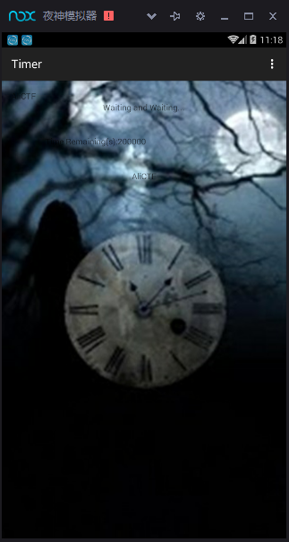
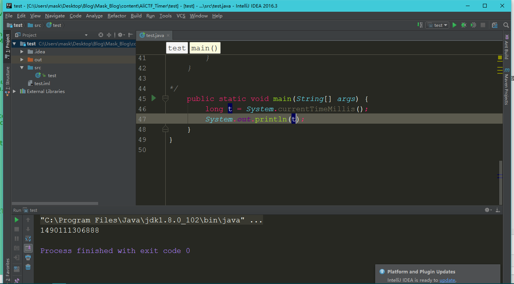

CTF--Timer 
-----------

运行界面：

不管三七二十一，先拖入jdgui分析，找到MainActivity：

分析下关键代码

    package net.bluelotus.tomorrow.easyandroid;
    
    import android.os.Bundle;
    import android.os.Handler;
    import android.support.v7.app.AppCompatActivity;
    import android.view.Menu;
    import android.view.MenuItem;
    import android.widget.TextView;
    
    public class MainActivity extends AppCompatActivity {
    int beg = (((int) (System.currentTimeMillis() / 1000)) + 200000); //System.currentTimeMills()方法是获得当前时间的毫秒数，这里用int获得，那么会产生数据溢出,那么此处可以看作0，所以beg=200000
    int k = 0;
    int now;
    long t = 0;

    public native String stringFromJNI2(int i);//声明一个native方法

    public static boolean is2(int n) {
        if (n <= 3) {
            if (n > 1) {
                return true;
            }
            return false;
        } else if (n % 2 == 0 || n % 3 == 0) {
            return false;
        } else {
            int i = 5;
            while (i * i <= n) {
                if (n % i == 0 || n % (i + 2) == 0) {
                    return false;
                }
                i += 6;
            }
            return true;
        }
    }

    protected void onCreate(Bundle savedInstanceState) {
        super.onCreate(savedInstanceState);
        setContentView((int) R.layout.activity_main);
        final TextView tv1 = (TextView) findViewById(R.id.textView2);
        final TextView tv2 = (TextView) findViewById(R.id.textView3);
        final Handler handler = new Handler();     //新建一个handler类
        handler.postDelayed(new Runnable() {    //这是一种可以创建多线程消息的函数，创建一个匿名Runnable类
            public void run() {    //需要执行的方法
                MainActivity.this.t = System.currentTimeMillis();   //获取当前时间的毫秒数，从1970年1月1日0时起
                MainActivity.this.now = (int) (MainActivity.this.t / 1000);
                MainActivity.this.t = 1500 - (MainActivity.this.t % 1000); 
                tv2.setText("AliCTF");
                if (MainActivity.this.beg - MainActivity.this.now <= 0) {
                    tv1.setText("The flag is:");
                    tv2.setText("alictf{" + MainActivity.this.stringFromJNI2(MainActivity.this.k) + "}");
                }
                MainActivity mainActivity;
                if (MainActivity.is2(MainActivity.this.beg - MainActivity.this.now)) {
                    mainActivity = MainActivity.this;
                    mainActivity.k += 100;
                } else {
                    mainActivity = MainActivity.this;
                    mainActivity.k--;
                }
                tv1.setText("Time Remaining(s):" + (MainActivity.this.beg - MainActivity.this.now));
                handler.postDelayed(this, MainActivity.this.t);        //这里再次调用此Runnable对象，以实现定时器操作
            }
        }, 0);
    }

    public boolean onCreateOptionsMenu(Menu menu) {
        getMenuInflater().inflate(R.menu.menu_main, menu);
        return true;
    }

    public boolean onOptionsItemSelected(MenuItem item) {
        if (item.getItemId() == R.id.action_settings) {
            return true;
        }
        return super.onOptionsItemSelected(item);
    }

    static {
        System.loadLibrary("lhm");
    }
    }

那么整理一下，首先，这个t为多少，

    MainActivity.this.t = System.currentTimeMillis();

那么这就近似取1000，

    1500 - (MainActivity.this.t % 1000)

每隔一秒执行一次

    handler.postDelayed(this, MainActivity.this.t)

那么下面可以模拟一个情况来获得k值：

