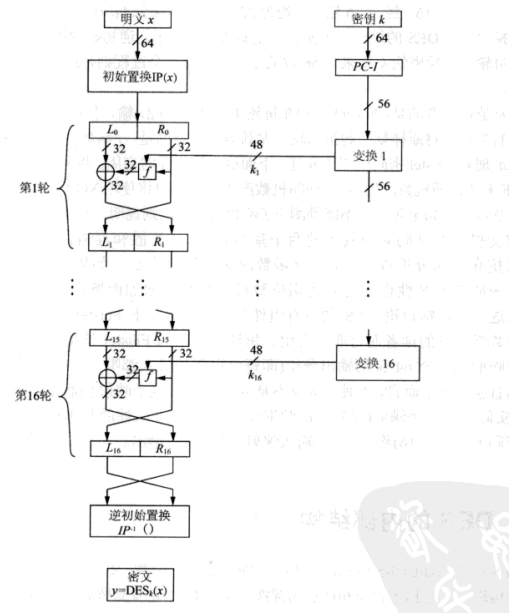
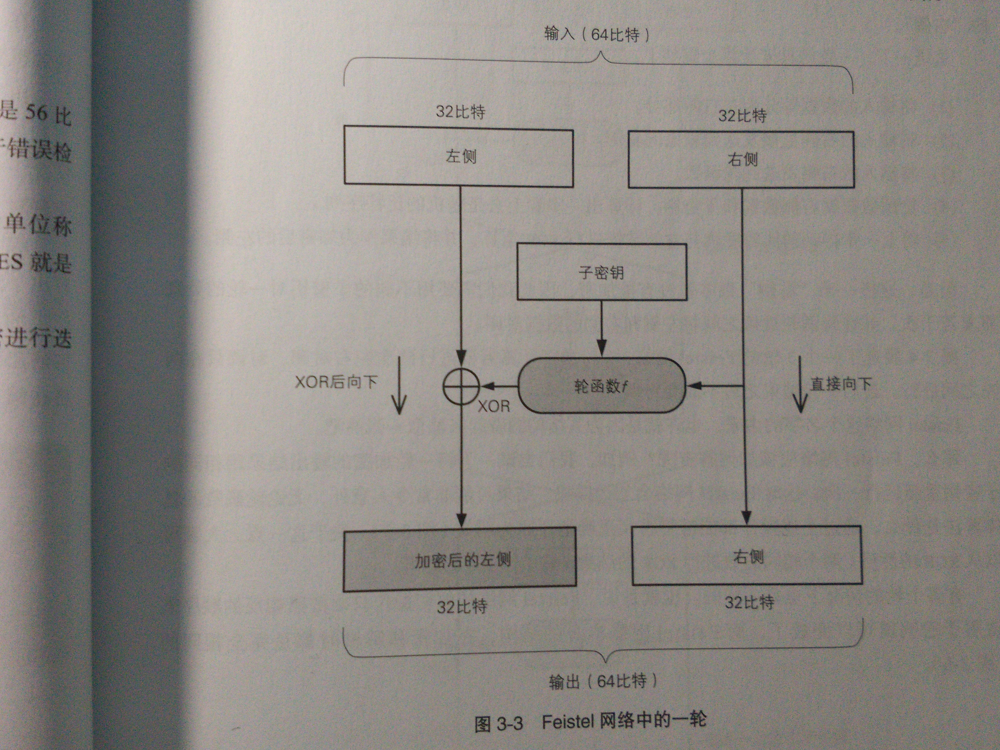
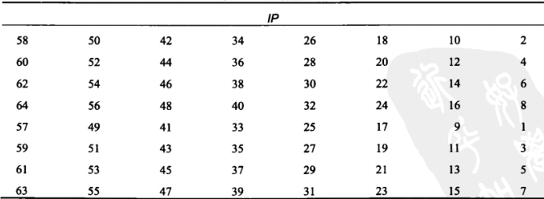
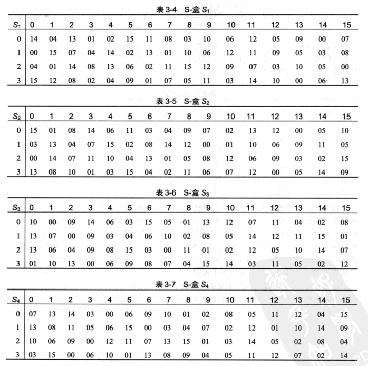
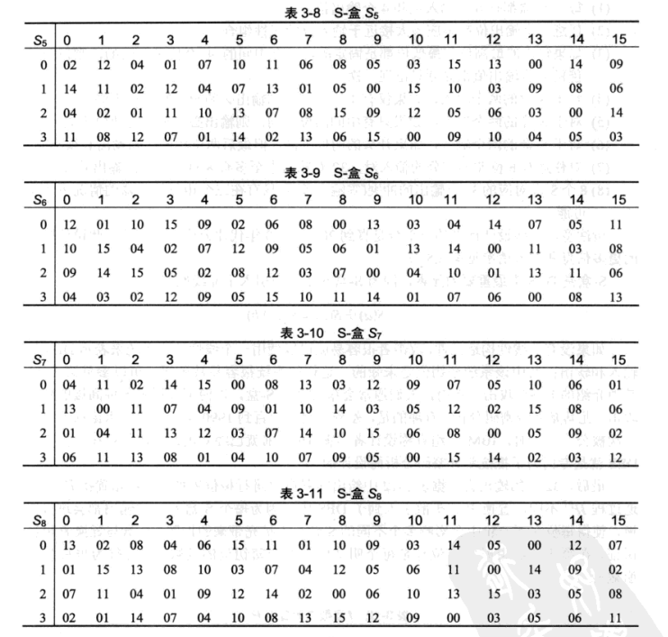

DES加密算法学习
=========

----------

0x01 算法概述
---------
DES是一种使用56位密钥对64位长分组进行加密的算法

DES对明文中每个分组的加密过程都包含16轮

将64位的明文x进行初始按位置换IP后，将明文分为L0和R0两部分；然后将得到的32位的左右两部分输入到Feistel网络

一轮：

然后将输出的左侧和右侧交叉互换，再进行下一轮

重复16次

下面具体来介绍这个算法的结构

0x02 内部结构
---------

**初始置换IP：**
将64位中的每一位按位置换

参照此表：

**逆初始化置换IP：**

参照此表：

**轮函数f**

f函数：将前一轮输出的右半部份和子密钥ki输入，输出的作为异或的掩码，用来加密左半部分

**E盒扩展**

轮函数f首先将输入分成8个4位的分组，然后将每个分组扩展为6位，从而将32位输入扩展为48位，这个扩展的过程就在E盒中进行

E扩展表：

既然是扩展肯定是有16位是重复的，重复的位为1,4,5,8,9,12,13,16,17,20,21,24,25,28,29,32

----------

接着将扩展得到的48位的结果与轮密钥ki(也有的地方叫做子密钥)进行异或操作,并将8个6位长的分组送入8个不同的S替换盒中

**S盒置换**

每个S盒都是一个映射表，将6位的输入映射为4位的输出

举个例子

输入b = (100101)

->取头尾两个数(11)，表示行，(11)转为10进制就是3

->剩下的(0010)，表示列(0010)转为10进制就是2

所以对应就是3行2列，假设这个数映射s1，那么就是08，转为二进制就是1000，那么就是4位输出

轮函数f内的置换

**子密钥或者说是轮密钥ki**

我们的密钥为8字节，也就是64位，但是因为每个字节第8位作为校验位，所以真正意义上来说密钥为56位

因为需要进行16轮，那么对应就有16个子密钥

首先，需要将64位密钥置换为56位，因为那八个就是校验用的，对加密没有关系

**初始化置换表密钥**

可以看到这里输出只有56位了，去除掉了8,16,24,32,40,48,56,64位

然后将置换后的56位密钥分为两组C0，D0

C0：

    57 49 41 33 25 17 09 
    01 58 50 42 34 26 18 
    10 02 59 51 43 35 27 
    19 11 03 60 52 44 36

D0：

    63 55 47 39 31 23 15 
    07 62 54 46 38 30 22 
    14 06 61 53 45 37 29 
    21 13 05 28 20 12 04

接下来就将C0和D0分别按照下面的左移位数循环移位

    1 1 2 2 2 2 2 2 1 2 2 2 2 2 2 1
例如，第1，2，9，16轮，左右两部分向左移1位，其他轮中，左右两部分向左移2位

最后再按照下面的轮密钥置换表进行置换,得到最终的的子密钥：

0x03 JAVA实现
-----------

    /**
     * Created by mask on 2017/5/15.
     */
    
    
    import javax.crypto.Cipher;
    import javax.crypto.SecretKey;
    import javax.crypto.SecretKeyFactory;
    import javax.crypto.spec.DESKeySpec;
    import java.security.SecureRandom;
    
    public class DES {
        public DES() {
        }
        //测试
        public static void main(String args[]) {
            //待加密内容
            String str = "苟利国家生死以";//一言不合就开始膜23333
            //密钥长度至少8位，大于8位也只会取前面8位
            String password = "12345678";

            byte[] result = DES.encrypt(str.getBytes(),password);
            System.out.println("加密后："+new String(result));
            
            try {
                byte[] decryResult = DES.decrypt(result, password);
                System.out.println("解密后："+new String(decryResult));
            } catch (Exception e1) {
                e1.printStackTrace();
            }
        }
        /**
         * 加密
         * @param datasource byte[]
         * @param password String
         * @return byte[]
         */
        public static  byte[] encrypt(byte[] datasource, String password) {
            try{
                SecureRandom random = new SecureRandom();
                DESKeySpec desKey = new DESKeySpec(password.getBytes());
                //创建一个密匙工厂，然后用它把DESKeySpec转换成
                SecretKeyFactory keyFactory = SecretKeyFactory.getInstance("DES");
                SecretKey securekey = keyFactory.generateSecret(desKey);
                //Cipher对象实际完成加密操作
                Cipher cipher = Cipher.getInstance("DES");
                //用密匙初始化Cipher对象
                cipher.init(Cipher.ENCRYPT_MODE, securekey, random);
                //现在，获取数据并加密
                //正式执行加密操作
                return cipher.doFinal(datasource);
            }catch(Throwable e){
                e.printStackTrace();
            }
            return null;
        }
        /**
         * 解密
         * @param src byte[]
         * @param password String
         * @return byte[]
         * @throws Exception
         */
        public static byte[] decrypt(byte[] src, String password) throws Exception {
            // DES算法要求有一个可信任的随机数源
            SecureRandom random = new SecureRandom();
            // 创建一个DESKeySpec对象
            DESKeySpec desKey = new DESKeySpec(password.getBytes());
            // 创建一个密匙工厂
            SecretKeyFactory keyFactory = SecretKeyFactory.getInstance("DES");
            // 将DESKeySpec对象转换成SecretKey对象
            SecretKey securekey = keyFactory.generateSecret(desKey);
            // Cipher对象实际完成解密操作
            Cipher cipher = Cipher.getInstance("DES");//这里的参数具体自己可以上网查下，还可以指定加密模式ECB,CBC之类的，还有之前说的扩展方式PKCS5Padding，这里不多解释，这里没设置，默认是DES/ECB/PKCS5Padding，ECB加密模式，PKCS5Padding扩展
            // 用密匙初始化Cipher对象
            cipher.init(Cipher.DECRYPT_MODE, securekey, random);
            // 真正开始解密操作
            return cipher.doFinal(src);
        }
    }

