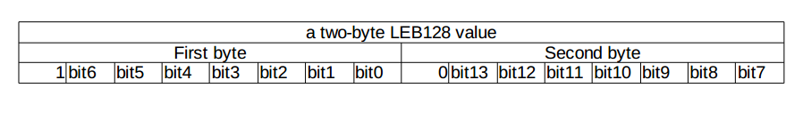
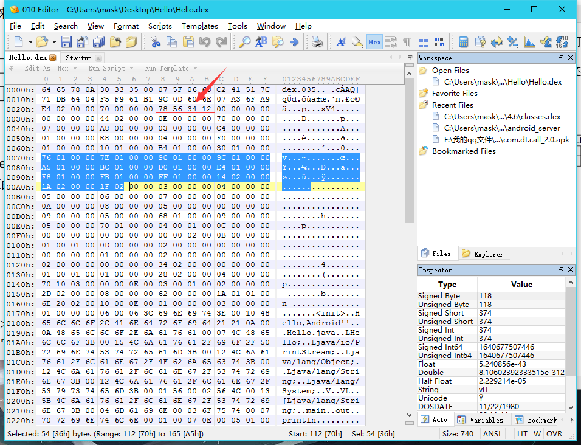
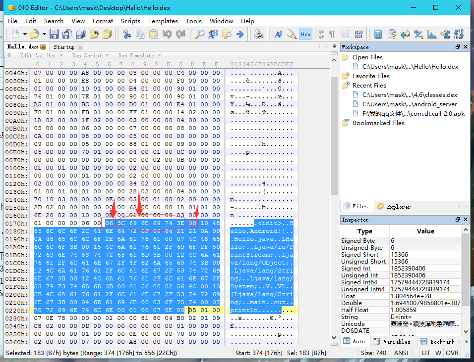
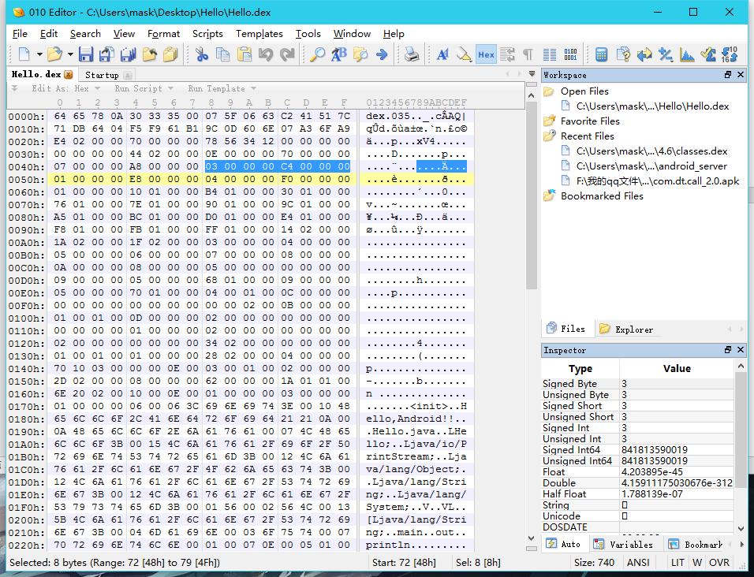
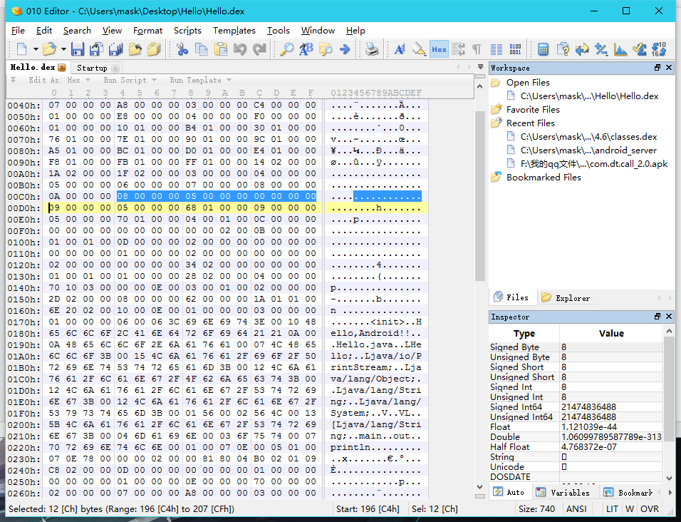
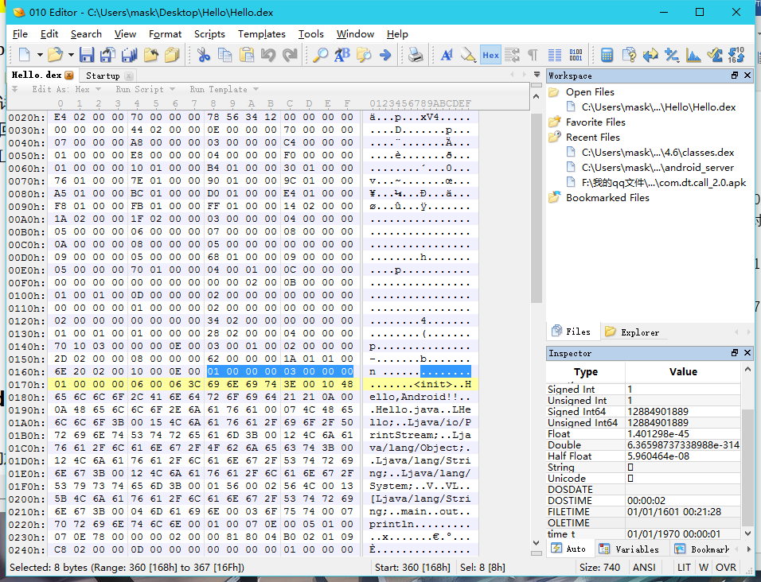
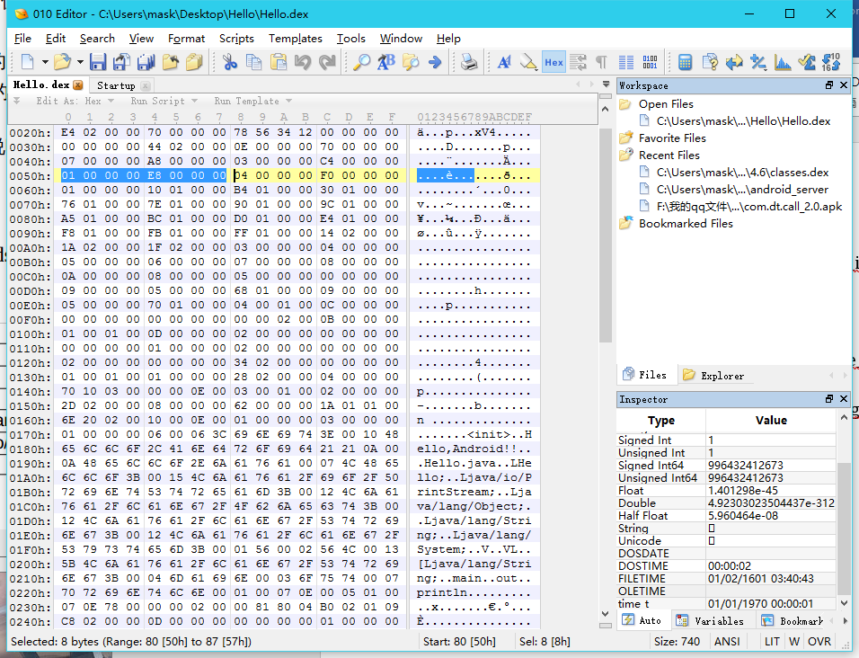
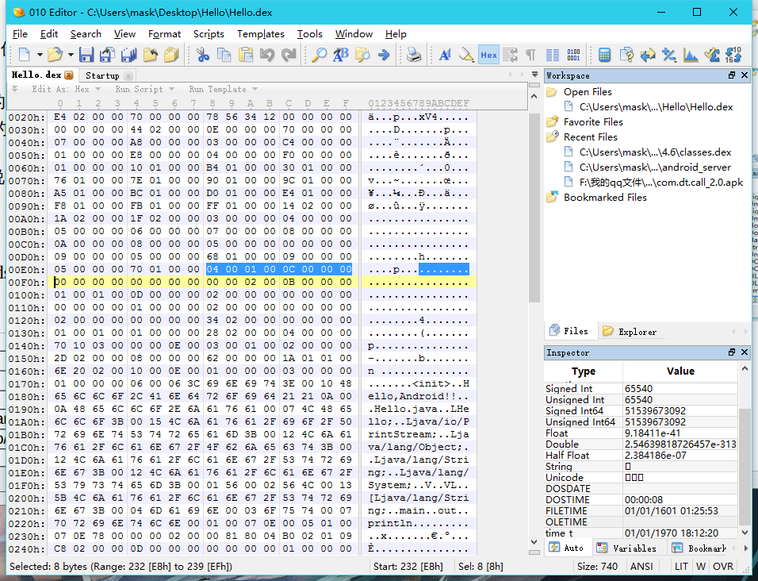

索引区：
----

1.string_ids:
这里索引了.dex文件中的所有字符串，这里的格式是string_ids_item，可以用下面的结构体表示：

    struct string_ids_item
    {
    uint string_data_off;
    }

string_data_off 只是一个偏移地址 ，它指向的数据结构为 string_data_item

    struct string_data_item
    {
    uleb128 utf16_size;
    ubyte data;
    }

这里说下LEB128格式，这是一种是基于 1 个 Byte 的一种不定长度的编码方式
若第一个 Byte 的最高位为 1 ，则表示还需要下一个 Byte 来描述 ，直至最后一个 Byte 的最高位为 0 。

根据header区的string_ids_size可知大小为0x0E,偏移位置为0x70，所以这一块即为string_ids中string_ids_item的二进制对应数据
先看第一个0x176索引到的字符串：

前面的string_data_item结构可以看出，前面有一个字节表示字符串的大小，这里是0x06那么后面六个字节都是用来表示这个字符串的，”0x00”表示结束，那么对应的即为“<init>“字符串，后面的依次类退

字符串的个数为0x0E个

2.type_ids:
-----------
type_ids 区索引了 .dex 文件里的所有数据类型
同样用结构体描述：

    struct type_ids_item
    {
    uint descriptor_idx;
    }

type_ids_item 里面 descriptor_idx 的值的意思 ，是 string_ids 里的 index 序号 ，是用来描述此type 的字符串

呐，这里的0x03,0x04,0x05,0x06,0x07,0x08,0x0A,0x0B,0x05是对应string_data_item中的描述数据类型的字符串：

3.proto_ids:
------------

proto_ids 里的元素为 proto_id_item , 结构如下

    struct proto_id_item
    {
    uint shorty_idx;
    uint return_type_idx;
    uint parameters_off;
    }

shorty_idx , 跟 type_ids 一样 ，它的值是一个 string_ids 的 index 号 ，最终是一个简短的字符串描述 ，用来说明该 method 原型 。

return_type_idx , 它的值是一个 type_ids 的 index 号 ，表示该 method 原型的返回值类型 。

parameters_off , 后缀 off 是 offset , 指向 method 原型的参数列表 type_list ; 若 method 没有参数 ，值为0 。参数列表的格式是 type_list ，结构从逻辑上如下描述 。

size 表示参数的个数 ；type_idx 是对应参数的类型 ，它的值是一个 type_ids 的 index 号 ，跟 return_type_idx 是同一种的东西

    struct type_list
    {
    uint size;
    ushort type_idx[size];
    }

header 里 proto_ids_size = 0x03 , proto_ids_off = 0xc4 , 它的二进制描述区如下 

从文件的0xc4得到prototype_id 的列表如下，共有3个proto_id_item

1)0x08 0x05 0x00
其中，第0x08(对应的是string_ids),第0x05(对应的是type_ids)分别是V,V,；第三个为0x00代表没有参数
2)0x09 0x05 0x0168 
 同理可推出VL，V;0x0168代表的是参数

前面的0x01代表参数个数，后面的代表在type_ids中的索引，值为Ljava/lang/String

3)0x09 0x05 0x170
同上面一样依次类推
为 VL ,V, Ljava/lang/String

4.field_ids:
------------
filed_ids 区里面有被本 .dex 文件引用的所有的 field , field_id_item 的逻辑结构描述：

    struct filed_id_item
    {
    ushort class_idx;
    ushort type_idx;
    uint name_idx;
    }

class_idx , 表示本 field 所属的 class 类型 , class_idx 的值是 type_ids 的index并且必须指向一个class 类型 。

type_idx , 表示本 field 的类型 ，它的值也是 type_ids 的一个 index 。

name_idx , 表示本 field 的名称 ，它的值是 string_ids 的一个 index 。

从header区看，field_ids_size=0x01,field_ids_off=0xE8

因为只有一个元素

5.method_ids
------------
它索引了.dex 文件里的所有的 method.method_ids 的元素格式是 method_id_item

    struct filed_id_item
    {
    ushort class_idx;
    ushort proto_idx;
    uint name_idx;
    }

class_idx , 和 name_idx 跟 fields_ids 是一样的 。class_idx , 表示本 method 所属的 class 类型 , class_idx 的值是 type_ids 的一个 index ， 并且必须指向一个 class 类型 。

name_idx , 表示本 method 的名称 ，它的值是 string_ids 的一个 index 。proto_idx 描述该 method 的原型 ，指向 proto_ids 的一个 index 。
header中的method_ids_size=0x04，method_ids_off=0xf0

索引区结束了！！！！！
-----------
总结的时候发现自己还是不太熟悉然后查阅了资料。。。。。。果然这个东西还是得多去理解

