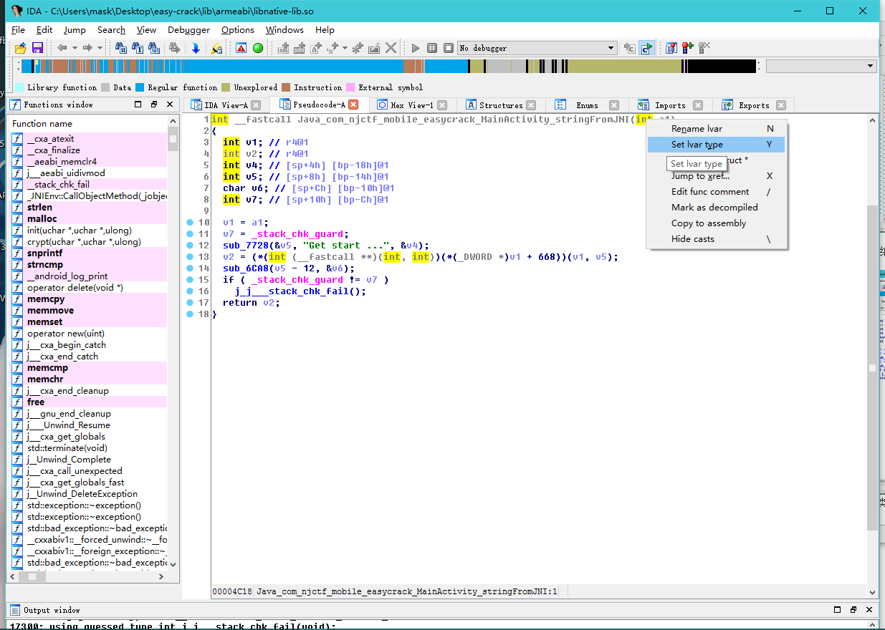
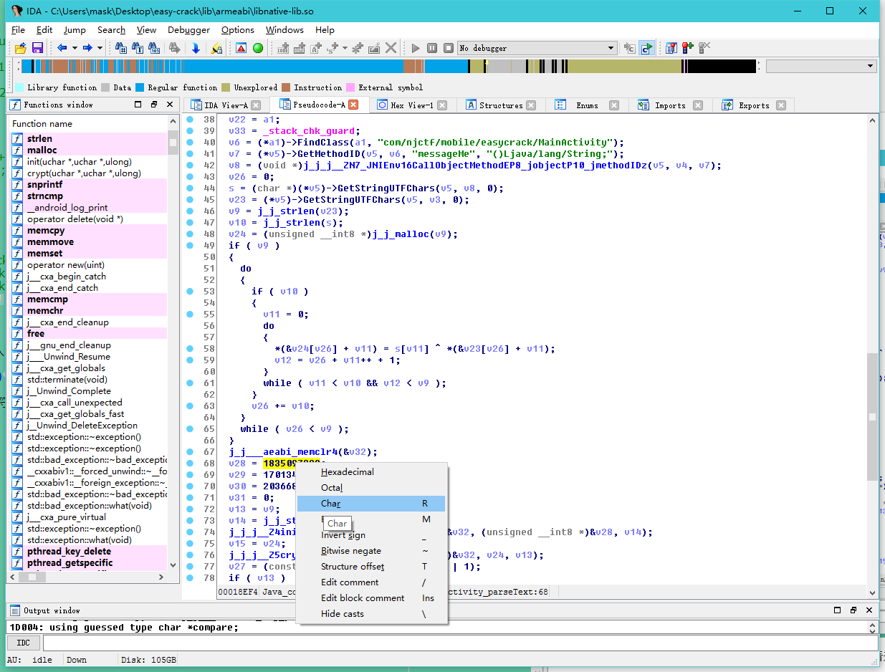
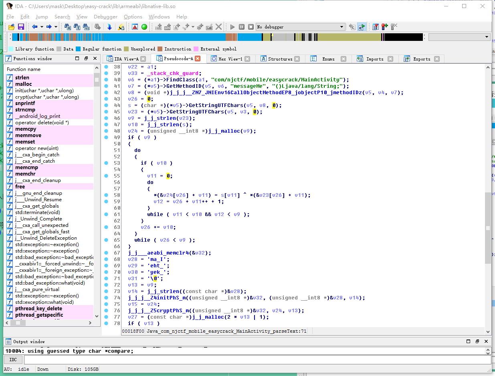
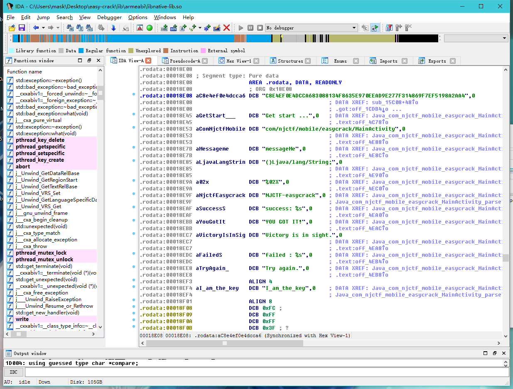

EasyCrack
---------

    package com.njctf.mobile.easycrack;
    
    import android.os.Bundle;
    import android.support.v7.app.AppCompatActivity;
    import android.text.Editable;
    import android.text.TextWatcher;
    
    public class MainActivity extends AppCompatActivity {
    class CheckText implements TextWatcher {
        CheckText(MainActivity arg1) {
            MainActivity.this = arg1;
            super();
        }

        public void afterTextChanged(Editable arg5) {
            MainActivity.this.findViewById(2131427416).setText("Status: " + MainActivity.this.parseText(arg5.toString()));
        }

        public void beforeTextChanged(CharSequence arg1, int arg2, int arg3, int arg4) {
        }

        public void onTextChanged(CharSequence arg1, int arg2, int arg3, int arg4) {
        }
    }

    static {
        System.loadLibrary("native-lib"); //加载native-lib库文件
    }

    public MainActivity() {
        super();
    }

    public String messageMe() {
        String v3 = "";
        int v4 = 51;
        String[] v1 = this.getApplicationContext().getPackageName().split("\\.");将包名按.分割
        char[] v6 = v1[v1.length - 1].toCharArray();
        int v7 = v6.length;
        int v5;
        for(v5 = 0; v5 < v7; ++v5) {
            v4 ^= v6[v5];
            v3 = v3 + (((char)v4));
        }

        return v3;
    }

    protected void onCreate(Bundle arg4) {
        super.onCreate(arg4);
        this.setContentView(2130968603);
        this.findViewById(2131427416).setText(this.stringFromJNI());
        this.findViewById(2131427415).addTextChangedListener(new CheckText(this)); 
    }

    public native String parseText(String arg1) { //声明native方法paresText
    }

    public native String stringFromJNI() {  //声明native方法stringFromJNI
    }
    }

用IDA打开so文件

这里stringFromJNI()并没有被识别，摁下快捷键p,再看就好了

F5大法好，毕竟汇编学得不咋地，

右键修复一下参数类型

根据NDK的知识可以知道，这个参数类型是JNIEnv*类型，是一个指向一个结构体的指针

然后再来修复一下函数的调用,在函数名那右键force call type：

然后再来看看第二个函数，同样需要修复，修复后如下：

    int __fastcall Java_com_njctf_mobile_easycrack_MainActivity_parseText(JNIEnv *a1, jobject a2, char *a3)
    {
      char *v3; // ST10_4@1 //传入的字符串，在C中表示字符串类型使用的是char数组
      jobject v4; // r4@1
      JNIEnv *v5; // r6@1
      jclass v6; // r0@1
      jmethodID v7; // r0@1
      void *v8; // r0@1
      size_t v9; // r4@1
      size_t v10; // r6@1
      size_t v11; // r2@3
      unsigned int v12; // r3@4
      unsigned __int32 v13; // r6@7
      unsigned __int32 v14; // r0@7
      unsigned __int8 *v15; // r4@7
      char *v16; // r5@8
      size_t v17; // r2@10
      int (*v18)(void); // r2@12
      const char *v19; // r4@13
      size_t v20; // r0@13
      int result; // r0@14
      JNIEnv *v22; // [sp+8h] [bp-134h]@1
      const char *v23; // [sp+Ch] [bp-130h]@1
      unsigned __int8 *v24; // [sp+10h] [bp-12Ch]@1
      char *s; // [sp+14h] [bp-128h]@1
      int v26; // [sp+18h] [bp-124h]@1
      const char *v27; // [sp+18h] [bp-124h]@7
      int v28; // [sp+1Ch] [bp-120h]@7
      signed int v29; // [sp+20h] [bp-11Ch]@7
      signed int v30; // [sp+24h] [bp-118h]@7
      int v31; // [sp+28h] [bp-114h]@7
      char v32; // [sp+2Ch] [bp-110h]@7
      int v33; // [sp+12Ch] [bp-10h]@1
    
      v3 = a3;
      v4 = a2;
      v5 = a1;
      v22 = a1;
      v33 = _stack_chk_guard;
      v6 = (*a1)->FindClass(a1, "com/njctf/mobile/easycrack/MainActivity"); //寻找MainActivity类
      v7 = (*v5)->GetMethodID(v5, v6, "messageMe", "()Ljava/lang/String;");//寻找MainActivity类中的messageMe()方法，得到他的MethodId，调用这个方法是需要传入这个ID
      v8 = (void *)j_j_j__ZN7_JNIEnv16CallObjectMethodEP8_jobjectP10_jmethodIDz(v5, v4, v7);//调用messageMe方法
      v26 = 0;
      s = (char *)(*v5)->GetStringUTFChars(v5, v8, 0); //一种类型转换，调用JNI结构体中的方法，s即为messageMe()方法的返回值
      v23 = (*v5)->GetStringUTFChars(v5, v3, 0);//同上
      v9 = j_j_strlen(v23); //获取输入字符串的长度
      v10 = j_j_strlen(s); //同上，获取s的长度
      v24 = (unsigned __int8 *)j_j_malloc(v9); //开辟一段空间，空间的长度为v9。即为输入字符串的长度，用来保存异或操作后的结果
      if ( v9 )
      {
    		do
    		{
      		if ( v10 )
      		{
        			v11 = 0;
       	 		do
        			{
          				*(&v24[v26] + v11) = s[v11] ^ *(&v23[v26] + v11); 使用s对输入的字符串进行异或处理
          				v12 = v26 + v11++ + 1;
        			}
        			while ( v11 < v10 && v12 < v9 );
      		}
      		v26 += v10;
    		}
    		while ( v26 < v9 );
      }
      j_j___aeabi_memclr4(&v32);
      v28 = 1835097929;
      v29 = 1701344351;
      v30 = 2036689759;
      v31 = 0;
      v13 = v9;
      v14 = j_j_strlen((const char *)&v28);
      j_j_j__Z4initPhS_m((unsigned __int8 *)&v32, (unsigned __int8 *)&v28, v14);
      v15 = v24;
      j_j_j__Z5cryptPhS_m((unsigned __int8 *)&v32, v24, v13);
      v27 = (const char *)j_j_malloc(2 * v13 | 1);
      if ( v13 )
      {
    v16 = (char *)v27;
    do
    {
      j_j_snprintf(v16, 3u, "%02X", *v15);
      v16 += 2;
      --v13;
      ++v15;
    }
    while ( v13 );
      }
      v17 = j_j_strlen(v27);
      if ( v17 && !j_j_strncmp(v27, compare, v17) )
      {
    j_j___android_log_print(2, "NJCTF-easycrack", "success: %s", v27);
    v19 = compare;
    v20 = j_j_strlen(compare);
    j_j_strncmp(v27, v19, v20);
    v18 = (int (*)(void))(*v22)->NewStringUTF;
      }
      else
      {
    j_j___android_log_print(6, "NJCTF-easycrack", "failed : %s", v27);
    v18 = (int (*)(void))(*v22)->NewStringUTF;
      }
      result = v18();
      if ( _stack_chk_guard != v33 )
    j_j___stack_chk_fail(result);
      return result;
    }

那么这个messageMe函数会返回什么呐，运行下试试：

    /**
     * Created by mask on 2017/4/3.
     */
    public class test {
    public static void main(String[] args) {
        String result = "";
        String packagename = "com.njctf.mobile.easycrack";
        int t = 51;
        String[] paname = packagename.split("\\.");
        for (char ch : paname[paname.length - 1].toCharArray()) {
            t ^= ch;
            result = result + ((char) t);
        }
        System.out.println(result);

    }
    }

运行结果为：

    "C:\Program Files\Java\jdk1.8.0_102\bin\java" -Didea.launcher.port=7532 "-Didea.launcher.bin.path=I:\IntelliJ IDEA Community Edition 2016.3\bin" -Dfile.encoding=UTF-8 -classpath "C:\Program Files\Java\jdk1.8.0_102\jre\lib\charsets.jar;C:\Program Files\Java\jdk1.8.0_102\jre\lib\deploy.jar;C:\Program Files\Java\jdk1.8.0_102\jre\lib\ext\access-bridge-64.jar;C:\Program Files\Java\jdk1.8.0_102\jre\lib\ext\cldrdata.jar;C:\Program Files\Java\jdk1.8.0_102\jre\lib\ext\dnsns.jar;C:\Program Files\Java\jdk1.8.0_102\jre\lib\ext\jaccess.jar;C:\Program Files\Java\jdk1.8.0_102\jre\lib\ext\jfxrt.jar;C:\Program Files\Java\jdk1.8.0_102\jre\lib\ext\localedata.jar;C:\Program Files\Java\jdk1.8.0_102\jre\lib\ext\nashorn.jar;C:\Program Files\Java\jdk1.8.0_102\jre\lib\ext\sunec.jar;C:\Program Files\Java\jdk1.8.0_102\jre\lib\ext\sunjce_provider.jar;C:\Program Files\Java\jdk1.8.0_102\jre\lib\ext\sunmscapi.jar;C:\Program Files\Java\jdk1.8.0_102\jre\lib\ext\sunpkcs11.jar;C:\Program Files\Java\jdk1.8.0_102\jre\lib\ext\zipfs.jar;C:\Program Files\Java\jdk1.8.0_102\jre\lib\javaws.jar;C:\Program Files\Java\jdk1.8.0_102\jre\lib\jce.jar;C:\Program Files\Java\jdk1.8.0_102\jre\lib\jfr.jar;C:\Program Files\Java\jdk1.8.0_102\jre\lib\jfxswt.jar;C:\Program Files\Java\jdk1.8.0_102\jre\lib\jsse.jar;C:\Program Files\Java\jdk1.8.0_102\jre\lib\management-agent.jar;C:\Program Files\Java\jdk1.8.0_102\jre\lib\plugin.jar;C:\Program Files\Java\jdk1.8.0_102\jre\lib\resources.jar;C:\Program Files\Java\jdk1.8.0_102\jre\lib\rt.jar;C:\Users\mask\Desktop\Algorithms(Fourth)\1.1.6.1\out\production\1.1.6.1;I:\IntelliJ IDEA Community Edition 2016.3\lib\idea_rt.jar" com.intellij.rt.execution.application.AppMain test
    V7D=^,M.E

再往下分析，会发现这里有两个函数，第二个看函数名应该是个加密函数，跟进查看：

    int __fastcall crypt(int result, unsigned __int8 *a2, unsigned __int32 a3)
    {
      int v3; // r3@1
      int v4; // r4@2
      int v5; // r6@3
    
      v3 = 0;
      if ( a3 )
      {
    v4 = 0;
    do
    {
      v3 = (v3 + 1) % 256;
      v5 = *(_BYTE *)(result + v3);
      v4 = (v5 + v4) % 256;
      *(_BYTE *)(result + v3) = *(_BYTE *)(result + v4);
      *(_BYTE *)(result + v4) = v5;
      *a2 ^= *(_BYTE *)(result + ((*(_BYTE *)(result + v3) + v5) & 0xFF));
      --a3;
      ++a2;
    }
    while ( a3 );
   

大佬说一眼看出RC4加密，可能我太菜，没有看出来23333
，那么第一个功能大致可以知道是用来初始化密钥的，跟进去看看：

    int __fastcall init(unsigned __int8 *a1, unsigned __int8 *a2, unsigned __int32 a3)
    {
      signed int v3; // r5@1
      int v4; // r4@1
      int v5; // r6@1
      int v6; // r1@2
      char *v7; // r0@2
      unsigned __int8 *v8; // r1@3
      int v9; // r2@4
      int result; // r0@5
      unsigned __int8 *v11; // [sp+4h] [bp-11Ch]@1
      unsigned __int32 v12; // [sp+8h] [bp-118h]@1
      unsigned __int8 *v13; // [sp+Ch] [bp-114h]@1
      char v14[256]; // [sp+10h] [bp-110h]@1
      int v15; // [sp+110h] [bp-10h]@1
    
      v12 = a3;
      v11 = a2;
      v13 = a1;
      v15 = _stack_chk_guard;
      v3 = 256;
      j_j___aeabi_memclr4(v14);
      v4 = 0;
      v5 = 0;
      do
      {
    v13[v5] = v5;
    j_j_j___aeabi_uidivmod(v5, v12);
    v7 = v14;
    v14[v5++] = v11[v6];
      }
      while ( v5 != 256 );
      v8 = v13;
      do
      {
    v9 = *v8;
    v4 = (v9 + v4 + (unsigned __int8)*v7) % 256;
    `*v8 = v13[v4];`
    v13[v4] = v9;
        --v3;
    	++v7;
    	++v8;
      }
      while ( v3 );
      result = _stack_chk_guard - v15;
      if ( _stack_chk_guard != v15 )
    j_j___stack_chk_fail(result);
      return result;
    }

那么这个init函数传入的参数是啥，来看看先：

第二个参数是一个字符串，这里用char*表示，v28是首地址，呢么来看看这个字符串到底是什么。嘿嘿~

全都这样操作一下，然后

剩下两个参数分别是一个数组和一个字符串长度

那么接着刚刚的再往下分析：

    v27 = (const char *)j_j_malloc(2 * v13 | 1); //这个就是2*v13+1
      if ( v13 )
      {
    v16 = (char *)v27;
    do
    {
      j_j_snprintf(v16, 3u, "%02X", *v15);
      v16 += 2;
      --v13;
      ++v15;
    }
    while ( v13 );
      }
      v17 = j_j_strlen(v27);
      if ( v17 && !j_j_strncmp(v27, compare, v17) ) 
      {
    		j_j___android_log_print(2, "NJCTF-easycrack", "success: %s", v27); //正确分支
    		v19 = compare;
    		v20 = j_j_strlen(compare);
    		j_j_strncmp(v27, v19, v20);
    		v18 = (int (*)(void))(*v22)->NewStringUTF;
      }
      else
      {
    		j_j___android_log_print(6, "NJCTF-easycrack", "failed : %s", v27);
    		v18 = (int (*)(void))(*v22)->NewStringUTF;
      }
      result = v18();
      if ( _stack_chk_guard != v33 )
    		j_j___stack_chk_fail(result);
      return result;
    }

这里compare是啥呢？点进去看看

是这样一串东西

C8E4EF0E4DCCA683088134F8635E970EEAD9E277F314869F7EF5198A2AA4

那么函数的作用大致都了解了，思路就是：

执行messageMe()函数得到一个字符串->
循环使用异或后的字符串跟输入的字符串进行异或->
将异或后的数据进行RC4加密，然后跟compare字符串对比，一样则校验通过

最后的脚本我是直接拿大佬的过来用的23333，懒得写了：

    # coding = utf-8
    
    import binascii
    
    def main():
    key_rc4 = "I_am_the_key"
    rc4_encrypted = binascii.a2b_hex("C8E4EF0E4DCCA683088134F8635E970EEAD9E277F314869F7EF5198A2AA4")

    # Init rc4_key
    j = 0;
    s = range(256)
    for i in range(256):
        j = (j + s[i] + ord(key_rc4[i % len(key_rc4)])) % 256
        s[i], s[j] = s[j], s[i]
    i = 0
    j = 0

    # Rc4 decryption
    rc4_decrypted = []
    for data in rc4_encrypted:
        i = (i + 1) % 256
        j = (j + s[i]) % 256
        s[i], s[j] = s[j], s[i]
        rc4_decrypted.append(chr(ord(data) ^ s[(s[i] + s[j]) % 256]))
    rc4_decrypted =  "".join(rc4_decrypted)
    #print rc4_decrypted

    key_xor = "V7D=^,M.E"
    key_xor_len = len(key_xor)
    Flag = []
    for i in range(len(rc4_decrypted)):
         Flag.append(chr(ord(rc4_decrypted[i]) ^ ord(key_xor[i % key_xor_len])))
    print "".join(Flag)

    if __name__ == '__main__':
    main()

flag为：

	It_s_a_easyCrack_for_beginners

大佬以及解释的很全了，我这多了一点新手的解释而已23333：

[http://www.wangzhixian.org/AndroidCrackMe/2017XCTF&NJCTF-easycrack-100/article.html](http://www.wangzhixian.org/AndroidCrackMe/2017XCTF&NJCTF-easycrack-100/article.html)
