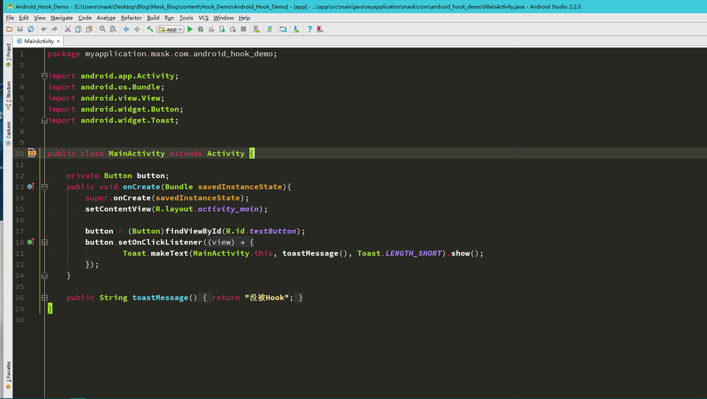
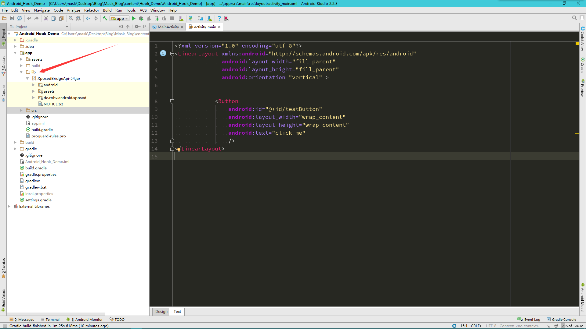
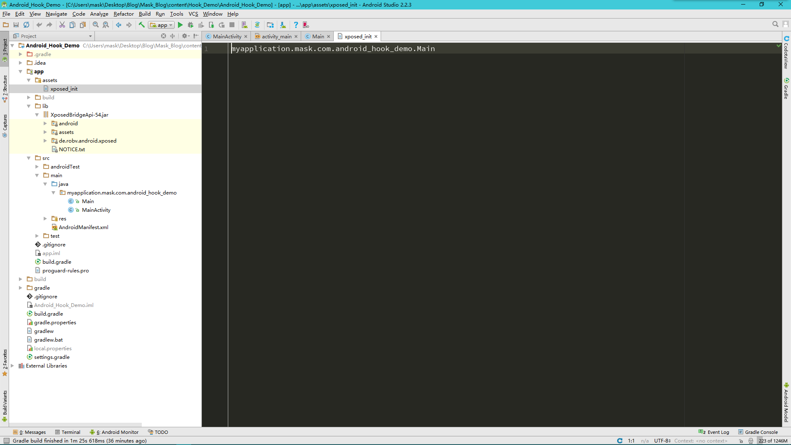
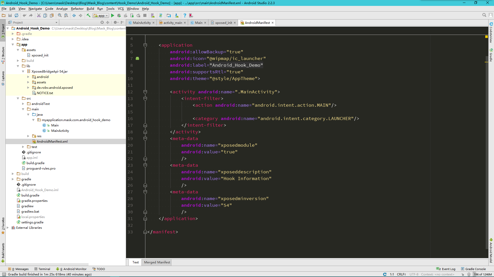
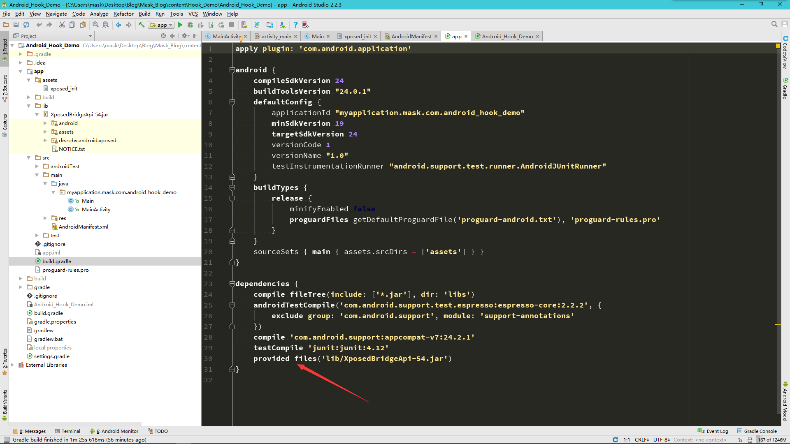
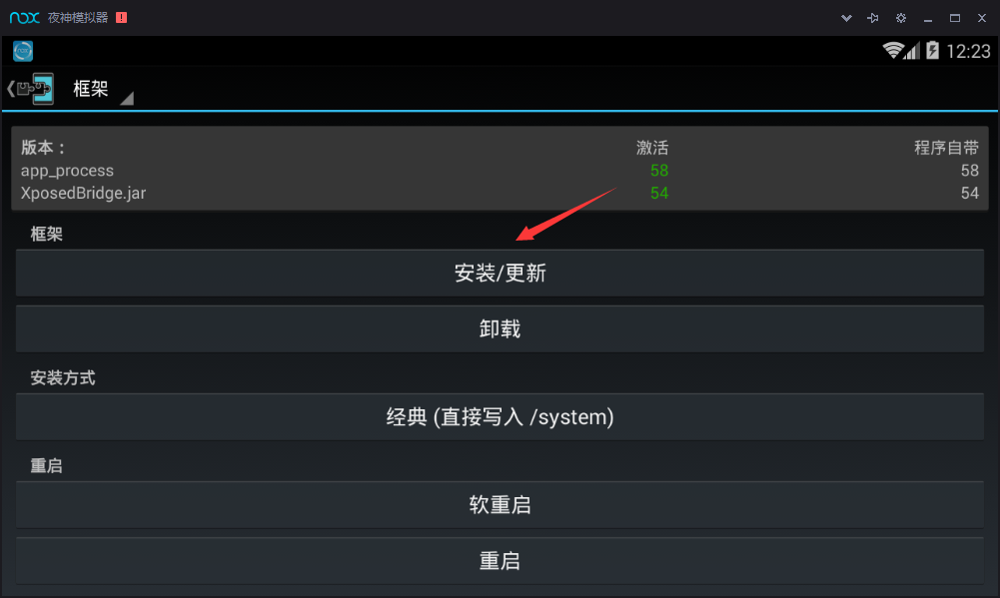
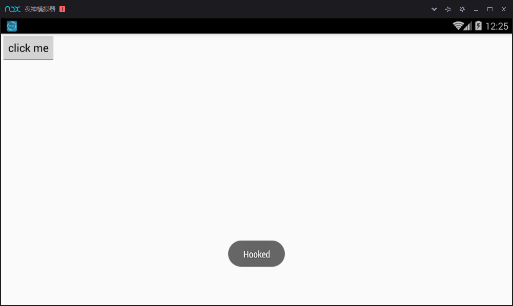

## 一个简单的Hook Demo ##
首先新建一个Android Studio项目工程

定义一个Button,然后再定义一个点击事件，在没被Hook的情况下，Toast出"没被Hook“

这时候来到Project目录下，在app下新建一个lib文件夹，将XposedBridgeApi-54.jar导入（我这里使用的Android4.4所以对应的是这个版本，4.4以上的系统可以去网上下载对应的jar包，）
第三方jar包
下载地址[http://forum.xda-developers.com/showthread.php?t=3034811](http://forum.xda-developers.com/showthread.php?t=3034811)

这时候我们就能调用这个第三方库来编写Xposed函数了
新建一个方法

    package myapplication.mask.com.android_hook_demo;
    import android.util.Log;import de.robv.android.xposed.IXposedHookLoadPackage;
    import de.robv.android.xposed.XC_MethodHook;
    import de.robv.android.xposed.XposedHelpers;
    import de.robv.android.xposed.callbacks.XC_LoadPackage;
    
    /**
     * Created by mask on 2017/3/4.
     */
    
    public class Main implements IXposedHookLoadPackage {
    	@Override
    		public void handleLoadPackage(XC_LoadPackage.LoadPackageParam loadPackageParam)throws Throwable{
    
    		Log.i("XposedDemo", "Call handleLoadPackage");
    		if (loadPackageParam.packageName.equals("myapplication.mask.com.android_hook_demo")){
    		Log.i("XposedDemo", "Enter " + loadPackageParam.packageName);
       		Class clazz = loadPackageParam.classLoader.loadClass("myapplication.mask.com.android_hook_demo.MainActivity");
    		XposedHelpers.findAndHookMethod(clazz, "toastMessage", new XC_MethodHook() {

    	@Override
    		protected void beforeHookedMethod(MethodHookParam param) throws Throwable {
    				super.beforeHookedMethod(param);
    
    				}
    	@Override
    		protected void afterHookedMethod(MethodHookParam param)throws Throwable{
    
    				param.setResult("Hooked");
    
    				}
    			});
    		}
    	}
    }

这里我们需要Hook的方法就是那个Toast方法，并让它显示“Hooked"。
新建一个实现IXposedHookLoadPackage接口的类，并实现handleLoadPackage方法，让系统打印出相应的语句，判断是否Hook住了相应的方法。首先调用一个loadPackageParam.packageName.equals()判断是否找到了对应的包名，然后看看loadPackageParam.classLoader.loadClass()方法，这个方法是找到对应的类名，这里我们用一个Class接受，然后是findAndHookMethod方法，这里传入了三个参数，分别是对应的类名，要Hook的方法，XC_MethodHook()函数。
XC_MethodHook()函数实现了两个方法，一个是Hook前的，一个是Hook后的，重点看这个Hook后需要回调的函数，afterHookedMethod函数传入了一个参数，这个参数是toastMessage()方法返回的结果，我们这里把他截住，并设置自己的值，那么这就是一个简单地Xposed函数。

----------

接下来，新建一个assets文件夹，然后新建一个xposed_init文件，这个文件是用来告诉Hook入口的，即那个类里实现了Hook函数

下一个就是修改项目的AndroidMainifest.xml文件 
    
		<meta-data
            android:name="xposedmodule"
            android:value="true"  //值为true说明这个Xposed模块有效
            />

        <meta-data
            android:name="xposeddescription"
            android:value="Hook Information" //这里是一些对这个模块的描述信息
            />

        <meta-data
            android:name="xposedminversion"
            android:value="54"		//最低要求版本号
            />

最后修改一下项目的build.gradle文件
导入第三方模块的时候会有一下几种方式:

方式:1： 它就会自动把这个包下载下来， 并且引用它， 节省Git空间， 而且修改版本也很方便

    compile 'com.android.support:support-v4:23.3.0'

方式2： 引用libs下所有jar包

    compile fileTree(dir: 'libs', include: ['*.jar'])

方式3： 引用一个jar

    compile files('libs/fastjson-1.1.53.android.jar')

方式4： 引用一个aar文件， 注意并不能像方式2那样自动引用全部的aar， 而需要对每个aar分别进行引用

    compile(name: 'aar_file_name', ext: 'aar')

方式5： 引用库类型的项目

    compile project(':xxxsdk')

方式6： 仅仅在编译时使用， 但最终不会被编译到apk或aar里

    provided files('libs/glide-3.7.0.jar')
那么我们这里只是编译是需要使用这个jar包即可，因为我们会在手机里安装一个Xposed框架，那么我们的Xposed模块就能被它调用，所以我们不需要将这个jar包打包进apk文件，那么我们修改一下

然后Xposed模块算是编写完成了，打开虚拟机，我们需要获取root权限，然后下载一个Xposed框架安装器，下载地址[ http://repo.xposed.info/module/de.robv.android.xposed.installer]( http://repo.xposed.info/module/de.robv.android.xposed.installer)：

安装完后重启即可
然后安装我们刚刚编写的apk文件，会提示你激活重启，最后

成功！
---

