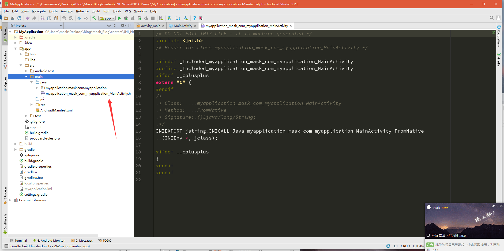
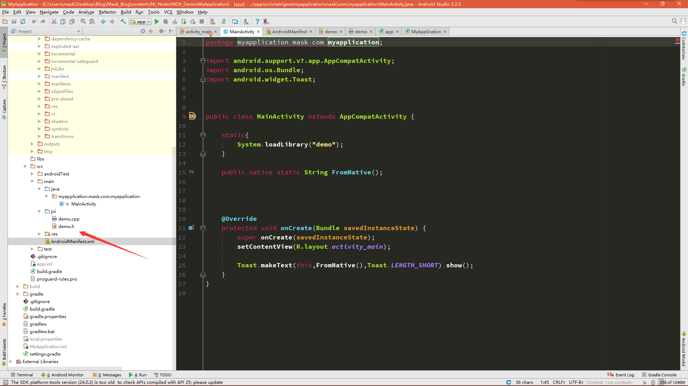
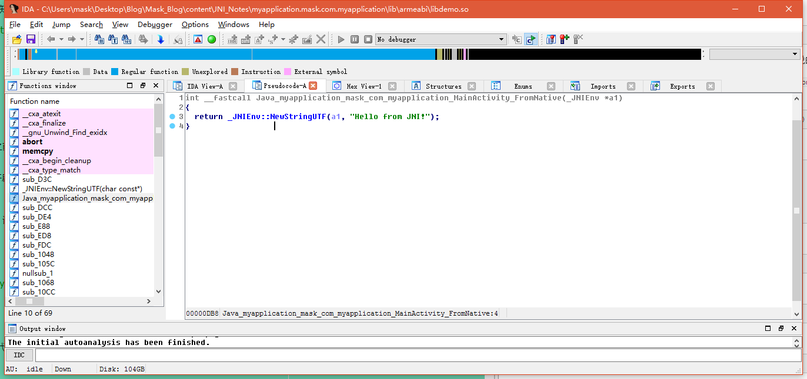
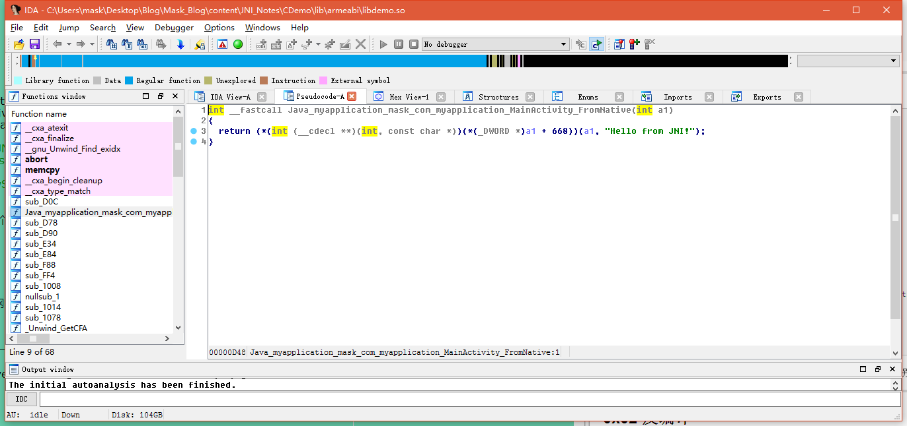
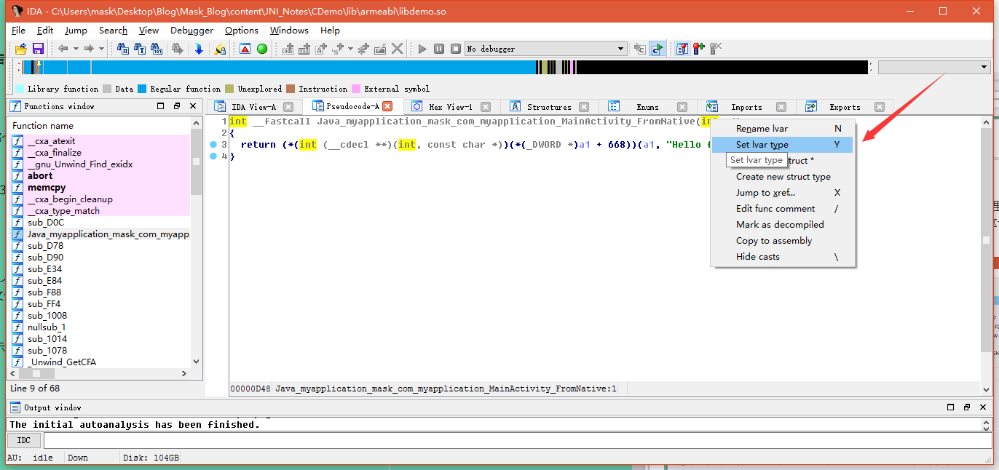
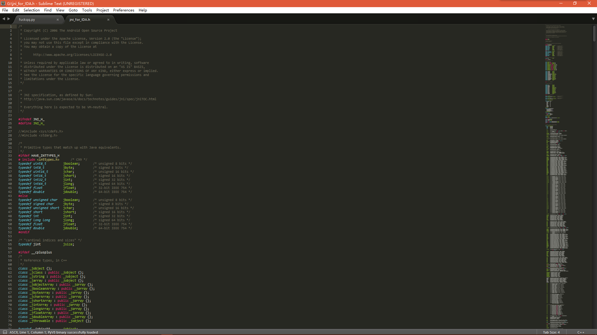
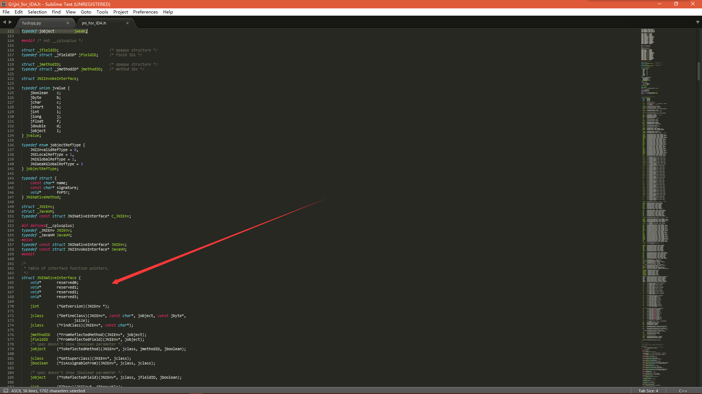
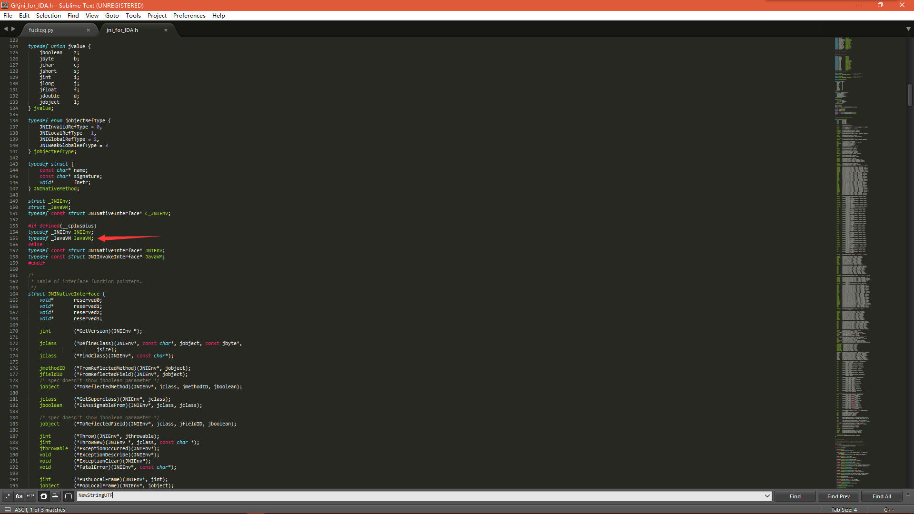
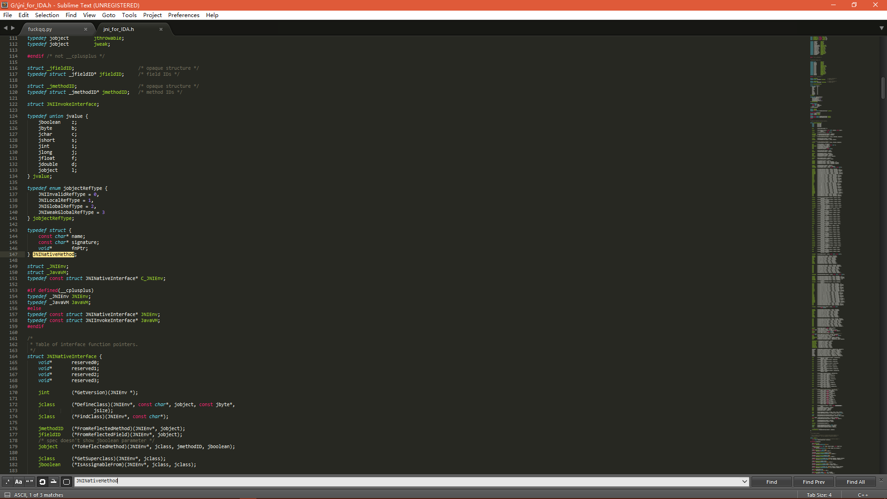

0x00 闲言碎语
----

最近状态很糟，写点东西静下心，捋捋思绪，就总结下之前学得JNI的一些知识点好了 

0x01 一个NDK demo
----
新建项目工程

    package myapplication.mask.com.myapplication;
    
    import android.support.v7.app.AppCompatActivity;
    import android.os.Bundle;
    import android.widget.Toast;
    
    
    
    public class MainActivity extends AppCompatActivity {

    static{
        System.loadLibrary("demo");//载入类库
    }

    public native static String FromNative();//声明Native方法

    @Override
    protected void onCreate(Bundle savedInstanceState) {
        super.onCreate(savedInstanceState);
        setContentView(R.layout.activity_main);

        Toast.makeText(this,FromNative(),Toast.LENGTH_SHORT).show();
    }
    }

然后Make Project

下面切换到`app/src/main/java`目录下，执行下面的命令生成一个JNI头文件

    javah myapplication.mask.com.myapplication.MainActivity

我们来看看这个头文件都有些啥

    /* DO NOT EDIT THIS FILE - it is machine generated */
    #include <jni.h> //需要导入jni.h头文件
    /* Header for class myapplication_mask_com_myapplication_MainActivity */
    
    #ifndef _Included_myapplication_mask_com_myapplication_MainActivity
    #define _Included_myapplication_mask_com_myapplication_MainActivity
    #ifdef __cplusplus
    extern "C" {
    #endif
    /*
     * Class: myapplication_mask_com_myapplication_MainActivity /*类名*/
     * Method:FromNative   /*方法名*/
     * Signature: ()Ljava/lang/String; /*签名信息（是不是很像smali代码？！！反正我第一反应是这个*/
     */
    JNIEXPORT jstring JNICALL Java_myapplication_mask_com_myapplication_MainActivity_FromNative
      (JNIEnv *, jclass);//这个Native方法的声明
    
    #ifdef __cplusplus
    }
    #endif
    #endif

这里有个概念那就是我怎么知道这个声明的方法就是我要调用的呢？

这个是JNI规定的写法，为了方便，编译时会自动在头文件生成，包含的内容一看便知，将包名中的"
."换成了"_"然后+“_”+类名

    myapplication_mask_com_myapplication_MainActivity

为了方便，我把这个头文件重命名为demo.h，然后新建一个JNI目录，将demo.h移动到JNI下

然后开始编译，
将项目的build.gradle改成如下：

    apply plugin: 'com.android.model.application' //此处加了model
    model {  //对应加上model
    android {
        compileSdkVersion 25
        buildToolsVersion "24.0.1"
        defaultConfig {
            applicationId "myapplication.mask.com.myapplication"
            minSdkVersion.apiLevel 19 //此处修改了
            targetSdkVersion.apiLevel 25//此处修改了
            versionCode 1
            versionName "1.0"
            testInstrumentationRunner "android.support.test.runner.AndroidJUnitRunner"
        }
        buildTypes {
            release {
                minifyEnabled false
                proguardFiles.add(file("proguard-rules.pro"))//此处修改了
            }
        }
        ndk {
            moduleName "demo" //库名
            stl "stlport_static"//以静态链接方式使用的stlport版本的STL
            ldLibs.addAll(["log","z","android"]) 
            abiFilters.addAll(['armeabi','armeabi-v7a']) //abi平台
        }
        //sourceSets { main { jni.srcDirs = ['src/main/jni', 'src/main/jni/'] } }
    }
    }
    
    dependencies {
    compile fileTree(dir: 'libs', include: ['*.jar'])
    androidTestCompile('com.android.support.test.espresso:espresso-core:2.2.2', {
        exclude group: 'com.android.support', module: 'support-annotations'
    })
    compile 'com.android.support:appcompat-v7:25.1.0'
    testCompile 'junit:junit:4.12'
    }

再来修改工程下的build.gradle:

    // Top-level build file where you can add configuration options common to all sub-projects/modules.
    
    buildscript {
    repositories {
        jcenter()
    }
    dependencies {
        classpath 'com.android.tools.build:gradle-experimental:0.8.3' //此处需要修改gradle的版本号

        // NOTE: Do not place your application dependencies here; they belong
        // in the individual module build.gradle files
    }
    }
    
    allprojects {
    repositories {
        jcenter()
    }
    }
    
    task clean(type: Delete) {
    delete rootProject.buildDir
    }
    

其他编译方式：

[http://www.tuicool.com/articles/3mu22ie](http://www.tuicool.com/articles/3mu22ie)

[http://www.jianshu.com/p/9d001d966053?utm_source=tuicool&utm_medium=referral](http://www.jianshu.com/p/9d001d966053?utm_source=tuicool&utm_medium=referral)

----------

然后新建一个demo.cpp文件

    //
    // Created by mask on 2017/4/25.
    //
    #include <iostream>
    #include "demo.h"
    #include <jni.h>
    
    using namespace std;
    
    /*头文件中的信息，可以直接复制过来
     * Class: myapplication_mask_com_myapplication_MainActivity
     * Method:FromNative
     * Signature: ()Ljava/lang/String;
     */
    JNIEXPORT jstring JNICALL Java_myapplication_mask_com_myapplication_MainActivity_FromNative
      (JNIEnv *env, jclass clazz)
      {
    return env->NewStringUTF("Hello from JNI!");
      }

然后运行：

----------

如果用c写的话，demo.c
    
    //
    // Created by mask on 2017/4/25.
    //

    #include "demo.h"
    #include <jni.h>
    

    
    /*
     * Class: myapplication_mask_com_myapplication_MainActivity
     * Method:FromNative
     * Signature: ()Ljava/lang/String;
     */
    JNIEXPORT jstring JNICALL Java_myapplication_mask_com_myapplication_MainActivity_FromNative
      (JNIEnv *env, jclass clazz)
      {
    return (*env)->NewStringUTF(env,"Hello from JNI!");
      }

可以发现这(*env)其实是个二级指针，而c++则是使用了一级指针，至于分别指向了哪，不急，下面开始切入正题

----------

0x02 反汇编
--------

那么可以把AS关了，把刚刚那么应用解压一下，你会发现有一个lib目录，这就是一般情况下库文件存放的地方

用IDA打开那个so文件(我一般喜欢打开armeabi下的)

这个就是我们编写的Native函数,跟进去

 

    ; =============== S U B R O U T I N E =======================================
    .text:00000D78
    .text:00000D78 ; Attributes: bp-based frame fpd=8
    .text:00000D78
    .text:00000D78 ; _DWORD __fastcall _JNIEnv::NewStringUTF(_JNIEnv *__hidden this, const char *)
    .text:00000D78 WEAK _ZN7_JNIEnv12NewStringUTFEPKc
    .text:00000D78 _ZN7_JNIEnv12NewStringUTFEPKc   ; CODE XREF: Java_myapplication_mask_com_myapplication_MainActivity_FromNative+14p
    .text:00000D78
    .text:00000D78 var_8   = -8
    .text:00000D78 var_4   = -4
    .text:00000D78
    .text:00000D78 PUSH{R7,LR}
    .text:00000D7A SUB SP, SP, #8
    .text:00000D7C ADD R7, SP, #0
    .text:00000D7E STR R0, [R7,#8+var_4]
    .text:00000D80 STR R1, [R7,#8+var_8]
    .text:00000D82 LDR R3, [R7,#8+var_4]
    .text:00000D84 LDR R2, [R3]
    .text:00000D86 MOVSR3, #0x29C
    .text:00000D8A LDR R3, [R2,R3]
    .text:00000D8C LDR R1, [R7,#8+var_4]
    .text:00000D8E LDR R2, [R7,#8+var_8]
    .text:00000D90 MOVSR0, R1
    .text:00000D92 MOVSR1, R2
    .text:00000D94 BLX R3
    .text:00000D96 MOVSR3, R0
    .text:00000D98 NOP
    .text:00000D9A MOVSR0, R3
    .text:00000D9C MOV SP, R7
    .text:00000D9E ADD SP, SP, #8
    .text:00000DA0 POP {R7,PC}
    .text:00000DA0 ; End of function _JNIEnv::NewStringUTF(char const*)

一句一句分析：

导入函数

     EXPORT Java_myapplication_mask_com_myapplication_MainActivity_FromNative
    .text:00000DA4 Java_myapplication_mask_com_myapplication_MainActivity_FromNative

将R7和LR寄存器的值压入栈（什么？啥是寄存器？啥是内存栈？呐，这个都不知道的话，下面你忽略吧0.0），LR寄存器是用来保存下一条指令的

    PUSH{R7,LR}

SP = SP -8 

SP寄存器是用来保存栈顶元素的，而内存栈是自下到上，降序的，此处SP减去8，就是为了开辟出一段栈空间

    SUB SP, SP, #8

R7 = SP + 0 

此处相当于R7 = SP，将SP的值传给R7，为什么这样做呢？这其实是一种保护机制，因为SP是时刻指向栈顶的，可以看到，下面的一些操作都是以SP为基地址进行的，那么我们这里用R7来替代SP，，将SP的值保存在R7中，我们后边调用函数出栈时，在将R7的值还给SP，这样可以保证栈平衡

    ADD R7, SP, #0

将R0寄存器的值赋给(R7+8-4)地址处，这是一个写操作

     STR R0, [R7,#8+var_4]

将R1寄存器的值赋给(R7+8-8)地址处，这是一个写操作

    STR R1, [R7,#8+var_8]

那么RO,R1寄存器的值是什么呢？在ARM中，前4个参数是用R0-R3来保存的（如果多余4个参数，剩下的则是用栈来操作）

那么JNI函数的第一个参数是一个JNIEnv 类型的指针`*env`，第二个参数是一个jclass类型的参数clazz或者是一个jobject类型的object，呐，这个函数其实只有一个参数，那就是JNIEnv类型的指针`*env`,为啥没有第二个，因为压根就啥也没操作，这里就只是return了一个字符串而已。。。

将第一个参数保存到R3寄存器

    LDR R3, [R7,#8+var_4]

将`aHelloFromJni - 0xDB6`的值赋给R2，这里有个小tip，你可以鼠标右键点击那个“=”,他会自动帮你转会为最终地址

    LDR R2, =(aHelloFromJni - 0xDB6)

R2 = R2 + PC

PC寄存器为当前指令，但是这里需要注意，之前我也搞错过，ARM在执行命令时，其实是分三步走的

1.取址

2.编译

3.执行

那么当我执行第一条命令时，第二条指令在编译，第三条指令在取址，过程大概如下：

     取址------------------编译-----------------------执行
    					   取址-----------------------编译-----------------执行
    										    	 取址-----------------编译-----------------执行
那么就好理解了，此时PC的值0x00000DB6

那么R2此时的值为(aHelloFromJni - 0xDB6+0xDB6)处的值,那么就是`Hello from JNI!`后面的注释也有给出

    ADD R2, PC

将R3的值赋给R0，并且会影响标志位

    MOVS R0, R3 

将R2的值赋给R1，并且会影响标志位

    MOVS R1, R2

上面两步其实是为子函数做准备，将`*env`和`Hello from JNI!`进行传参，和之前说的一样，是用R0,R1保存前两个参数

BL进行函数跳转，根据注释可以知道，调用的是_`JNIEnv::NewStringUTF(char const*)`函数，有兴趣可以跟过去分析，过程都差不多

    BL  _ZN7_JNIEnv12NewStringUTFEPKc ; _JNIEnv::NewStringUTF(char const*)

NOP为空操作，就是啥也不干

    MOVS R3, R0
    
    NOP
    
    MOVS R0, R3

这里将R7的值赋给SP，和我们之前说的一样

    MOV SP, R7
这里SP = SP+8，回收调之前开辟的空间

    ADD SP, SP, #8

出栈，此时LR的值保存到PC中，说明结束上述操作，开始下一条指令

    POP {R7,PC}

函数结束

    ; End of function Java_myapplication_mask_com_myapplication_MainActivity_FromNative

----------

汇编分析完了，我们再来看看伪代码，可以更好的理解刚刚的操作，F5大法好哇

哗擦，居然识别出来了。。。。。。。还想演示一遍修复参数呢！！！！

待我翻下刚刚C版本写的那个

呐，稳，没识别出来23333

----------

开始修复

之前说过，JNI函数的第一个参数一般默认是JNIEnv的结构体指针，那么这里我们要让IDA能够识别JNI结构体，我们需要导入一个JNI.h头文件（我的IDA好像自带），这个文件是啥，待会再说，这个IDA.h你可以去网上下载，其实NDK就自带这个

导入该文件，成功会有提示，提示啥我忘了，反正会告诉你导入成功了

然后

修复参数类型，输入JNIEnv*

我这里函数都给我识别出来了。。。，其实应该还有一步，如果你的函数没有正确识别的话，右键你的函数名，会显示Force call type，点击这个就能正确识别了 

----------
这里还有几个疑问没解决

1.JNIEnv* env这个指针到底指向哪？

2.JNI.h是干啥的？

3.第二个参数类型何时是jclass何时是jobject

0x03 JNI.h
----------

先来看看这个JNI.h是啥

这里其实是一些数据类型转换，比如JAVA中的

    #ifdef HAVE_INTTYPES_H
    # include <inttypes.h>  /* C99 */
    typedef uint8_t jboolean;   /* unsigned 8 bits */
    typedef int8_t  jbyte;  /* signed 8 bits */
    typedef uint16_tjchar;  /* unsigned 16 bits */
    typedef int16_t jshort; /* signed 16 bits */
    typedef int32_t jint;   /* signed 32 bits */
    typedef int64_t jlong;  /* signed 64 bits */
    typedef float   jfloat; /* 32-bit IEEE 754 */
    typedef double  jdouble;/* 64-bit IEEE 754 */
    #else
    typedef unsigned char   jboolean;   /* unsigned 8 bits */
    typedef signed char jbyte;  /* signed 8 bits */
    typedef unsigned short  jchar;  /* unsigned 16 bits */
    typedef short   jshort; /* signed 16 bits */
    typedef int jint;   /* signed 32 bits */
    typedef long long   jlong;  /* signed 64 bits */
    typedef float   jfloat; /* 32-bit IEEE 754 */
    typedef double  jdouble;/* 64-bit IEEE 754 */

这里是C和C++中的一些差别

    #ifdef __cplusplus
    /*
     * Reference types, in C++
     */
    class _jobject {};
    class _jclass : public _jobject {};
    class _jstring : public _jobject {};
    class _jarray : public _jobject {};
    class _jobjectArray : public _jarray {};
    class _jbooleanArray : public _jarray {};
    class _jbyteArray : public _jarray {};
    class _jcharArray : public _jarray {};
    class _jshortArray : public _jarray {};
    class _jintArray : public _jarray {};
    class _jlongArray : public _jarray {};
    class _jfloatArray : public _jarray {};
    class _jdoubleArray : public _jarray {};
    class _jthrowable : public _jobject {};
    
    typedef _jobject*   jobject;
    typedef _jclass*jclass;
    typedef _jstring*   jstring;
    typedef _jarray*jarray;
    typedef _jobjectArray*  jobjectArray;
    typedef _jbooleanArray* jbooleanArray;
    typedef _jbyteArray*jbyteArray;
    typedef _jcharArray*jcharArray;
    typedef _jshortArray*   jshortArray;
    typedef _jintArray* jintArray;
    typedef _jlongArray*jlongArray;
    typedef _jfloatArray*   jfloatArray;
    typedef _jdoubleArray*  jdoubleArray;
    typedef _jthrowable*jthrowable;
    typedef _jobject*   jweak;
    
    
    #else /* not __cplusplus */
    
    /*
     * Reference types, in C.
     */
    typedef void*   jobject;
    typedef jobject jclass;
    typedef jobject jstring;
    typedef jobject jarray;
    typedef jarray  jobjectArray;
    typedef jarray  jbooleanArray;
    typedef jarray  jbyteArray;
    typedef jarray  jcharArray;
    typedef jarray  jshortArray;
    typedef jarray  jintArray;
    typedef jarray  jlongArray;
    typedef jarray  jfloatArray;
    typedef jarray  jdoubleArray;
    typedef jobject jthrowable;
    typedef jobject jweak;

简单看看就好，下面来看看关键

这个就是*env所指向的结构体了，下面是它所包含的一系列函数，我们来找找之前的`NewStringUTF`函数

呐，参数和我们刚刚在汇编分析时描述的一样。那么刚刚的第一个第二个问题算是解决了。但是细心的朋友肯定注意到了一个细节

这个和JNIEnv在一块的另一个结构体是他娘的啥？凭这打破砂锅问到底的精神，我说

这个JavaVM其实是虚拟机在JNI层的一个代表，一个进程中只有一个JavaVM,他是进程级的，那么相对的，JINEnv其实是线程级的。那么他们必然是有关系的，有啥关系？你等着

看到这个JavaVm结构体了么？这里有个函数

通过调用这个函数我们就可以获得这个线程的JNIEnv结构体，干嘛要获得？等你要的时候你就晓得了
    
    jint AttachCurrentThread(JNIEnv** p_env, void* thr_args)

那么再来看看第三个问题，什么时候是jclass，什么时候是object？

这个其实很好理解，在Java层，如果你声明的是一个static函数，那么他就是jclass，如果不是static函数，那就是jobject，很好理解的

0x04 函数注册
----

在JNI注册函数有两种注册方法，一种是静态注册，就是刚才演示的那种，在Java层声明，在JNI定义，下面来讲第二种，动态注册

将动态注册前，先看看Java层是怎样找到JNI层中对应的函数的，之前说过JNI库中默认使用`Java_myapplication_mask_com_myapplication_MainActivity_FromNative`这种格式，那么可以理解为JNI会为库和java层建立某种联系，注册函数其实就是建立这种联系，然后进行查找，作用类似指针，其实你就可以理解为指针，那么JNI中是如何建立这种关系的呢？

JNI.h中有这样一个结构体

    typedef struct {
    const char* name; //函数名
    const char* signature;//签名信息
    void*   fnPtr;//这个就是函数对应的指针和上面说的吻合，果然是个指针
    } JNINativeMethod;
    

呐，找到这个关系了，怎么去注册呢？这就要分析源码了，源码位置在`\frameworks\base\core\jni\AndroidRunTime.cpp`,感兴趣可以看看

    /*
     * Register native methods using JNI.
     */
    /*static*/ int AndroidRuntime::registerNativeMethods(JNIEnv* env,
    const char* className, const JNINativeMethod* gMethods, int numMethods)
    {
    return jniRegisterNativeMethods(env, className, gMethods, numMethods);
    }

可以看到这里回调了一个函数，行，我说

诺，在这呢\dalvik\libnativehelper\JNIHelp.c

    static jclass findClass(C_JNIEnv* env, const char* className) {
    JNIEnv* e = reinterpret_cast<JNIEnv*>(env);
    return (*env)->FindClass(e, className);
    }
    
    extern "C" int jniRegisterNativeMethods(C_JNIEnv* env, const char* className,
    const JNINativeMethod* gMethods, int numMethods)
    {
    JNIEnv* e = reinterpret_cast<JNIEnv*>(env);
    
    LOGV("Registering %s natives", className);
    
    scoped_local_ref<jclass> c(env, findClass(env, className));
    if (c.get() == NULL) {
    LOGE("Native registration unable to find class '%s', aborting", className);
    abort();
    }
    
    if ((*env)->RegisterNatives(e, c.get(), gMethods, numMethods) < 0) {
    LOGE("RegisterNatives failed for '%s', aborting", className);
    abort();
    }
    
    return 0;
    }

绕了半天。。。又回到JNI去了23333

那么我们动态注册的时候，只需要完成下面操作即可

    jclass clazz = (*env) -> FindClass(env,className);
    (*env) ->RegisterNatives（env,clazz,gmethods,numMethods);

那么注册在哪操作呢？？？呐，需要在一个JNI_Onload()函数中，这个函数的第一个参数就是JavaVM* vm
（动态注册必须实现这个函数，静态注册则不需要，但是这个函数通常可以用来初始化一些操作）

0x05 结语
----

这些只是新手自己的一些学习笔记，捋了捋思绪后稍微平静了些，那么也不早了

睡觉！！！！！
-------
