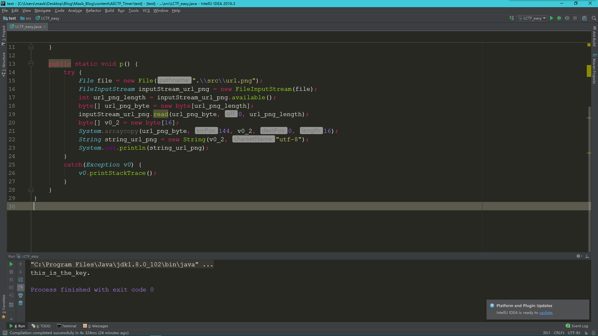

write up
--------

用jadx打开apk文件，为啥不用jeb呢，方便查看函数而已，jeb方便修改

    package com.example.ring.myapplication;
    
    import android.content.pm.ApplicationInfo;
    import android.os.Bundle;
    import android.support.v7.a.q;
    import android.widget.Button;
    import java.io.InputStream;
    
    public class MainActivity extends q {
    private String v;

    protected void onCreate(Bundle bundle) {
        super.onCreate(bundle);
        setContentView((int) R.layout.activity_main);
        ApplicationInfo applicationInfo = getApplicationInfo();
        int i = applicationInfo.flags & 2;  //进行“与”运算
        applicationInfo.flags = i;      //等价于applicationInfo.flags &= 2
        if (i != 0) { //无论条件成不成立，后续操作相同
            p();
            ((Button) findViewById(R.id.sureButton)).setOnClickListener(new d(this));
        } else {
            p();
            ((Button) findViewById(R.id.sureButton)).setOnClickListener(new d(this));
        }
    }

    private void p() {
        try {
            InputStream open = getResources().getAssets().open("url.png"); //从assets文件夹下读取url.png
            int available = open.available(); //返回在不堵塞情况下，一次读取到的数据长度
            Object obj = new byte[available];
            open.read(obj, 0, available);
            Object obj2 = new byte[16];
            System.arraycopy(obj, 144, obj2, 0, 16); //复制,obj源数组，144源数组起始位置，obj2目标数组，0起始位置，16长度
            this.v = new String(obj2, "utf-8");
        } catch (Exception e) {
            e.printStackTrace();
        }
    }

    private boolean a(String str, String str2) {
        return new c().a(str, str2).equals(new String(new byte[]{(byte) 21, (byte) -93, (byte) -68, (byte) -94, (byte) 86, (byte) 117, (byte) -19, (byte) -68, (byte) -92, (byte) 33, (byte) 50, (byte) 118, (byte) 16, (byte) 13, (byte) 1, (byte) -15, (byte) -13, (byte) 3, (byte) 4, (byte) 103, (byte) -18, (byte) 81, (byte) 30, (byte) 68, (byte) 54, (byte) -93, (byte) 44, (byte) -23, (byte) 93, (byte) 98, (byte) 5, (byte) 59}));
    }
    }

那么下面继续跟进d类：

    package com.example.ring.myapplication;
    
    import android.view.View;
    import android.view.View.OnClickListener;
    import android.widget.EditText;
    import android.widget.TextView;
    import android.widget.Toast;
    
    class d implements OnClickListener {
    final /* synthetic */ MainActivity a;

    d(MainActivity mainActivity) {
        this.a = mainActivity; //初始化
    }

    public void onClick(View view) {
        if (this.a.a(this.a.v, ((EditText) this.a.findViewById(R.id.passCode)).getText().toString())) {
            TextView textView = (TextView) this.a.findViewById(R.id.textView);
            Toast.makeText(this.a.getApplicationContext(), "Congratulations!", 1).show();  //那么这是正确分支
            textView.setText(R.string.nice);
            return;
        }
        Toast.makeText(this.a.getApplicationContext(), "Oh no.", 1).show();
    }
    }

关键代码：

      if (mainActivity.a(mainActivity.v, ((EditText) mainActivity.findViewById(R.id.passCode)).getText().toString())) 

那么先求出mainActivity.v的值：

新建一个项目，将url.png拷贝到src目录下

    import java.io.File;
    import java.io.FileInputStream;
    
    /**
     * Created by mask on 2017/3/27.
     */
    public class LCTF_easy {

    public static void main(String[] args) throws Exception{
        p();
    }

    public static void p() {
        try {
            File file = new File(".\\src\\url.png");
            FileInputStream inputStream_url_png = new FileInputStream(file);
            int url_png_length = inputStream_url_png.available(); 
            byte[] url_png_byte = new byte[url_png_length];  
            inputStream_url_png.read(url_png_byte, 0, url_png_length);  
            byte[] v0_2 = new byte[16];
            System.arraycopy(url_png_byte, 144, v0_2, 0, 16);
            String string_url_png = new String(v0_2, "utf-8");
            System.out.println(string_url_png);
        }
        catch(Exception v0) {
            v0.printStackTrace();
        }
    }
    }

那么v的值就是this_is_the_key.

第二个参数，就是我们要输入的东东，然后我们把这两个参数传入到mainActivity.a()函数

    private boolean a(String str, String str2) {
        return new c().a(str, str2).equals(new String(new byte[]{(byte) 21, (byte) -93, (byte) -68, (byte) -94, (byte) 86, (byte) 117, (byte) -19, (byte) -68, (byte) -92, (byte) 33, (byte) 50, (byte) 118, (byte) 16, (byte) 13, (byte) 1, (byte) -15, (byte) -13, (byte) 3, (byte) 4, (byte) 103, (byte) -18, (byte) 81, (byte) 30, (byte) 68, (byte) 54, (byte) -93, (byte) 44, (byte) -23, (byte) 93, (byte) 98, (byte) 5, (byte) 59}));
    }

下面跟进c类查看：

    package com.example.ring.myapplication;
    
    import java.io.UnsupportedEncodingException;
    
    public class c {
    public String a(String str, String str2) {
        String a = a(str); //将str初始化，即将this_is_the_key.进行初始化
        String str3 = "";
        a aVar = new a(); //新建一个a类
        aVar.a(a.getBytes()); 
        try {
            return new String(aVar.b(str2.getBytes()), "utf-8");
        } catch (Exception e) {
            e.printStackTrace();
            return str3;
        }
    }

    private String a(String str) {
        try {
            str.getBytes("utf-8");
            StringBuilder stringBuilder = new StringBuilder();
            for (int i = 0; i < str.length(); i += 2) {
                stringBuilder.append(str.charAt(i + 1));
                stringBuilder.append(str.charAt(i));
            }
            return stringBuilder.toString();
        } catch (UnsupportedEncodingException e) {
            e.printStackTrace();
            return null;
        }
    }
    }

跟进a类进行查看：

    package com.example.ring.myapplication;
    
    import java.io.UnsupportedEncodingException;
    import java.security.MessageDigest;
    import java.security.NoSuchAlgorithmException;
    import javax.crypto.Cipher;
    import javax.crypto.NoSuchPaddingException;
    import javax.crypto.spec.SecretKeySpec;
    
    public class a {
    private SecretKeySpec a;
    private Cipher b;

    protected void a(byte[] bArr) {
        if (bArr == null) { //是否有盐，盐为空
            try {
                this.a = new SecretKeySpec(MessageDigest.getInstance("MD5").digest("".getBytes("utf-8")), "AES");
                this.b = Cipher.getInstance("AES/ECB/PKCS5Padding");
                return;
            } catch (UnsupportedEncodingException e) {
                e.printStackTrace();
                return;
            } catch (NoSuchAlgorithmException e2) {
                e2.printStackTrace();
                return;
            } catch (NoSuchPaddingException e3) {
                e3.printStackTrace();
                return;
            }
        }
        this.a = new SecretKeySpec(bArr, "AES"); //盐不为空，则传入
        this.b = Cipher.getInstance("AES/ECB/PKCS5Padding");
    }

    protected byte[] b(byte[] bArr) {
        this.b.init(1, this.a);
        return this.b.doFinal(bArr);
    }
    }

可以发现这是一个加密类，
那么顺序大致理清楚了，开始写脚本：

    public static void main(String[] args) throws Exception{
        
        Deryption();
    }

   

    public static void Deryption() {
        byte[] content = new byte[]{21, -93, -68, -94, 86, 117, -19, -68, -92, 33, 50, 118, 16, 13, 
            1, -15, -13, 3, 4, 103, -18, 81, 30, 68, 54, -93, 44, -23, 93, 98, 5, 59};
        String password = a("this_is_the_key.");
        System.out.println(password);
        try {  
            SecretKeySpec secretKeySpec = new SecretKeySpec(password.getBytes(), "AES");
            Cipher cipher = Cipher.getInstance("AES/ECB/PKCS5Padding");
            cipher.init(Cipher.DECRYPT_MODE, secretKeySpec);
            byte[] result = cipher.doFinal(content);
            System.out.println(new String(result));
        } catch (Exception e) {  
            e.printStackTrace();  
        }  
    }    

    public static String a(String input) {
        String result;
        try {
            input.getBytes("utf-8");
            StringBuilder stringBuilder = new StringBuilder();
            int i;
            for(i = 0; i < input.length(); i += 2) {
                stringBuilder.append(input.charAt(i + 1));
                stringBuilder.append(input.charAt(i));
            }
            result = stringBuilder.toString();
        }
        catch(Exception e) {
            e.printStackTrace();
            result = null;
        }
        return result;
    }

