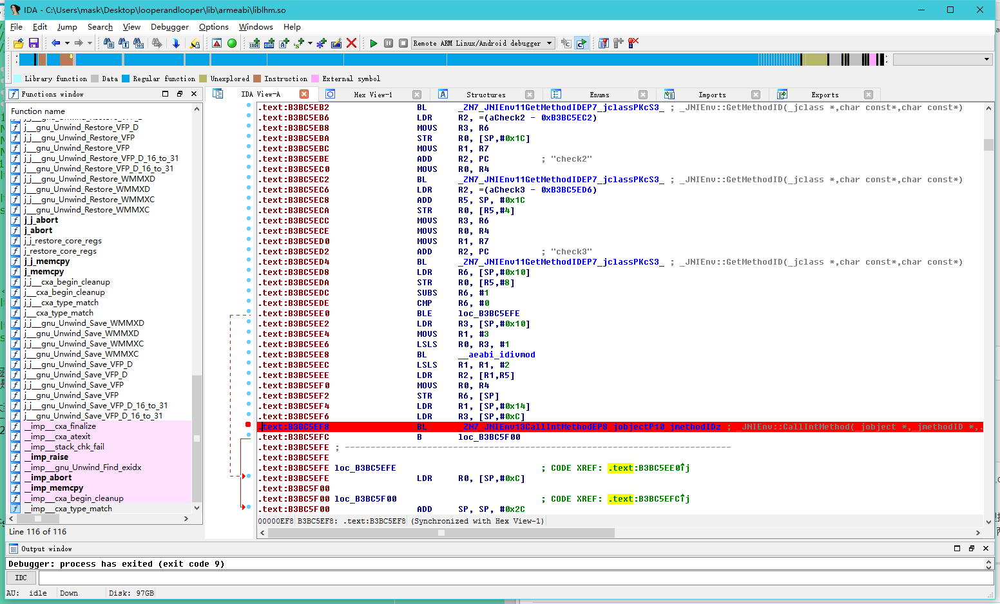
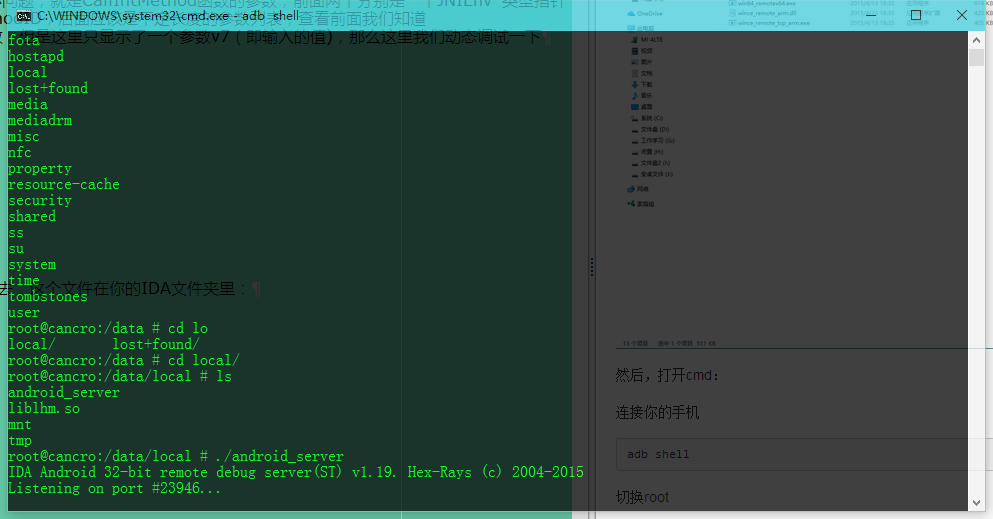
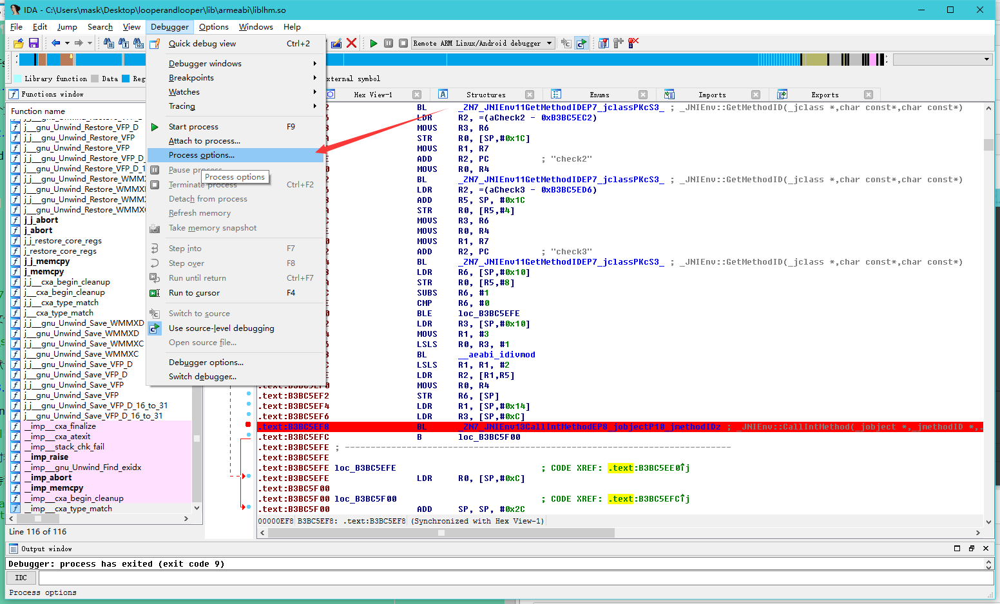
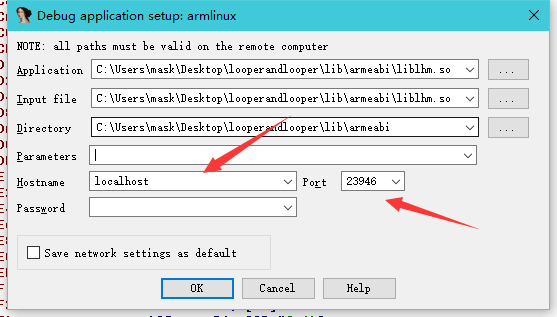
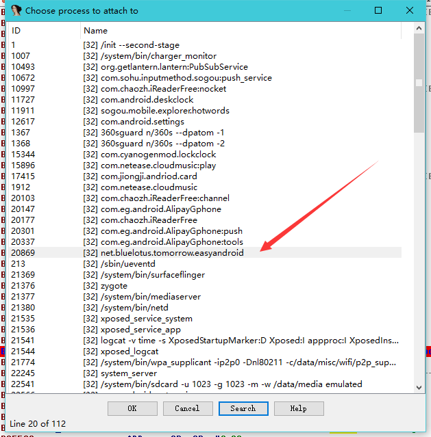
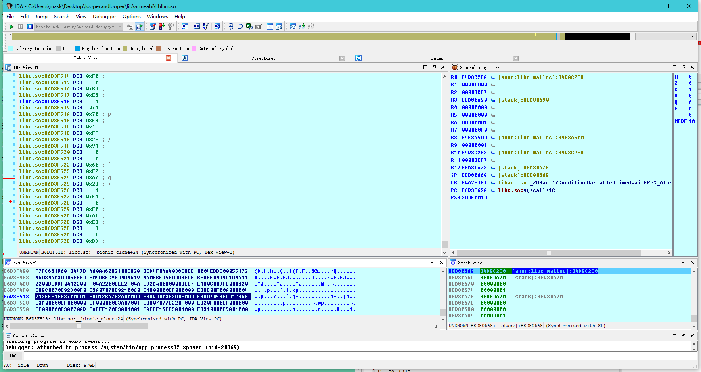
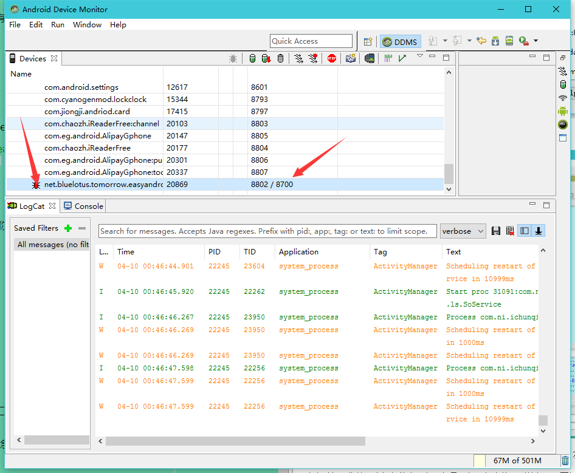
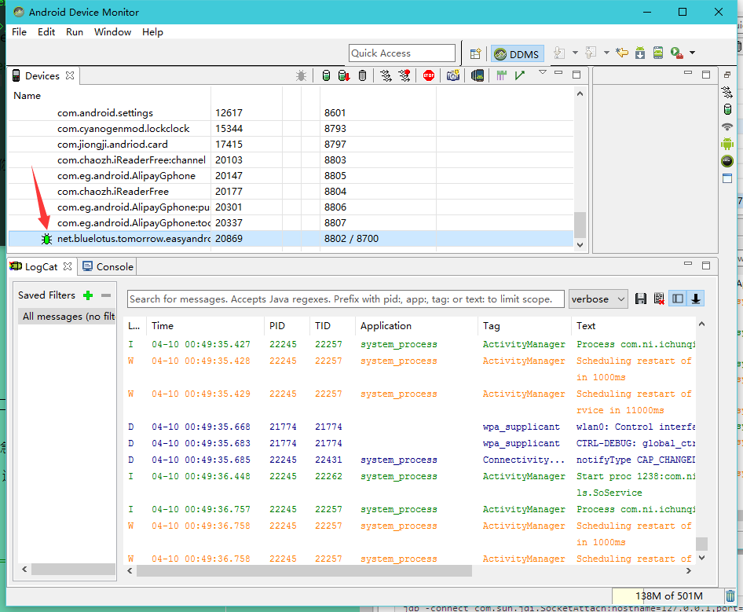

LooperAndLooper
---------------

这是大佬的write-up我这里加了一点点自己的补充，嘻嘻，大佬讲的以及很详细了：[http://www.wangzhixian.org/AndroidCrackMe/2016AliCTF-LoopAndLoop-android-100/article.html](http://www.wangzhixian.org/AndroidCrackMe/2016AliCTF-LoopAndLoop-android-100/article.html)

老规矩，先看看反编译代码

    package net.bluelotus.tomorrow.easyandroid;
    
    import android.os.Bundle;
    import android.support.v7.app.AppCompatActivity;
    import android.view.Menu;
    import android.view.MenuItem;
    import android.view.View;
    import android.view.View.OnClickListener;
    import android.widget.Button;
    import android.widget.EditText;
    import android.widget.TextView;
    
    public class MainActivity extends AppCompatActivity {
    public native int chec(int i, int i2);//声明一个native方法

    public native String stringFromJNI2(int i); //同上

    protected void onCreate(Bundle savedInstanceState) {
        super.onCreate(savedInstanceState);
        setContentView((int) R.layout.activity_main);
        final TextView tv1 = (TextView) findViewById(R.id.textView2);
        final TextView tv2 = (TextView) findViewById(R.id.textView3);
        final EditText ed = (EditText) findViewById(R.id.editText);
        ((Button) findViewById(R.id.button)).setOnClickListener(new OnClickListener() {
            public void onClick(View v) {
                try {
                    int in_int = Integer.parseInt(ed.getText().toString());
                    if (MainActivity.this.check(in_int, 99) == 1835996258) { //关键判断
                        tv1.setText("The flag is:");
                        tv2.setText("alictf{" + MainActivity.this.stringFromJNI2(in_int) + "}");
                        return;
                    }
                    tv1.setText("Not Right!");
                } catch (NumberFormatException e) {
                    tv1.setText("Not a Valid Integer number");
                }
            }
        });
    }

    public boolean onCreateOptionsMenu(Menu menu) {
        getMenuInflater().inflate(R.menu.menu_main, menu);
        return true;
    }

    public boolean onOptionsItemSelected(MenuItem item) {
        if (item.getItemId() == R.id.action_settings) {
            return true;
        }
        return super.onOptionsItemSelected(item);
    }

    public String messageMe(String text) {
        return "LoopOk" + text;
    }

    public int check(int input, int s) {
        return chec(input, s);
    }

    public int check1(int input, int s) {
        int t = input;
        for (int i = 1; i < 100; i++) {
            t += i;
        }
        return chec(t, s);
    }

    public int check2(int input, int s) {
        int t = input;
        int i;
        if (s % 2 == 0) {
            for (i = 1; i < 1000; i++) {
                t += i;
            }
            return chec(t, s);
        }
        for (i = 1; i < 1000; i++) {
            t -= i;
        }
        return chec(t, s);
    }

    public int check3(int input, int s) {
        int t = input;
        for (int i = 1; i < 10000; i++) {
            t += i;
        }
        return chec(t, s);
    }

    static {
        System.loadLibrary("lhm"); //加载lhm类库
    }
    }

接着查看so文件，直接分析这个关键的chec()方法：

    int __fastcall Java_net_bluelotus_tomorrow_easyandroid_MainActivity_chec(int a1, int a2, int a3, int a4)
    {
      int v4; // r4@1
      int v5; // r7@1
      int result; // r0@2
      int v7; // [sp+Ch] [bp-34h]@1
      int v8; // [sp+10h] [bp-30h]@1
      int v9; // [sp+14h] [bp-2Ch]@1
      int v10; // [sp+1Ch] [bp-24h]@1
      int v11; // [sp+20h] [bp-20h]@1
      int v12; // [sp+24h] [bp-1Ch]@1
    
      v9 = a2;
      v8 = a4;
      v4 = a1;
      v7 = a3;
      v5 = (*(int (**)(void))(*(_DWORD *)a1 + 24))();
      v10 = _JNIEnv::GetMethodID(v4, v5, "check1", "(II)I");
      v11 = _JNIEnv::GetMethodID(v4, v5, "check2", "(II)I");
      v12 = _JNIEnv::GetMethodID(v4, v5, "check3", "(II)I");
      if ( v8 - 1 <= 0 )
    		result = v7;
	   else
    		result = _JNIEnv::CallIntMethod(v4, v9, *(&v10 + 2 * v8 % 3));
      return result;
    }  

这里需要修复一下参数类型：

 a1: 应该是一个结构体指针，参数类型为JNIEnv *

 a2:根据调用情况，CallIntMethod()中调用了v9（就是a2），来看看这个函数的参数类型：

    jint        (*CallIntMethod)(JNIEnv*, jobject, jmethodID, ...);

jint是函数返回类型，第一个参数是结构体指针，指向JNIEnv这个结构体，第二个是一个jobject类型参数，第三个待会再讲，那么由此可知，a2的参数类型是jobject

a3,a4:是我们传入的参数

再来看看 _JNIEnv::GetMethodID方法：

    jmethodID   (*GetMethodID)(JNIEnv*, jclass, const char*, const char*);

第一个参数依然是JNIEnv*结构体指针，第二个参数是jclass，第三个参数一个字符串指针，第四个也是.

这个函数的作用是在so里调用java层的函数，后面两个参数分别是方法名以及返回的函数类型

----------

*这些JNI自带的方法以及参数类型都在一个JNI.h的文件里标有详细说明，JNI.h可以在NDK里找到

----------

这是修复参数类型以及函数调用后的函数

    int __fastcall Java_net_bluelotus_tomorrow_easyandroid_MainActivity_chec(JNIEnv *a1, jobject a2, int a3, int a4)
    {
      JNIEnv *v4; // r4@1
      jclass v5; // r7@1
      int result; // r0@2
      int v7; // [sp+Ch] [bp-34h]@1
      int v8; // [sp+10h] [bp-30h]@1
      jobject v9; // [sp+14h] [bp-2Ch]@1
      int v10; // [sp+1Ch] [bp-24h]@1
      int v11; // [sp+20h] [bp-20h]@1
      int v12; // [sp+24h] [bp-1Ch]@1
    
      v9 = a2;
      v8 = a4;
      v4 = a1;
      v7 = a3;
      v5 = (*a1)->FindClass(a1, "net/bluelotus/tomorrow/easyandroid/MainActivity");
      v10 = _JNIEnv::GetMethodID(v4, v5, "check1", "(II)I");
      v11 = _JNIEnv::GetMethodID(v4, v5, "check2", "(II)I");
      v12 = _JNIEnv::GetMethodID(v4, v5, "check3", "(II)I");
      if ( v8 - 1 <= 0 )
    		result = v7;
    	else
    		result = _JNIEnv::CallIntMethod((int)v4, (int)v9, *(&v10 + 2 * v8 % 3), v7);
      return result;
    }

关键地方：

    if ( v8 - 1 <= 0 )
    		result = v7;
    	else
    		result = _JNIEnv::CallIntMethod((int)v4, (int)v9, *(&v10 + 2 * v8 % 3), v7);
      return result;
    }

此处v8为chec函数传入的第二个参数，99
这个if的作用就是计算（2*99%3）的值，然后判断调用哪一个函数(check1,check2,check3),每次调用完后，v8-1

那么调用流程大致清楚了，但是这里有一个小问题，就是CallIntMethod函数的参数，前面两个分别是一个JNIEnv*类型指针指向结构体，一个是jobject，第三个是MethodID，后面应该是不定长度的参数列表，查看前面我们知道check1,check2,check3都是传入了两个参数，但是这里只显示了一个参数v7（即输入的值)，那么这里我们动态调试一下

----------

IDA动态调试
-------
*请用真机调试

首先用IDA打开so文件，下好断点：

然后将下面这个文件adb push到你的真机中去，这个文件在你的IDA文件夹里：

然后，打开cmd：

连接你的手机

    adb shell

切换root

    su

给予权限

    chmod 777 /data/local/android_server(这里是我的目录，你要换成你的)

然后运行这个文件

    ./android_server

这里使用的是默认端口23946，当然你也可以修改端口(因为有些加固应用会反调试默认的23946端口)：

端口转发：

    adb forward tcp:23946 tcp:23946

接下来用adb install给手机安装应用：

    adb install looperandlooper

下面按照步骤对着来，不要错了哦~

将应用进入等待调试状态，这时候界面会显示Waiting For Debugger，说明执行成功

    adb shell am start -D -n net.bluelotus.tomorrow.easyandroid/net.bluelotus.tomorrow.easyandroid.MainActivity

下面进入这个选项：

Hostname填写localhost或者你的手机内网地址，端口填写你设置的端口，我刚刚用的是默认端口23946，所以这里就是23946

然后点击ok，接下来开始用IDA attach应用：

找到对应的包名：

然后点过去：

快成功了，别激动，先看看几个窗口，和OD差不多左上是反汇编窗口，左下是HEX数据窗口，右上是寄存器窗口，右下是堆栈窗口

这个时候，你按那个绿色的小三角运行是运行不起来的，别着急，下面继续：

打开monitor,看到一个红色的虫子没，说明它在等你调试呢，还有记住这个8700端口，待会我们要用上

输入下面的命令：

    jdb -connect com.sun.jdi.SocketAttach:hostname=127.0.0.1,port=8700

可以看到，红色变绿了：

那么在回到IDA，点击那个绿色三角运行：

会跳出下面的窗口,问你so文件是否相同，我们选相同

然后，再看看你的手机，我们可以开始运行程序调试了，我们这里输入一个任意值123，然后按下按钮

可以看到IDA跑了起来，然后断在了刚才下断的地方，分析一下

我们知道，在ARM中，前四个参数是使用R0-R3进行传递，其余的使用栈传递，那么这里最后一个参数便是使用栈来传递的

那么第五个参数就是它了！！！

解题脚本直接拿大佬的

其实也不复杂

    public class Main {

    public static void main(String[] args) throws Exception{
        int output = 1835996258;
        for(int i = 2; i <= 99; i++) {
            if((2 * i % 3) == 0) {
                output = check1(output, i - 1);
            } else if((2 * i % 3) == 1) {
                output = check2(output, i - 1);
            } else {
                output = check3(output, i - 1);
            }
        }
        System.out.println(Integer.toString(output));
    }

    public static int check1(int input, int s) {
        int t = input;
        for (int i = 1; i < 100; i++) {
            t -= i;
        }
        return t;
    }

    public static int check2(int input, int s) {
        int t = input;
        int i;
        if (s % 2 == 0) {
            for (i = 1; i < 1000; i++) {
                t -= i;
            }
            return t;
        }
        for (i = 1; i < 1000; i++) {
            t += i;
        }
        return t;
    }

    public static int check3(int input, int s) {
        int t = input;
        for (int i = 1; i < 10000; i++) {
            t -= i;
        }
        return t;
    }
    }

结果：

    236492408

睡觉！！！
--