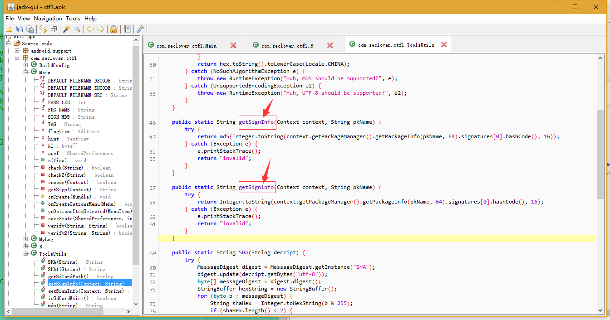
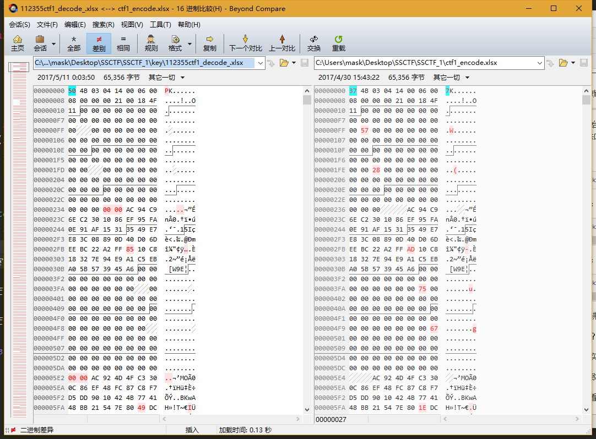
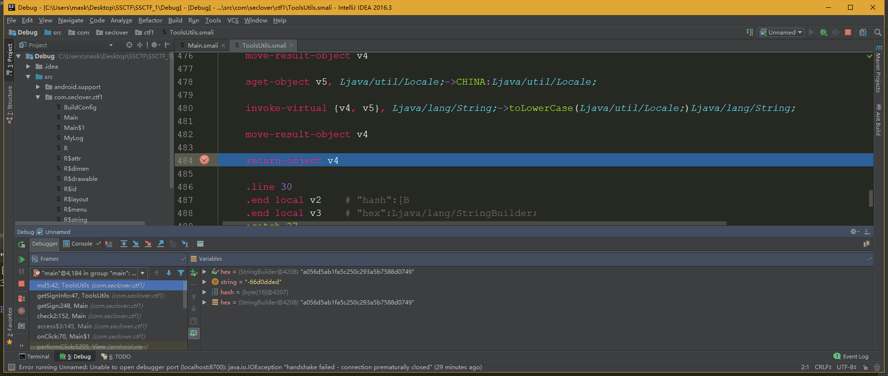

Write up
--------

先看AndroidManifest，纯属习惯问题：

    <?xml version="1.0" encoding="utf-8"?>
    <manifest package="com.seclover.ctf1" platformBuildVersionCode="24" platformBuildVersionName="7.0" xmlns:android="http://schemas.android.com/apk/res/android">
    <uses-sdk android:minSdkVersion="19" android:targetSdkVersion="22" />
    <uses-permission android:name="android.permission.MOUNT_UNMOUNT_FILESYSTEMS" />
    <uses-permission android:name="android.permission.WRITE_EXTERNAL_STORAGE" />
    <application android:allowBackup="true" android:icon="@drawable/ic_launcher" android:label="@string/app_name" android:theme="@style/AppTheme">
    <activity android:label="@string/app_name" android:name=".Main" android:screenOrientation="portrait">
    <intent-filter>
    <action android:name="android.intent.action.MAIN" />
    <category android:name="android.intent.category.LAUNCHER" />
    </intent-filter>
    </activity>
    </application>
    </manifest>

这里有两条权限：

    <uses-permission android:name="android.permission.MOUNT_UNMOUNT_FILESYSTEMS" />	 //允许挂载和反挂载文件系统
    <uses-permission android:name="android.permission.WRITE_EXTERNAL_STORAGE" />	//允许写入外部存储

以上全属废话，和解题无关
----------

跟进入口类：

这里一般都会先找onCreate()方法

这里有一些资源文件需要找到对应的，我这里就直接给出注释了

    protected void onCreate(Bundle savedInstanceState) {
        boolean isEncrypted = false;
        System.out.println("BuildConfig.DEBUGfalse");
        super.onCreate(savedInstanceState);
        setContentView(R.layout.preference);
        this.flagView = (EditText) findViewById(R.id.c);
        this.hint = (TextView) findViewById(R.id.e);
        final Button submit = (Button) findViewById(R.id.d);
        this.pref = getSharedPreferences("ctf1", 0);//设置SharedPreferences文件 在/data/data/com.seclover.ctf1/shared_prefs/目录下
        if (this.pref.getInt("isEncrypted", 0) != 0) {//如果isEncrypted的值不为0
            isEncrypted = true;//设置true
        }
        if (isEncrypted) {
            this.hint.setText(R.string.hint_encrypted);//文档已加密,请联系xxx解密.
            submit.setText(R.string.btn_text_decrypt);//解密
        } else {
            this.hint.setText(R.string.hint_set_pwd);//请设置一个6位数密码,然后才能进入应用
            submit.setText(R.string.btn_text_set_pwd);//设置密码
        }
        submit.setOnClickListener(new OnClickListener() {
            public void onClick(View v) { //设置按钮点击事件
                boolean isEncrypted;
                Main.this.pref = Main.this.getSharedPreferences("ctf1", 0);
                if (Main.this.pref.getInt("isEncrypted", 0) != 0) {
                    isEncrypted = true;
                } else {
                    isEncrypted = false;
                }
                if (!isEncrypted) {
                    String key = Main.this.flagView.getText().toString();
                    if (key == null || key.isEmpty() || key.length() != 6) {//输入的key满足其中一个
                        Toast.makeText(Main.this, R.string.input_len_not_enough, 0).show();//输入不能为空或长度不正确！
                        return;
                    }
                    Main.this.check(Main.this.flagView.getText().toString());
                    Main.this.hint.setText(R.string.hint_encrypted);//文档已加密,请联系xxx解密.
                    submit.setText(R.string.btn_text_decrypt);//解密
                    Main.this.saveState(Main.this.pref, 1);
                } else if (Main.this.check2(Main.this.flagView.getText().toString())) {
                    Toast.makeText(Main.this, R.string.try_face_swiping, 0).show();//刷脸试试!
                } else {
                    Toast.makeText(Main.this, R.string.try_shout, 0).show();//大喊一声解锁试试!
                }
            }
        });
    }

那么接着跟进check方法：

    private boolean check(String key) {
    		if (!verify(getSign(this), this.SIGN_MD5)) {
    			return false;
    		}
    		for (int i = 0; i < 100; i++) {
    				for (int j = 0; j < 100; j++) {
    					this.k1[((i + 17) * (j + 5)) % this.k1.length] = (byte) ((this.k1[(i * j) % this.k1.length] ^ (key.charAt((i * j) % key.length()) * 7)) % TransportMediator.KEYCODE_MEDIA_PAUSE);
    				}
    		}
    		encode(this);
    		return true;
    }

跟进verify：

    private boolean verify(String key1, String key2) {
        int i;
        this.k1 = ToolsUtils.SHA(key1).getBytes();
        byte[] k2 = ToolsUtils.SHA(key2).getBytes();
        for (i = 0; i < this.k1.length; i++) {
            for (int j = 0; j < k2.length; j++) {
                this.k1[(((i * j) * 7) + 9) % this.k1.length] = (byte) ((this.k1[i] ^ (j * 5)) % TransportMediator.KEYCODE_MEDIA_PAUSE);
                k2[(((i * j) * 7) + 9) % k2.length] = (byte) ((k2[i] ^ (j * 5)) % TransportMediator.KEYCODE_MEDIA_PAUSE);
            }
        }
        boolean isBreak = false;
        int len = this.k1.length > k2.length ? k2.length : this.k1.length;
        for (i = 0; i < len; i++) {
            if (((this.k1[i] ^ k2[i]) ^ this.k1[i]) != this.k1[i]) {
                isBreak = true;
                break;
            }
        }
        if (isBreak) {
            return false;
        }
        return true;
    }

和getSign：

    private String getSign(Context context) {
        return ToolsUtils.getSignInfo(context, "com.seclover.ctf1");//可以看到这里调用了ToolsUtils类，那么我们跟进查看
    }

继续跟进，别看花眼了2333

    public static String getSignInfo(Context context, String pkName) {
        try {
            return md5(Integer.toString(context.getPackageManager().getPackageInfo(pkName, 64).signatures[0].hashCode(), 16));
        } catch (Exception e) {
            e.printStackTrace();
            return "invalid";
        }
    }

看看这个MD5方法：

    public static String md5(String string) {
        try {
            byte[] hash = MessageDigest.getInstance("MD5").digest(string.getBytes("utf-8"));
            StringBuilder hex = new StringBuilder(hash.length * 2);
            for (byte b : hash) {
                if ((b & 255) < 16) {
                    hex.append("0");
                }
                hex.append(Integer.toHexString(b & 255));
            }
            return hex.toString().toLowerCase(Locale.CHINA);//
        } catch (NoSuchAlgorithmException e) {
            throw new RuntimeException("Huh, MD5 should be supported?", e);
        } catch (UnsupportedEncodingException e2) {
            throw new RuntimeException("Huh, UTF-8 should be supported?", e2);
        }
    }

然后接着跟进encode：

    private boolean encode(Context context) {
        File fileR = new File(Environment.getExternalStorageDirectory(), DEFAULT_FILENAME_SRC);//ctf1.xlsx
        if (!fileR.exists()) {
            return false;
        }
        try {
            FileOutputStream fos = new FileOutputStream(new File(Environment.getExternalStorageDirectory(), DEFAULT_FILENAME_ENCODE));//ctf1_encode.xlsx
            FileInputStream fis = new FileInputStream(fileR);
            byte[] b = new byte[fis.available()];
            fis.read(b);
            for (int i = 0; i < b.length; i += 256) {
                b[i] = (byte) (b[i] ^ this.k1[i % this.k1.length]);
            }
            fos.write(b);
            fos.close();
            fis.close();
            fileR.delete();
        } catch (Exception e) {
            e.printStackTrace();
        }
        return true;
    }

那么流程大致清楚了，这里简单说下

将输入的的密码作为参数传入check方法，然后check方法里面调用了一次verify，作用就是判断应用的包名信息通过MD5加密后，是否等于SIGN_MD5。

并且在verify中同时对k1数组进行了初始化，开始瞄了半天没找到在哪赋值的

然后在check这里将k1进行一个处理，得到一个新的k1

    for (int i = 0; i < 100; i++) {
    	for (int j = 0; j < 100; j++) {
    		this.k1[((i + 17) * (j + 5)) % this.k1.length] = (byte) ((this.k1[(i * j) % this.k1.length] ^ (key.charAt((i * j) % key.length()) * 7)) % TransportMediator.KEYCODE_MEDIA_PAUSE);
    	}
    }

然后调用了encode方法，作用就是将这个新的k1和ctf1_encode.xlsx文件进行异或，没0x100个字节异或一下。

呐，这就是大致的流程

----------
那么开始解密操作，既然是异或加密了，那么我们在异或一次就能解密，讲道理是这样的，但是我们并不知道这个新的k1是多少，这里回忆一下这个新的k1怎么来的

第一步

    this.k1 = ToolsUtils.SHA(key1).getBytes();

第二步：

    this.k1[(((i * j) * 7) + 9) % this.k1.length] = (byte) ((this.k1[i] ^ (j * 5)) % 127);
    
第三步：

    this.k1[((i + 17) * (j + 5)) % this.k1.length] = (byte) ((this.k1[(i * j) % this.k1.length] ^ (key.charAt((i * j) % key.length()) * 7)) % 127);

那么，讲道理是通过key1然后各种变换来的

逆回去？，不存在的好吧。这里我当时也思考了半天。。。。没办法，做题经验太少，略略略

然后其实看了一下大佬写的writeup，然后自己再顺着思路解的23333

呐，大致思路就是爆破，爆破啥？通过爆破那个输入的6位数的值

这里先看看一下那个加密的xlsx文件的格式和正常xlsx文件（这里随便新建一个就行我偷了下懒，拿解密好了的对比。。。懒得再去新建了23333）的区别

不同处红色标明出来了

0x00，0x100,0x200,0x300,0x400,0x500处，我们看前几个就够了，
那么爆破的思路就是

通过爆破那个6位密码 -> 得到k1 -> 各种变换得到那个新的k1 -> 然后再和加密的xlsx异或一次 ->得到解密后的原文件

这里给出解题代码，大部分都是题目里给的。。。分析下即可得出，主要是那个爆破以及xlsx的几处标志位，那才是关键

    import java.io.File;
    import java.io.FileInputStream;
    import java.io.FileOutputStream;
    
    public class test {

    static byte[] k1;
    static String MD5_KEY = "a056d5ab1fa5c250c293a5b7588d0749";

    public static void main(String[] args) throws Exception {
        for(int i = 100000; i < 999999; i++) {

            verify(String.valueOf(i),MD5_KEY);

            if(check(String.valueOf(i), i)) {
                System.out.println("Find it : ctf1_decode_" + i + ".xlsx");
            }
        }
    }

    private static boolean verify(String key,String key2) {
        k1 = ToolsUtils.SHA(key).getBytes();
        byte[] k2 = ToolsUtils.SHA(key2).getBytes();

        for(int i = 0; i < k1.length; i++) {
            for(int j = 0; j < k1.length; j++) {
                k1[(i * j * 7 + 9) % k1.length] = ((byte)((k1[i] ^ j * 5) % 127));
                k2[(((i * j) * 7) + 9) % k2.length] = (byte) ((k2[i] ^ (j * 5)) % 127);

            }
        }
        boolean isBreak = false;
        int len = k1.length > k2.length ? k2.length : k1.length;
        for (int i = 0; i < len; i++) {
            if (((k1[i] ^ k2[i]) ^ k1[i]) != k1[i]) {
                isBreak = true;
                break;
            }
        }
        if (isBreak) {
            return false;
        }
        return true;

    }

    private static boolean check(String key, int index) {
        for(int i = 0; i < 100; i++) {
            for(int j = 0; j < 100; j++) {
                k1[(i + 17) * (j + 5) % k1.length] = ((byte)((k1[i * j % k1.length] ^ key.charAt(i * j % key.length()) * 7) % 127));
            }
        }
        if(test.decode(k1, index)) {
            return true;
        }
        return false;
    }

    private static boolean decode(byte[] key, int index) {
        try {

            File file = new File("D:\\ctf1_encode.xlsx");
            if (!file.exists()) {
                System.out.println("file does not exist");
                return false;
            }
            FileInputStream fileInputStream = new FileInputStream(file);
            byte[] temp = new byte[fileInputStream.available()];
            fileInputStream.read(temp);
            for(int i = 0; i < temp.length; i += 256) {
                temp[i] = ((byte)(temp[i] ^ key[i % key.length]));//再异或一次，即可解密
            }
            if ((temp[0x00] != 'P')//判断是否为一个符合格式的xls文件
                    || (temp[0x100] != 0x00)
                    || (temp[0x200] != 0x00)
                    || (temp[0x400] != 0x00)
                    || (temp[0x500] != 0x00)) {
                fileInputStream.close();
                return false;
            }
            File output = new File(index+"ctf1_decode_.xlsx" );
            FileOutputStream fileOutputStream = new FileOutputStream(output);
            fileOutputStream.write(temp);
            fileOutputStream.close();
            fileInputStream.close();
            System.out.println("key:"+index);//输入的key
        }
        catch(Exception e) {
            e.printStackTrace();
        }
        return true;
    	}
    }

然后输出，key就是爆破出来的6位密码

    "C:\Program Files\Java\jdk1.8.0_102\bin\java" -Didea.launcher.port=7532 "-Didea.launcher.bin.path=I:\IntelliJ IDEA Community Edition 2016.3\bin" -Dfile.encoding=UTF-8 -classpath "C:\Program Files\Java\jdk1.8.0_102\jre\lib\charsets.jar;C:\Program Files\Java\jdk1.8.0_102\jre\lib\deploy.jar;C:\Program Files\Java\jdk1.8.0_102\jre\lib\ext\access-bridge-64.jar;C:\Program Files\Java\jdk1.8.0_102\jre\lib\ext\cldrdata.jar;C:\Program Files\Java\jdk1.8.0_102\jre\lib\ext\dnsns.jar;C:\Program Files\Java\jdk1.8.0_102\jre\lib\ext\jaccess.jar;C:\Program Files\Java\jdk1.8.0_102\jre\lib\ext\jfxrt.jar;C:\Program Files\Java\jdk1.8.0_102\jre\lib\ext\localedata.jar;C:\Program Files\Java\jdk1.8.0_102\jre\lib\ext\nashorn.jar;C:\Program Files\Java\jdk1.8.0_102\jre\lib\ext\sunec.jar;C:\Program Files\Java\jdk1.8.0_102\jre\lib\ext\sunjce_provider.jar;C:\Program Files\Java\jdk1.8.0_102\jre\lib\ext\sunmscapi.jar;C:\Program Files\Java\jdk1.8.0_102\jre\lib\ext\sunpkcs11.jar;C:\Program Files\Java\jdk1.8.0_102\jre\lib\ext\zipfs.jar;C:\Program Files\Java\jdk1.8.0_102\jre\lib\javaws.jar;C:\Program Files\Java\jdk1.8.0_102\jre\lib\jce.jar;C:\Program Files\Java\jdk1.8.0_102\jre\lib\jfr.jar;C:\Program Files\Java\jdk1.8.0_102\jre\lib\jfxswt.jar;C:\Program Files\Java\jdk1.8.0_102\jre\lib\jsse.jar;C:\Program Files\Java\jdk1.8.0_102\jre\lib\management-agent.jar;C:\Program Files\Java\jdk1.8.0_102\jre\lib\plugin.jar;C:\Program Files\Java\jdk1.8.0_102\jre\lib\resources.jar;C:\Program Files\Java\jdk1.8.0_102\jre\lib\rt.jar;C:\Users\mask\Desktop\SSCTF\SSCTF_1\key\out\production\key;I:\IntelliJ IDEA Community Edition 2016.3\lib\idea_rt.jar" com.intellij.rt.execution.application.AppMain test
    key:112355
    Find it : ctf1_decode_112355.xlsx
    key:179351
    Find it : ctf1_decode_179351.xlsx

答案应该不止两个的，这里等了一下不想等了，就停止运行了，反正答案出来了

总结一下，学到了一些解题套路，然后还有就是不要被题目牵着走。这题有一点就是那个算包名的MD5的值然后比较，分析一下啊，肯定要，必须要，一定要相等的啊，不然你怎么搞嘞，不要傻乎乎的真的去算一下包名的MD5值，你算了的话，会发现就和前面给的`private String SIGN_MD5 = "a056d5ab1fa5c250c293a5b7588d0749";`一毛一样，看到还有说啥用jeb动态调试一下得出来的。（其实我倒拿IDEA调试了下smali，验证一下，确实一样）

浪费时间。。。。。。

