0x00 闲言碎语
---------

因为这位朋友 @挥汗如雨 希望我用动态调试解这道题，所以我写这篇分析文章来给大家介绍介绍IDA的动态调试，最好能看懂汇编，当然我也会解释关键语句。一点简单地东西，让大佬们见笑了
给出一和二的链接，两篇都是精华帖，大家可以认真看看

[http://www.52pojie.cn/thread-602744-1-1.html](http://www.52pojie.cn/thread-602744-1-1.html)

[http://www.52pojie.cn/thread-603169-1-1.html](http://www.52pojie.cn/thread-603169-1-1.html)

0x01 Java层分析
------------

这里有件有意思的事，因为个人喜好，每次分析CTF题目时，都喜欢去先安装应用然后查看界面，刚好这次我使用真机安装后打开应用居然会闪退，这我就奇怪了，模拟器打不开我见过，真机打不开，少见啊，难道是设置了Android版本？记得之前写过一个CM，基于android7.0的，当时我用手机也打不开
因为是6.0，好了，废话不多说，有问题那就去分析分析便知

这次我换个一个工具使用jadx，因为它貌似能够把一些混淆的变量名识别出来

先来看看AndroidMainifest.xml

    <?xml version="1.0" encoding="utf-8"?>
    <manifest xmlns:android="http://schemas.android.com/apk/res/android" android:versionCode="1" android:versionName="1.0" package="com.example.xtu" platformBuildVersionCode="25" platformBuildVersionName="7.1.1">
    <uses-sdk android:minSdkVersion="14" android:targetSdkVersion="18" />
    <application android:theme="@style/AppTheme" android:label="@string/app_name" android:icon="@drawable/ic_launcher" android:allowBackup="true">
    <activity android:label="@string/app_name" android:name=".MainActivity">
    <intent-filter>
    <action android:name="android.intent.action.MAIN" />
    <category android:name="android.intent.category.LAUNCHER" />
    </intent-filter>
    </activity>
    </application>
    </manifest>

咦？貌似并没有限制Android最低版本为7.0，奇怪，跟进入口看看

翻一番，这个东西讲道理我第一次见

    public static boolean isEmulator(Context context) {
    	try {
    		String imei = ((TelephonyManager) context.getSystemService("phone")).getDeviceId(); //获取手机的imei序列号
    		sign = false;
    		Log.d("HelloWorld", imei);
    		if (imei == null || !imei.equals("000000000000000")) { 对比imei为空获知imei不等于0
    				return false; //返回false
    			}
    			return true;
    		} catch (Exception e) {
    		return true;
    		}
    }

呐，这就有味道了，哇，一道CTF搞这种东西！！！再看看前面

    final String string01 = Build.MODEL;
    final boolean is = isEmulator(this);
    final String string02 = Build.BRAND;
    new Thread(new Runnable() {
    	public void run() {
    	if (MainActivity.sign || is || string01.indexOf("Android") != -1 || string02.indexOf("gen") != -1) {
    		MainActivity.this.finish();
    		}
    	}
    }).start();

这里新建了一个线程一直在检查，只要不满足，那么MainActivity就结束，这就是之前为啥我的手机运行时退出的原因了，那么后面要动态调试的时候，一般都是用真机的，但是这里会给你退出，那么怎么办呢？

凉拌！！！！哈哈，开玩笑的，删掉便是

这里用AndroidKiller打开

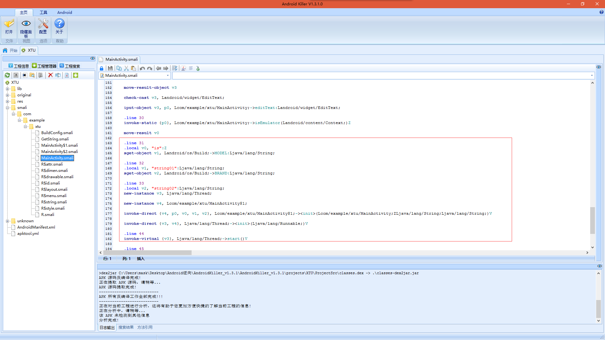

这里需要会一点smali语法，论坛有教程，我就不多啰嗦了，删掉这一块，然后重新打包回编

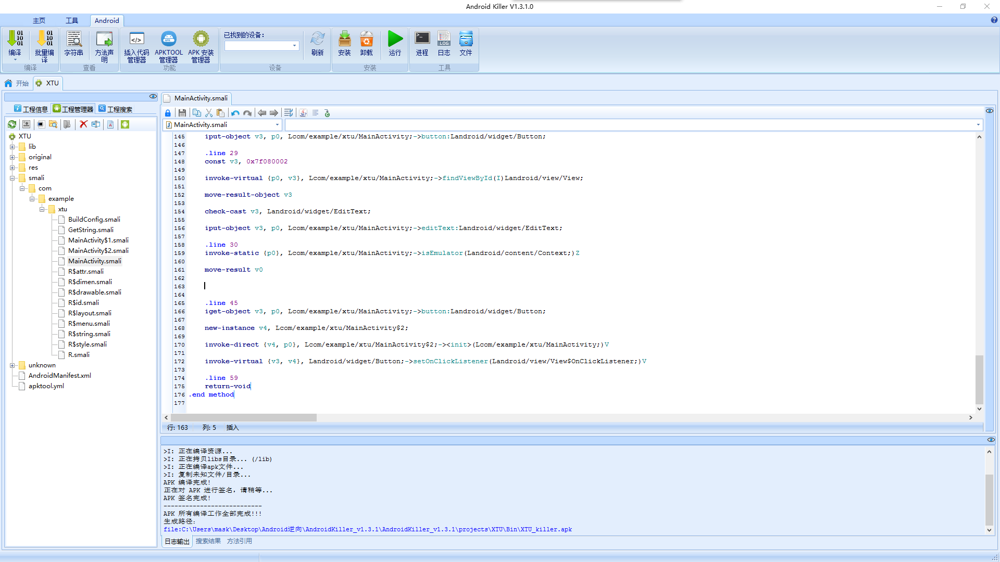

Lucky,没有报错，成功编译好了，那么再到手机上安装成功打开

西安科技大学o.o

呐，上面这个只是分享的一个小知识，其实不改也不会影响你做题，我只是为了方便演示动态调试而已

来看关键代码

    this.button.setOnClickListener(new OnClickListener() {
    public void onClick(View v) {
    	if (GetString.encrypt(MainActivity.this.editText.getText().toString().trim())) {
    		Toast.makeText(MainActivity.this, "OK", 0).show();
    	} else {
    		Toast.makeText(MainActivity.this, "Error", 0).show();
    			}
    		}
    	});
    }

跟进查看

    package com.example.xtu;
    
    public class GetString {
    public static native boolean encrypt(String str);
    
    public static native String getString();
    
    public static native String sendData(String str);
    
    static {
    	System.loadLibrary("XTU");
    	}
    }

思路明确，不多解释，开始分析so文件

0x02 so分析

这是我优化好参数类型和变量名之后的，不会的可以参考我前面的几篇文章，有详细的介绍

    signed int __fastcall Java_com_example_xtu_GetString_encrypt(JNIEnv *a1, jclass a2, jstring input)
    {
      JNIEnv *v3; // r4@1
      jstring v4; // r7@1
      jstring v5; // r6@1
      jstring v6; // r0@1
      const char *v7; // r5@1
      const char *v8; // r6@1
      char *s; // ST04_4@1
      size_t v10; // r4@1
      size_t v11; // r7@1
      char *v12; // r4@1
      char *v13; // r7@1
      size_t v14; // r0@1
      size_t i; // r6@1
      int v16; // r3@4
      char *v18; // [sp+8h] [bp-60h]@1
      char dest; // [sp+14h] [bp-54h]@1
    
      v3 = a1;
      v4 = input;
      v5 = _JNIEnv::NewStringUTF(a1, "yInS567!bcNOUV8vwCDefXYZadoPQRGx13ghTpqrsHklm2EFtuJKLzMijAB094W");
      v6 = _JNIEnv::NewStringUTF(v3, "Welc0meT0XTUCTF");
      v7 = _JNIEnv::GetStringUTFChars(v3, v6, 0);
      v8 = _JNIEnv::GetStringUTFChars(v3, v5, 0);
      s = (char *)_JNIEnv::GetStringUTFChars(v3, v4, 0);
      v10 = j_j_strlen(v7);//获取长度
      v11 = j_j_strlen(v8);//获取长度
      v12 = (char *)j_operator new;//开辟新空间
      v13 = (char *)j_operator new;
      v14 = j_j_strlen(s);
      v18 = (char *)j_operator new;
      j_j_memcpy(&dest, &unk_2018, 0x3Cu);初始化
      j_j_strcpy(v12, v7);复制
      j_j_strcpy(v13, v8);
      j_j_strcpy(v18, s);
      for ( i = 0; i < j_j_strlen(v7); ++i )
    v12 = v13[*((_DWORD *)&dest + i)];
      v16 = 0;
      while ( (unsigned __int8)v18[v16] == (unsigned __int8)v12[v16] )
      {
    if ( ++v16 == 15 )
      return 1;
      }
      return 0;
    }

函数作用就不多说，之前都有介绍过，我们来看看部分

    for ( i = 0; i < j_j_strlen(v7); ++i )
    v12 = v13[*((_DWORD *)&dest + i)];
      v16 = 0;
      while ( (unsigned __int8)v18[v16] == (unsigned __int8)v12[v16] )
      {
    if ( ++v16 == 15 )
      return 1;
      }
      return 0;

思路很清楚，将字符串“yInS567!bcNOUV8vwCDefXYZadoPQRGx13ghTpqrsHklm2EFtuJKLzMijAB094W”按位取，分别取它的0x39,0x20,7,0xA,0x20,0x29,0x13,2,0x3A,0xC,0x11,0x31,0x3B,0xB,7位，然后传入一个新的字符串数组，我们输入的值与这个
字符串数组进行比较，相等的话，那么成功，不相等，则失败。
给出解题脚步：

    #include<stdio.h>
    int main(){
    	char arr[]={"yInS567!bcNOUV8vwCDefXYZadoPQRGx13ghTpqrsHklm2EFtuJKLzMijAB094W"};
    	char index[]={0x39,0x20,7,0xA,0x20,0x29,0x13,2,0x3A,0xC,0x11,0x31,0x3B,0xB,7};
    	for(int i=0;i<15;i++){
    		printf("%c",arr[index]);
    	}
    }

最后Flag：A1!N1HenBUCu0O!

算法不难，看不懂的话就去补补基础啥的，这里不多啰嗦，主要是介绍动态调试

0x03 汇编分析

动态调试是在分析汇编的基础上进行的，当然有经验的话可以很快看出，并且下好断点，不多说，开始

那么，下面切换至汇编窗口

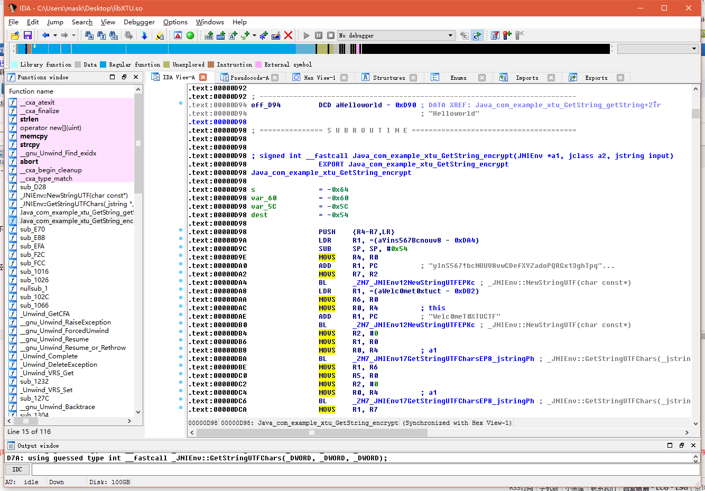

这里有个小技巧，按空格键会显示逻辑界面

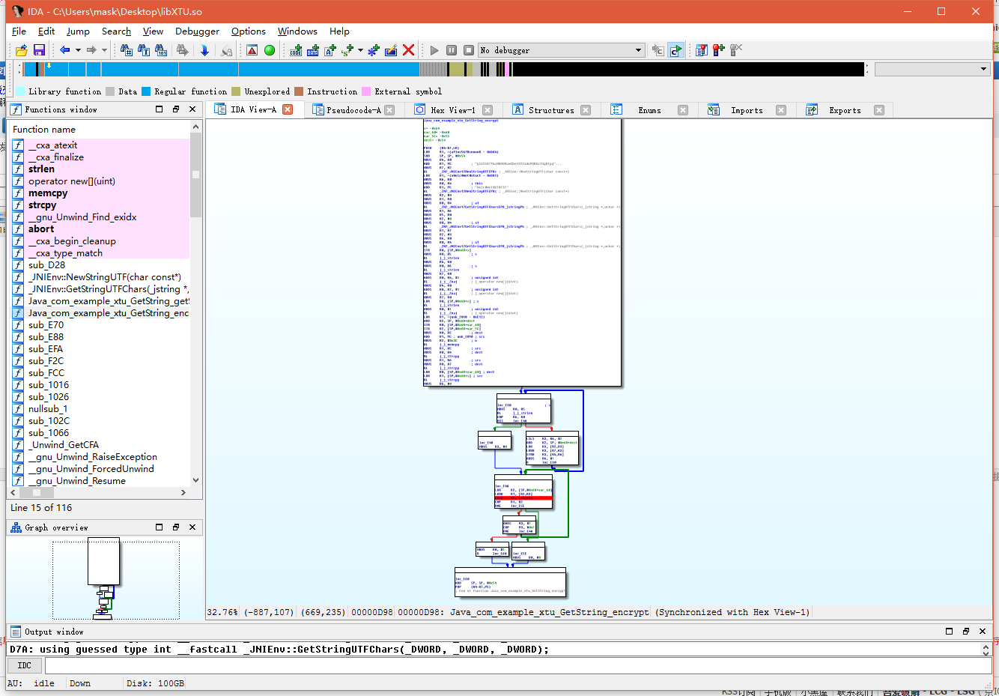

执行流程一目了然

第一句，压栈操作，将R4-R7还有LR寄存器入栈

    PUSH{R4-R7,LR}

还记得之前说的小技巧么？在等号上右键点击可以给你具体值，将哪个位置的值赋给R1

    LDR R1, =(aYins567Bcnouv8 - 0xDA4)

`SP = SP-0x54`,目的是开辟一段栈空间

    SUB SP, SP, #0x54

R0的值赋给R4

    MOVS R4, R0

重定位操作，前面文章也讲过，此时R1为这段字符串

    ADD R1, PC  ; "yInS567!bcNOUV8vwCDefXYZadoPQRGx13ghTpq"...

    R7 = R2

    MOVS R7, R2

调用函数，R0,R1为参数传入

    BL  _ZN7_JNIEnv12NewStringUTFEPKc ; _JNIEnv::NewStringUTF(char const*)

下面这段步骤相同，不多介绍

    .text:00000DA8 LDR R1, =(aWelc0met0xtuct - 0xDB2)
    .text:00000DAA MOVSR6, R0
    .text:00000DAC MOVSR0, R4  ; this
    .text:00000DAE ADD R1, PC  ; "Welc0meT0XTUCTF"
    .text:00000DB0 BL  _ZN7_JNIEnv12NewStringUTFEPKc ; _JNIEnv::NewStringUTF(char const*)
    
R2 =0
    MOVS R2, #0

R1 = R0，

    MOVS R1, R0

R4 = R0

    MOVS R0, R4  ; a1

参数传入，调用函数

    BL  _ZN7_JNIEnv17GetStringUTFCharsEP8_jstringPh ; _JNIEnv::GetStringUTFChars(_jstring *,uchar *)

好了，下面就不一行行分析了，因为参数传递调用函数步骤差不多，这里就直接贴出，感兴趣的自己逐行去分析，有助于阅读汇编的能力

    MOVS R1, R6
    MOVS R5, R0
    MOVS R2, #0
    MOVS R0, R4  ; a1
    BL  _ZN7_JNIEnv17GetStringUTFCharsEP8_jstringPh ; _JNIEnv::GetStringUTFChars(_jstring *,uchar *)
    MOVS R1, R7
    MOVS R2, #0
    MOVS R6, R0
    MOVS R0, R4  ; a1
    BL  _ZN7_JNIEnv17GetStringUTFCharsEP8_jstringPh ; _JNIEnv::GetStringUTFChars(_jstring *,uchar *)
    STR R0, [SP,#0x68+s]
    MOVS R0, R5  ; s
    BL  j_j_strlen
    MOVS R4, R0
    MOVS R0, R6  ; s
    BL  j_j_strlen
    MOVS R7, R0
    ADDS R0, R4, #1  ; unsigned int
    BL  j_j__Znaj   ; j_operator new
    MOVS R4, R0
    ADDS R0, R7, #1  ; unsigned int
    BL  j_j__Znaj   ; j_operator new
    MOVS R7, R0
    LDR R0, [SP,#0x68+s] ; s
    BL  j_j_strlen
    ADDS R0, #1  ; unsigned int
    BL  j_j__Znaj   ; j_operator new
    LDR R1, =(unk_2018 - 0xE12)
    ADD R2, SP, #0x68+dest
    STR R0, [SP,#0x68+var_60]
    STR R2, [SP,#0x68+var_5C]
    MOVS R0, R2  ; dest
    ADD R1, PC ; unk_2018 ; src
    MOVS R2, #0x3C   ; n
    BL  j_j_memcpy
    MOVS R1, R5  ; src
    MOVS R0, R4  ; dest
    BL  j_j_strcpy
    MOVS R1, R6  ; src
    MOVS R0, R7  ; dest
    BL  j_j_strcpy
    LDR R0, [SP,#0x68+var_60] ; dest
    LDR R1, [SP,#0x68+s] ; src
    BL  j_j_strcpy
    MOVS R6, #0
    MOVS R0, R5
    BL  j_j_strlen

下面我们来看看关键的循环，在汇编里是怎样表示的，可以看到，当命令执行到这里是进行了判断

    CMP R6, R0

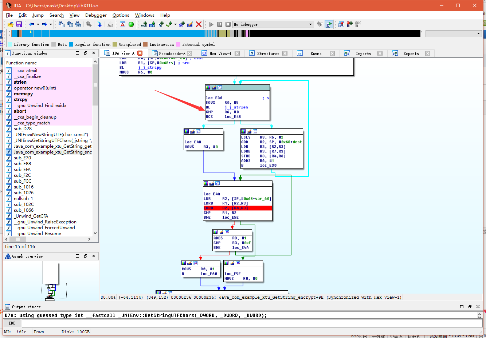

可以看出R6的值为0，那么R0呢？在arm汇编中，函数执行完后会将返回值保存在R0寄存器，那么这就好办了，j_j_strlen函数是获取字符数组长度的，并且返回值是“Welc0meT0XTUCTF”的长度，为15，那么很明显，R0此时不等于R6，
那么便会往右边的红线走，然后再去判断，然后再执行，直到R0等于R6为止，那么这里其实就对应着这一块伪代码

    for ( i = 0; i < j_j_strlen(v7); ++i )
    	v12 = v13[*((_DWORD *)&dest + i)];

那么下面的循环操作类似，有一个地方需要注意

其实CMP命令虽说是比较，但是其实会进行一个减操作，让R1-R2，如果为0，那么Z标志位就置位（然后Z = 1），如果不为零，则Z = 0；
BNE就是判断Z标志位是否就位，也就是R1-R2是否等于0，如果等于0不跳转，不为0，则跳转，没错，他是反的来的，这里需要注意！！！！！

    CMP R1, R2
    BNE loc_E5E

呐，汇编差不多就这些，如果自己跟着一行行分析下来，相信对流程已经清楚了，那么我来指出关键{:301_1000:}

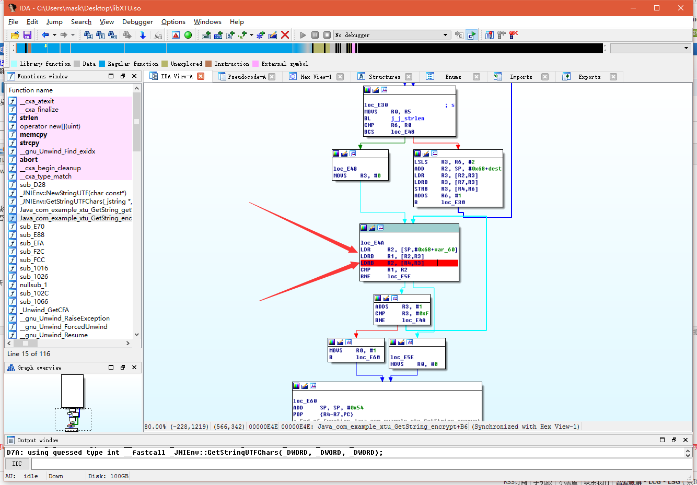

这里R1就是我们输入的，R2便是按位取的，这里会比较每一位，有一位不一样，那么变会跳出，然后函数结束，那么我们开始动态调试

0x04 动态调试
---------

说了这么半天，终于开始动态调试了，但其实我觉得前面的步骤至关重要，不然你压根不知道关键点在哪，以及在哪里下断点

首先下好断点，这里我断在了给R2赋值的地方，当然这一块你都可以下断点，反正最后只要能查看R2的值便可以

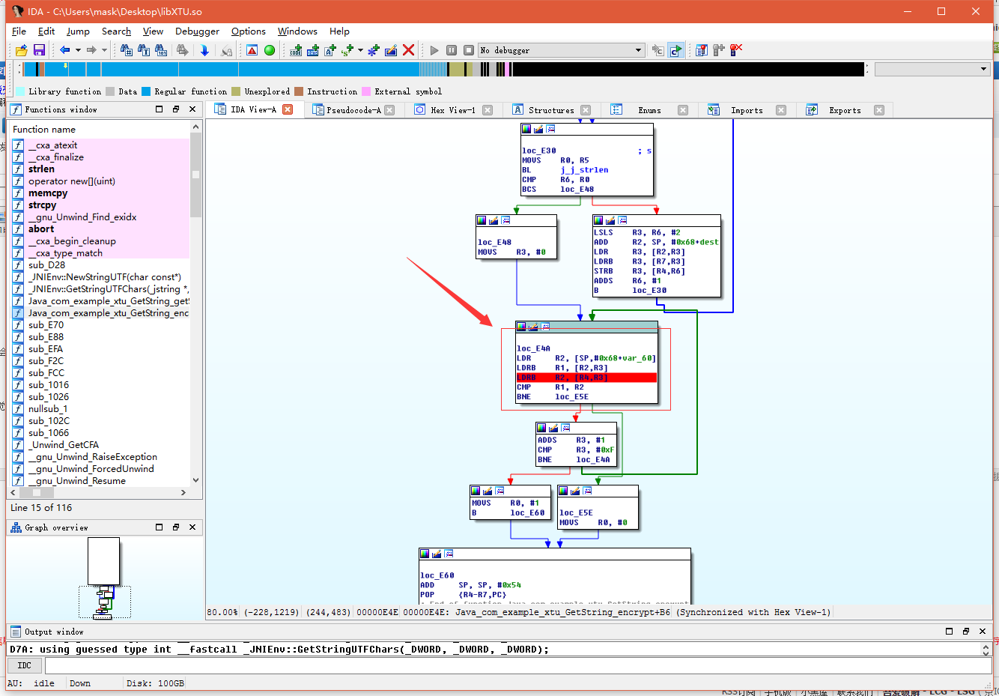

然后将下面这个文件adb push到你的真机中去，这个文件在你的IDA文件夹里：

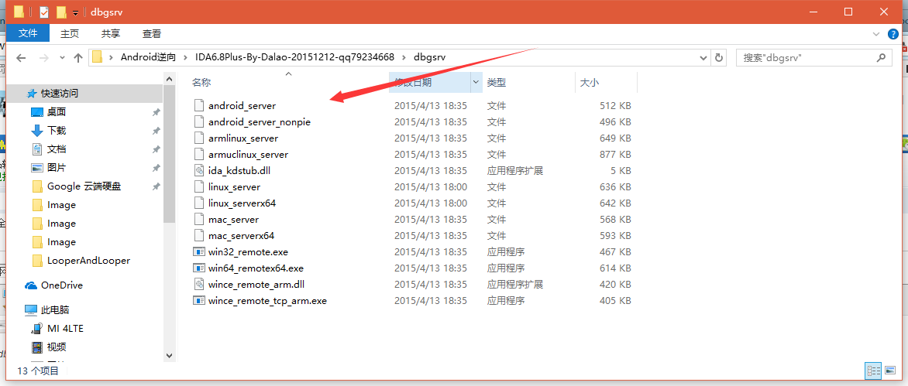

然后，打开cmd：连接你的手机

    adb shell

切换root

    su

给予权限

    chmod 777 /data/local/android_server
(这里是我的目录，你要换成你的)

然后运行这个文件

    ./android_server

这里使用的是默认端口23946，当然你也可以修改端口(因为有些加固应用会反调试默认的23946端口)：

端口转发：

    adb forward tcp:23946 tcp:23946

让应用进入调试状态

    adb shell am start -D -n com.example.xtu/com.example.xtu.MainActivity
    
然后手机会显示Waiting For Debugger，并且monitor出现了调试的标志

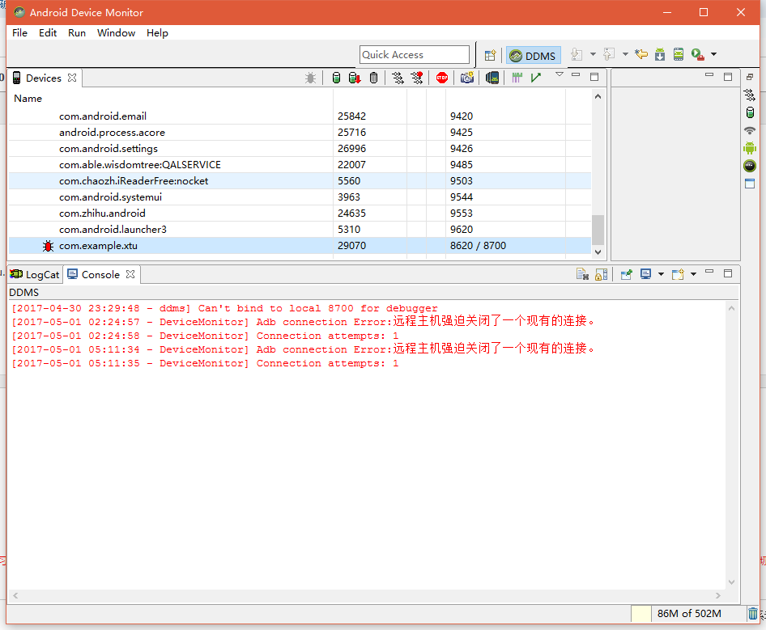

下面按照步骤来，点击Debugger，选中这个

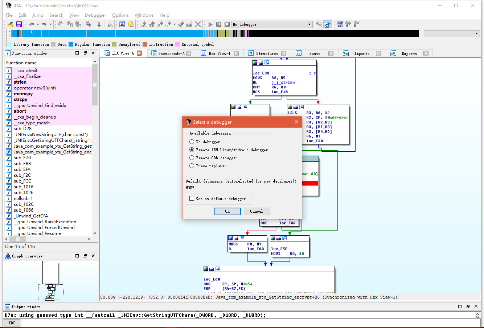

然后Debugger->Process option

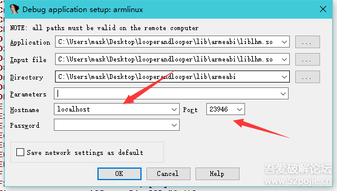

 
Debugger -> Attach to process ->

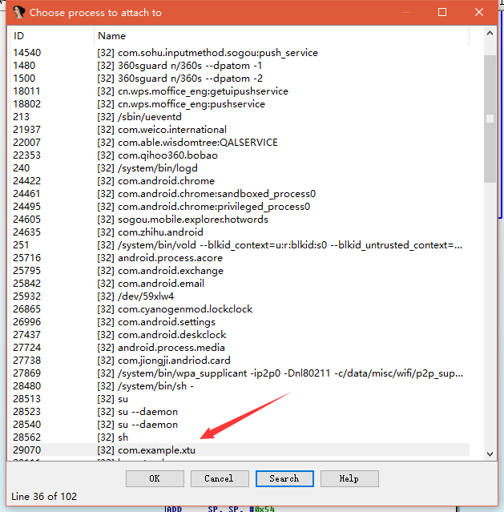

然后执行下面命令，让java层也跑起来

    jdb -connect com.sun.jdi.SocketAttach:hostname=127.0.0.1,port=8700

这个时候，Waiting for debugger应该消失了，那么输入字符串，这里随便输入15个字符，abcdefghijklmno然后点击确定，IDA窗口出现了一个点击选项，问你so文件是否相同，选择相同，然后运行，会发现断在了断点处

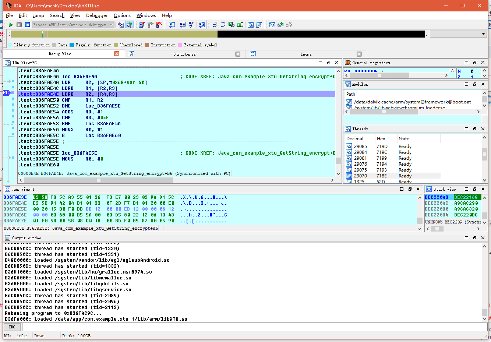

下面摁F8单步步过开始调试

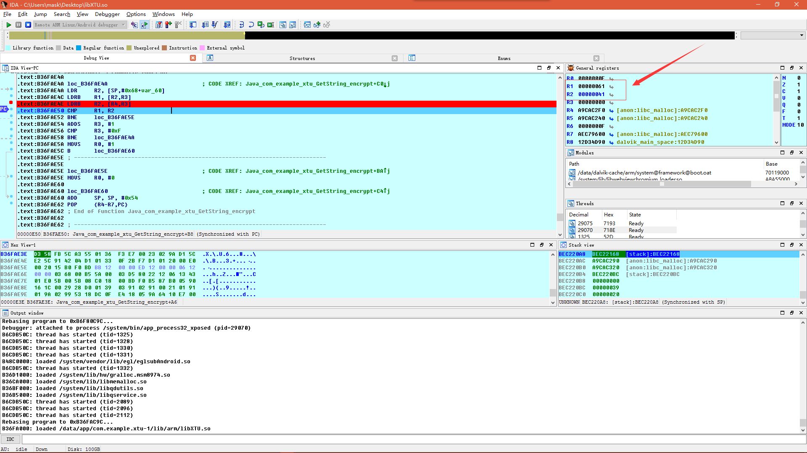

可以看到执行后，R1,R2值不相等，呐讲道理后面程序就会退出，那么我们要阻止他退出
当他运行到这一步时，我们设置一下IP的值？啥是IP？就是你下一步要执行的命令的地址

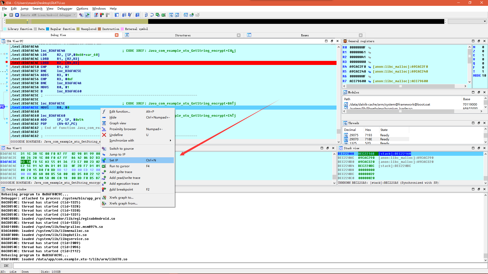

我们这里设在这里

    .text:B36FAE54 ADDS R3, #1

然后再继续运行

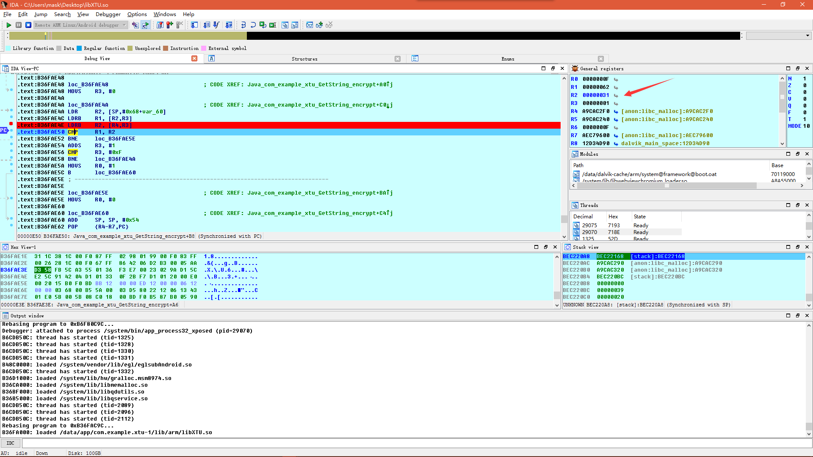

那这时R2的值变为了31

那么重复操作15次，得到下面的数据
41 31 21 4E 31 48 65 6E 42 55 43 75 30 4F 21

那么对应的字符为别是

    A1!N1HenBUCu0O!

或者你直接查看R4寄存器处的值，也是一样的{:301_986:}
和之前静态调试结果一样，有兴趣的还可以试试调试时，输入正确答案进去，你会发现单步运行时，R1会等于R2，那么就验证了

0x05 小结
-------

都是一些简单的东西，又让各位大佬们见笑了，新手看完相信收获会挺大的吧

其实我觉得这道题静态时比较方便的，当然学习一下动态也不错，每次写总结感觉自己总是罗里吧嗦，大家谅解，卧槽天亮了，

我要去睡觉了。mmp五一节我在这分析二进制

